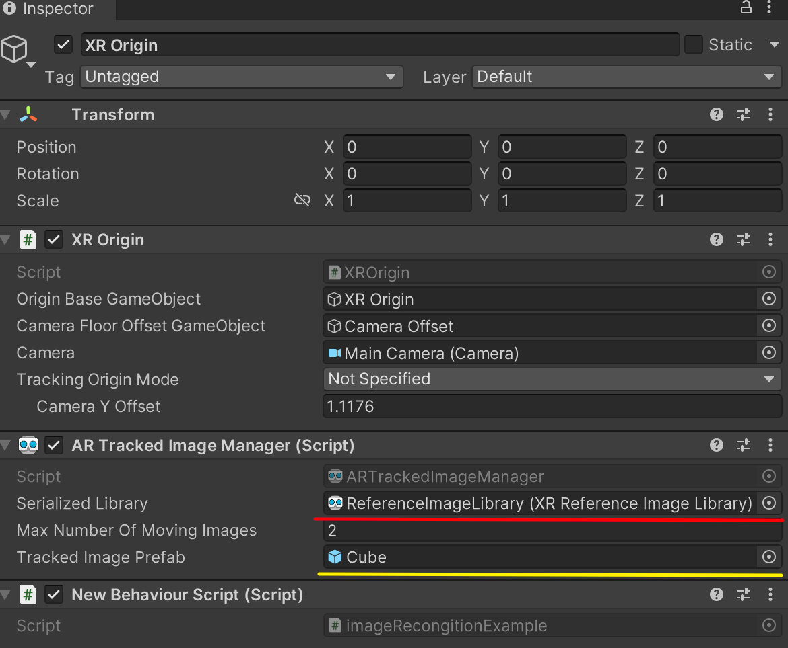
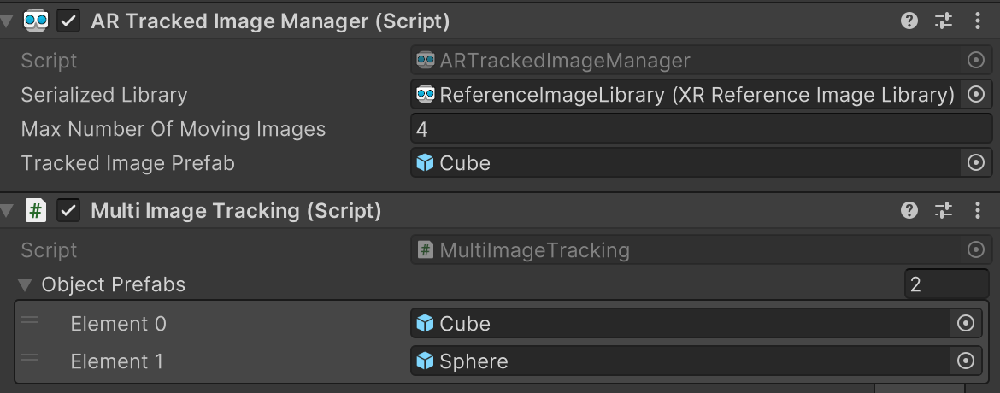
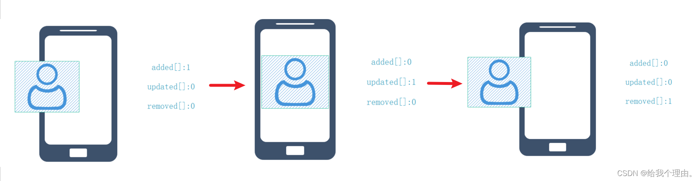
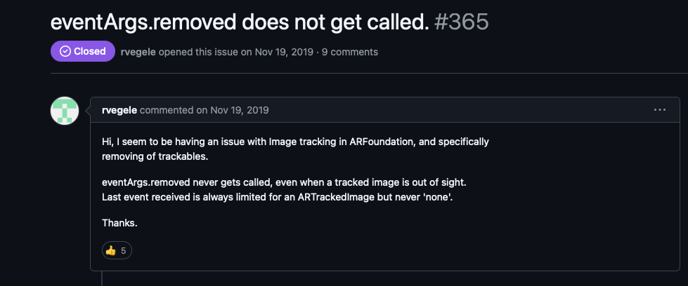
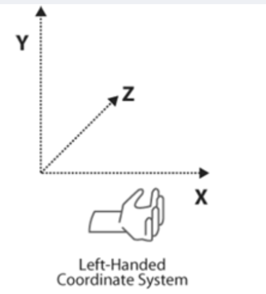

# About ARFoundation

## ARSession

An AR scene should include an `ARSession` component. The AR Session controls the lifecycle of an AR experience, enabling or disabling AR on the target platform. The `ARSession` can be on any `GameObject`

An AR scene should include an `ARSession` component. The AR Session controls the lifecycle of an AR experience, enabling or disabling AR on the target platform. The `ARSession` can be on any `GameObject`

## ARSessionOrigin

The purpose of the `ARSessionOrigin` is to transform trackable features (such as planar surfaces and feature points) into their final position, orientation, and scale in the Unity scene. Because AR devices provide their data in "session space", an unscaled space relative to the beginning of the AR session, the `ARSessionOrigin` performs the appropriate transformation into Unity space.

## Tracked Pose Driver

Parented to the `ARSessionOrigin`'s' `GameObject` should be (at least) one camera, which will be used to render any trackables you wish to visualize. The camera should also have a `TrackedPoseDriver` component on it, which will drive the camera's local position and rotation according to the device's tracking information. This setup allows the camera's local space to match the AR "session space".


# ARFoundation－图像跟踪

https://blog.csdn.net/yolon3000/article/details/96502120

图像跟踪技术，是指通过图像处理技术对摄像头中拍摄到的2D图像进行定位，并对其姿态进行跟踪的技术。

在ARFoundation中，图像跟踪的操作使用分成两步，第一步是建立一个参考图像库Create->XR->Reference Image Library，第二步是在场景中挂载AR Tracked Image Manager组件，并将一个需要实例化的Prefab赋给其Tracked Image Prefab即可


Max Number of Moving Images属性指定了最大的可跟踪的动态图像数，因为动态图像跟踪是一个非常消耗CPU性能的任务，过多的动态图像跟踪会导致应用卡顿。

## 图像跟踪启用与禁用

在ARFoundation中，实例化出来的虚拟对象并不会随着被跟踪物体的消失而消失，而是会继续停留在原来的位置上，这有时就会变得很不合适。而且，图像跟踪是一个非常消耗性能的操作，在不使用图像跟踪时一定要把图像跟踪功能关闭。参考平面检测功能的关闭与启用，类似的我们可以编写如下代码来控制图像跟踪的启用与禁用以及所跟踪对象的显示与隐藏。

```c#
    public Text m_TogglePlaneDetectionText;
    private ARTrackedImageManager mARTrackedImageManager;
    void Awake()
    {
        mARTrackedImageManager = GetComponent<ARTrackedImageManager>();
    }

    #region 启用与禁用图像跟踪
    public void ToggleImageTracking()
    {
        mARTrackedImageManager.enabled = !mARTrackedImageManager.enabled;

        string planeDetectionMessage = "";
        if (mARTrackedImageManager.enabled)
        {
            planeDetectionMessage = "禁用图像跟踪";
            SetAllImagesActive(true);
        }
        else
        {
            planeDetectionMessage = "启用图像跟踪";
            SetAllImagesActive(false);
        }

        if (m_TogglePlaneDetectionText != null)
            m_TogglePlaneDetectionText.text = planeDetectionMessage;
    }

    void SetAllImagesActive(bool value)
    {
        foreach (var img in mARTrackedImageManager.trackables)
            img.gameObject.SetActive(value);
    }
    #endregion

```

**`enabled`属性（主要用于组件）**

- **功能**：`enabled`是许多 Unity 组件（如`MonoBehaviour`、`ARTrackedImageManager`等）都具有的一个属性。它用于控制组件是否处于启用状态。

**`SetActive`方法（用于游戏对象）**

- **功能**：`SetActive`是`GameObject`类的一个方法，用于控制游戏对象是否在场景中处于活动（可见和可交互）状态。当`SetActive(true)`时，游戏对象及其所有子对象（如果有）会变为可见状态，并且可以与场景中的其他对象进行交互，如接收碰撞检测、触发事件等；当`SetActive(false)`时，游戏对象及其所有子对象会被隐藏，并且不会参与场景中的大多数交互活动，如不会触发碰撞事件，也不会被渲染出来（不可见）。

## 多图像跟踪

在AR Tracked Image Manager组件中，有一个Tracked Image Prefab属性，这个属性即为需要实例化的虚拟对象。默认，ARFoundation是支持多图像跟踪的，如下图所示。

但在AR应用运行时，只能有一个AR Tracked Image Manager组件运行（多个AR Tracked Image Manager组件会导致跟踪冲突），即只能设置一个Tracked Image Prefab，即不能实例化多个虚拟对象，这将极大的限制跟踪图像的实际应用，所以为了实例化多个虚拟对象，我们只能动态的修改Tracked Image Prefab属性。

经过测试，我们发现在ARFoundation中，AR Tracked Image Manager组件在trackedImagesChanged事件触发之前就已经实例化了虚拟对象。

> 直接看官网给的解释，也会方便我们后续的理解：
>
> ## Tracked Image Prefab
>
> The [ARTrackedImageManager](https://docs.unity3d.com/Packages/com.unity.xr.arfoundation@4.1/api/UnityEngine.XR.ARFoundation.ARTrackedImageManager.html) has a ["Tracked Image Prefab"](https://docs.unity3d.com/Packages/com.unity.xr.arfoundation@4.1/api/UnityEngine.XR.ARFoundation.ARTrackedImageManager.html#UnityEngine_XR_ARFoundation_ARTrackedImageManager_trackedImagePrefab) field; however, this is not intended for content. When an image is detected, ARFoundation will create a new [GameObject](https://docs.unity3d.com/2019.4/Documentation/Manual/GameObjects.html) to represent it.
>
> ARTrackedImageManager（增强现实跟踪图像管理器）有一个 “跟踪图像预制体（Tracked Image Prefab）” 字段；然而，这个字段不是用于（直接关联）内容的（<font color=DodgerBlue>这也就解释了预制体中的预字</font>）。当一个图像被检测到时，ARFoundation（增强现实基础框架）将会创建一个新的游戏对象（GameObject）来表示它。
>
> If "Tracked Image Prefab" is `null`, then ARFoundation simply creates a GameObject with an [ARTrackedImage](https://docs.unity3d.com/Packages/com.unity.xr.arfoundation@4.1/api/UnityEngine.XR.ARFoundation.ARTrackedImage.html) component on it. However, if you want *every tracked image* to also include additional components, you can provide a prefab for ARFoundation to instantiate for each detected image. In other words, the purpose of the prefab field is to *extend* the default behavior of tracked images; it is not the recommended way to *place content* in the world.
>
> 如果“跟踪图像预制件”为空，则 ARFoundation 只会创建一个带有 ARTrackedImage 组件的 GameObject。但是，如果您希望每个跟踪图像也包含其他组件，则可以为每个检测到的图像提供一个预制件，供 ARFoundation 实例化。换句话说，预制件字段的目的是扩展跟踪图像的默认行为；这不是在世界中放置内容的推荐方式。
>
> `Tracked Image Prefab`为空，`ARTrackedImageManager`依然会创建一个GameObject，该GameObject会添加所检测到ARTrackedImage（Reference Image Library中设置的待检测的图像集）的组件；而`Tracked Image Prefab`不为空，那么GameObject下则会多一个预制件，ARTrackedImageManager则会根据该预制件对检测到的图像位置进行实例化。

因此我们的解决思路是：在AR Tracked Image Manager组件Tracked Image Prefab中设置第一个需要实例化的Prefab（<font color=dodgerblue>若Tracked Image Prefab为空，那么当检测到第一个待检测图像added时候，ARTrackedImageManager不会为其实例化</font>），然后在trackedImagesChanged事件里捕捉到图像added操作，更改Tracked Image Prefab为下一个需要实例化的Prefab，这样来达到动态调整虚拟对象的目的。如正常设置Tracked Image Prefab为Spider Prefab，在检测到Spider图像后，我们将Tracked Image Prefab修改为Cat Prefab，这样，再检测到Cat图像后就会实例化Cat Prefab了。



```c#
using System.Collections;
using System.Collections.Generic;
using UnityEngine;
using UnityEngine.XR.ARFoundation;

public class MultiImageTracking : MonoBehaviour
{
    ARTrackedImageManager ImgTrackedManager;
    public GameObject[] ObjectPrefabs;

    private void Awake()
    {
        ImgTrackedManager = GetComponent<ARTrackedImageManager>();
    }


    private void OnEnable()
    {
        ImgTrackedManager.trackedImagesChanged += OnTrackedImagesChanged;
    }
    void OnDisable()
    {
        ImgTrackedManager.trackedImagesChanged -= OnTrackedImagesChanged;
    }
    void OnTrackedImagesChanged(ARTrackedImagesChangedEventArgs eventArgs)
    {
        if (eventArgs.added.Count != 0)Debug.Log(eventArgs.added.Count); 
        
        foreach (var trackedImage in eventArgs.added)
        {
            // Debug.Log(trackedImage.referenceImage.name);
            OnImagesChanged(trackedImage.referenceImage.name);
        }
    //    foreach (var trackedImage in eventArgs.updated)
    //    {
    //        OnImagesChanged(trackedImage.referenceImage.name);
    //    }
    }

    private void OnImagesChanged(string referenceImageName)
    {
        if (referenceImageName == "prefab1")
        {           
            ImgTrackedManager.trackedImagePrefab = ObjectPrefabs[1];
            Debug.Log("Tracked Name is .." + referenceImageName);
            Debug.Log("Prefab Name is .." + ImgTrackedManager.trackedImagePrefab.name);
        }
        if (referenceImageName == "prefab2")
        {
            Debug.Log("Tracked Name is .." + referenceImageName);
            Debug.Log("Prefab Name is .." + ImgTrackedManager.trackedImagePrefab.name);
            ImgTrackedManager.trackedImagePrefab = ObjectPrefabs[0];
        }
    }
}

```

读者可能已经看到，这种方式其实有个很大的弊端，即必须要按顺序检测图像，因为我们无法在用户检测图像之前预测用户可能会检测的2D图像。为解决这个问题，就不能让AR Tracked Image Manager组件实例化对象，而由我们自己负责虚拟对象的实例化。将AR Tracked Image Manager组件下的Tracked Image Prefab属性清空，为MultiImageTracking脚本的ObjectPrefabs数组赋上相应的值，并编写如下代码。

```c#
using System.Collections;
using System.Collections.Generic;
using UnityEngine;
using UnityEngine.XR.ARFoundation;

public class MultiImageTracking : MonoBehaviour
{
    ARTrackedImageManager ImgTrackedmanager;
    public GameObject[] ObjectPrefabs;

    private void Awake()
    {
        ImgTrackedmanager = GetComponent<ARTrackedImageManager>();
    }

    private void OnEnable()
    {
        ImgTrackedmanager.trackedImagesChanged += OnTrackedImagesChanged;
    }
    void OnDisable()
    {
        ImgTrackedmanager.trackedImagesChanged -= OnTrackedImagesChanged;
    }
    void OnTrackedImagesChanged(ARTrackedImagesChangedEventArgs eventArgs)
    {
        foreach (var trackedImage in eventArgs.added)
        {
            OnImagesChanged(trackedImage);
        }
       // foreach (var trackedImage in eventArgs.updated)
       // {
       //     OnImagesChanged(trackedImage.referenceImage.name);
       // }
    }

    private void OnImagesChanged(ARTrackedImage referenceImage)
    {
        if (referenceImage.referenceImage.name == "Spider")
        {
            Instantiate(ObjectPrefabs[0], referenceImage.transform);
        }
        if (referenceImage.referenceImage.name == "Cat")
        {
            Instantiate(ObjectPrefabs[1], referenceImage.transform);
        }
    }
}
```


# AR tracked image manager

The tracked image manager is a type of [trackable manager](https://docs.unity3d.com/Packages/com.unity.xr.arfoundation@4.1/manual/trackable-managers.html) and performs `2D image tracking`.

The tracked image manager `creates` [GameObjects](https://docs.unity3d.com/2019.4/Documentation/Manual/GameObjects.html) for `each detected image` in the environment. 

`Before ` an image can be detected, the manager must be instructed to look for a set of reference images compiled into a reference image library. It <u>`only` detects images in this library</u>.


### Responding to detected images

`Subscribe ` to the ARTrackedImageManager's [trackedImagesChanged](https://docs.unity3d.com/Packages/com.unity.xr.arfoundation@4.1/api/UnityEngine.XR.ARFoundation.ARTrackedImageManager.html#UnityEngine_XR_ARFoundation_ARTrackedImageManager_trackedImagesChanged) `event` to be notified whenever an image is `added` (i.e., first detected), ≈`removed`, or `updated`:

```c#
[SerializeField]
ARTrackedImageManager m_TrackedImageManager;

void OnEnable() => m_TrackedImageManager.trackedImagesChanged += OnChanged;

void OnDisable() => m_TrackedImageManager.trackedImagesChanged -= OnChanged;

void OnChanged(ARTrackedImagesChangedEventArgs eventArgs)
{
    foreach (var newImage in eventArgs.added)
    {
        // Handle added event
    }

    foreach (var updatedImage in eventArgs.updated)
    {
        // Handle updated event
    }

    foreach (var removedImage in eventArgs.removed)
    {
        // Handle removed event
    }
}
```

You can also get all the currently tracked images with the ARTrackedImageManager's [trackables](https://docs.unity3d.com/Packages/com.unity.xr.arfoundation@4.1/api/UnityEngine.XR.ARFoundation.ARTrackableManager-4.html#UnityEngine_XR_ARFoundation_ARTrackableManager_4_trackables) property. This acts like an [IEnumerable](https://learn.microsoft.com/dotnet/api/system.collections.ienumerable) collection, so you can use it in a `foreach` statement:

```c#
void ListAllImages()
{
    Debug.Log(
        $"There are {m_TrackedImageManager.trackables.count} images being tracked.");

    foreach (var trackedImage in m_TrackedImageManager.trackables)
    {
        Debug.Log($"Image: {trackedImage.referenceImage.name} is at " +
                  $"{trackedImage.transform.position}");
    }
}
```

Or access a specific image by its [TrackableId](https://docs.unity3d.com/Packages/com.unity.xr.arsubsystems@4.1/api/UnityEngine.XR.ARSubsystems.TrackableId.html):

```cs
ARTrackedImage GetImageAt(TrackableId trackableId)
{
    return m_TrackedImageManager.trackables[trackableId];
}
```

## Class ARTrackedImageManager

- Properties

  - trackedImagePrefab
  
    If not null, instantiates this prefab for each detected image.
  
    ```csharp
    public GameObject trackedImagePrefab { get; set; }
    ```
  
    The purpose of this property is to *extend* the functionality of [ARTrackedImage](https://docs.unity3d.com/Packages/com.unity.xr.arfoundation@4.1/api/UnityEngine.XR.ARFoundation.ARTrackedImage.html)s. It is not the recommended way to instantiate *content* associated with an [ARTrackedImage](https://docs.unity3d.com/Packages/com.unity.xr.arfoundation@4.1/api/UnityEngine.XR.ARFoundation.ARTrackedImage.html). （该属性只是为了扩展ARTrackedImage的功能，当不是为空时，会自动为其实例化，但是这个并不是为ARTrackedImage实例化的推荐方式）
  
  - referenceLibrary
  
    Get or set the reference image library, the set of images to search for in the physical environment.
  
    Declaration
  
    ```csharp
    public IReferenceImageLibrary referenceLibrary { get; set; }
    ```
    
  - 其他属性可以在[Class ARTrackedImageManager](https://docs.unity3d.com/Packages/com.unity.xr.arfoundation@4.1/api/UnityEngine.XR.ARFoundation.ARTrackedImageManager.html#UnityEngine_XR_ARFoundation_ARTrackedImageManager_trackedImagesChanged)查看
  
- Methods 

  重点讲解OnTrackablesChanged
  
  - OnTrackablesChanged(List<ARTrackedImage>, List<ARTrackedImage>, List<ARTrackedImage>)
  
    Invokes the [trackedImagesChanged](https://docs.unity3d.com/Packages/com.unity.xr.arfoundation@4.1/api/UnityEngine.XR.ARFoundation.ARTrackedImageManager.html#UnityEngine_XR_ARFoundation_ARTrackedImageManager_trackedImagesChanged) event.
  
     Declaration
  
    ```csharp
    protected override void OnTrackablesChanged(List<ARTrackedImage> added, List<ARTrackedImage> updated, List<ARTrackedImage> removed)
    ```
  
     Parameters
  
    | Type                 | Name      | Description                          |
    | :------------------- | :-------- | :----------------------------------- |
    | List<ARTrackedImage> | *added*   | A list of images added this frame.   |
    | List<ARTrackedImage> | *updated* | A list of images updated this frame. |
    | List<ARTrackedImage> | *removed* | A list of images removed this frame. |
    
    
    
    
    
    `added` 参数是一个列表，其中包含了自上一帧以来新添加的可跟踪对象 。这些对象是在当前帧中被 AR 系统检测到并添加到跟踪列表中的。
    
    `updated` 列表包含了自上一帧以来发生了更新的可跟踪对象。这些对象已经被 AR 系统跟踪，并且在当前帧中其某些属性或状态发生了变化，例如位置、旋转、缩放等。
    
    `removed` 列表则包含了自上一帧以来被移除的可跟踪对象，即这些对象在上一帧还在被跟踪，但在当前帧中由于某种原因不再被 AR 系统跟踪，例如超出了跟踪范围、被遮挡时间过长等。
    
    
    
    Tracking State
    
    There are three possible tracking states for `ARTrackedImages`:
    
    |                        TrackingState                         | Description                                                  |
    | :----------------------------------------------------------: | :----------------------------------------------------------- |
    | [None](https://docs.unity3d.com/Packages/com.unity.xr.arsubsystems@4.0/api/UnityEngine.XR.ARSubsystems.TrackingState.html#UnityEngine_XR_ARSubsystems_TrackingState_None) | The image is not being tracked. Note that this may be the initial state when the image is first detected. |
    | [Limited](https://docs.unity3d.com/Packages/com.unity.xr.arsubsystems@4.0/api/UnityEngine.XR.ARSubsystems.TrackingState.html#UnityEngine_XR_ARSubsystems_TrackingState_Limited) | The image is being tracked, but not as well. The situations in which an image is considered `Limited` instead of `Tracking` depend on the underlying AR framework. Examples that may cause `Limited` tracking include: Obscuring the image so that it is not visible to the camera.The image is not tracked as a moving image. This can happen, for example, if the `maxNumberOfMovingImages` is exceeded. |
    | [Tracking](https://docs.unity3d.com/Packages/com.unity.xr.arsubsystems@4.0/api/UnityEngine.XR.ARSubsystems.TrackingState.html#UnityEngine_XR_ARSubsystems_TrackingState_Tracking) | The underlying AR SDK reports that it is actively tracking the image. |
  
- Events

  - trackedImagesChanged
  
    Invoked once per frame with information about the [ARTrackedImage](https://docs.unity3d.com/Packages/com.unity.xr.arfoundation@4.1/api/UnityEngine.XR.ARFoundation.ARTrackedImage.html)s that have changed, i.e., been added, updated, or removed. This happens just before [ARTrackedImage](https://docs.unity3d.com/Packages/com.unity.xr.arfoundation@4.1/api/UnityEngine.XR.ARFoundation.ARTrackedImage.html)s are destroyed, so you can set `ARTrackedImage.destroyOnRemoval` to `false` from this event to suppress this behavior.
  
    ##### Declaration
  
    ```csharp
    public event Action<ARTrackedImagesChangedEventArgs> trackedImagesChanged
    ```
  
    ##### Event Type
  
    | Type                                    | Description |
    | :-------------------------------------- | :---------- |
    | Action<ARTrackedImagesChangedEventArgs> |             |


​	




https://github.com/Unity-Technologies/arfoundation-samples/issues/365

ƒ