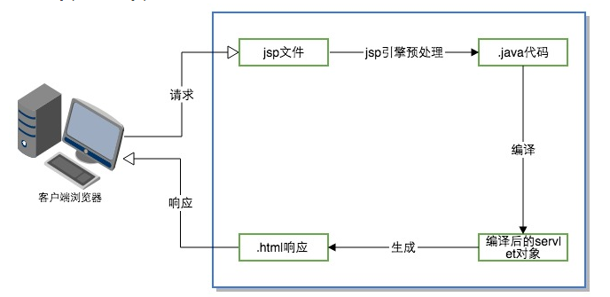
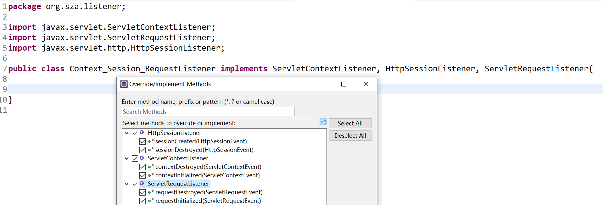
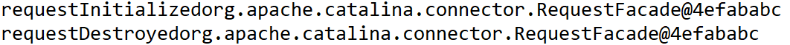
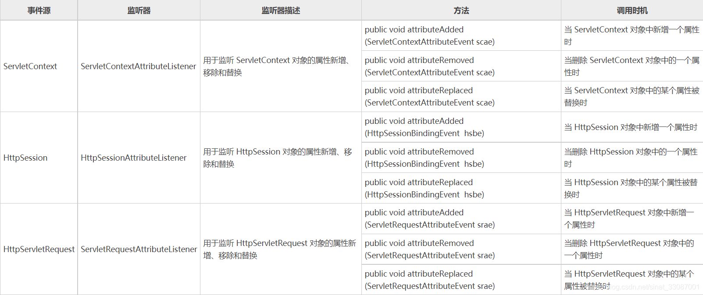
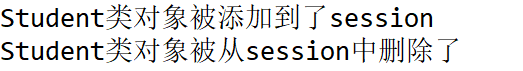

JSP页面元素

- a.脚本Scriptlet

  - ```jsp
    <%
    		局部变量、java语句
    %>
    
    <%!
        	全局变量、定义方法
     %>
    
    <%= 输出表达式  %>
    这里的局部变量的作用域并不是局限于<%	.....%>，这是因为JSP最终都会转译为servlet，全局变量为该类的成员变量，作用域为整个类；而局部变量被写在了service方法当中，为客户端向服务端的servlet中，service()方法中的本地变量只能每响应一次请求就重建一次。
    全局变量在关闭该网页、关闭浏览器、更换浏览器，再重新访问该jsp页面后仍然持续保留之前的值（服务器仍然保留着该servlet）；
    但在清除tomcat的work文件夹，或重启tomcat后恢复初始值。
    <!DOCTYPE html>
    <html>
    <head>
    <meta charset="UTF-8">
    <title>Insert title here</title>
    </head>
    <body>
    	<%
    		int x = 1;
    	%>
    	<%!
    		int y = 1;
    	%>
    	hello Jsp
    	<br>
    	
    	<%
        	x++;
    		y++;
    	%>
    	
    	<%="x的值：" + x + "y的值：" + y  %>
    </body>
    </html>
    输出为
    hello Jsp
    x的值：2y的值：2
    但是刷新页面，也就是重新提交请求后
    y的值会逐渐变大：
    hello Jsp
    x的值：2y的值：6
    ```

  - b.指令

    - page指令：

      - ```jsp
        <%@ page language="java" contentType="text/html; charset=UTF-8"
            pageEncoding="UTF-8" import = "java.util.Date"%>
        language：jsp页面使用的脚本语言
        import：导入的类
        pageEncoding：jsp自身编码 JSP最终是要编译成java的
        contentType：浏览器解析Jsp的编码
        ```

        

  - c. 注释

    - ```html
      <!-- html 注释-->
      java注释 // /**/
      jsp注释 <%-- --%>
      ```

# JSP9大内置对象（自带的，不需要new 也能使用的对象）

- out ：输出对象，向客户端输出内容，当浏览器访问时，浏览器就是客户端

- request：请求对象，存储"客户端向服务端发送的请求内容"

  - void setCharacterEncoding(String encoding)用来确保发往服务器的参数的编码格式例如"utf-8"
  - String getParameter(String name)根据请求的字段名key（input标签的name属性值），返回字段值（也就是input标签的value属性）
  - String[] getParameterValues(String name);根据请求的字段名key，返回多个字段值values，通常使用checkbox
  - request.getRequestDispatcher("b.jsp").forward(request, response);请求转发 跳转页面 A->B
  - ServletContext getServletContext();获取项目的ServletContext 对象

  Demo1：注册 register.jsp --> registerResult.jsp

  ```jsp
  <!-- register.jsp -->
  <%@ page language="java" contentType="text/html; charset=UTF-8"
      pageEncoding="UTF-8"%>
  <!DOCTYPE html>
  <html>
  <head>
  <meta charset="UTF-8">
  <title>Insert title here</title>
  </head>
  <body>
  	<form action="registerResult.jsp" method="get">
  		用户名：<input type="text" name="uname"/><br/>
  		密码：<input type="password" name="upwd"/><br/>
  		年龄：<input type="text" name="uage"/><br/>
  		爱好：<br/>
  		<input type="checkbox" name="uhobbies" value="足球"/>足球、
  		<input type="checkbox" name="uhobbies" value="篮球"/>篮球、
  		<input type="checkbox" name="uhobbies" value="乒乓球"/>乒乓球<br/>
  		<input type="submit" value="注册">
  	</form>
  </body>
  </html>
  ```

  ```jsp
  <!-- registerResult.jsp -->
  <%@ page language="java" contentType="text/html; charset=UTF-8"
      pageEncoding="UTF-8"%>
  <!DOCTYPE html>
  <html>
  <head>
  <meta charset="UTF-8">
  <title>Insert title here</title>
  </head>
  <body>
  	<%
  		request.setCharacterEncoding("utf-8");
  		String name = request.getParameter("uname");
  		int age = Integer.parseInt(request.getParameter("uage"));
  		String pwd = request.getParameter("upwd");
  		String[] hobbies = request.getParameterValues("uhobbies");
  	%>
  	注册成功,信息如下:<br/>
  	<%="name:" + name %><br/>
  	<%="age:"  + age%><br/>
  	<%="pwd:"  + pwd%><br/>
  	<%
  		if (hobbies != null ){
  			for (String hobby : hobbies){
  				out.print(hobby + " ");
  			}
  		}
  
  	%>
  </body>
  </html>
  ```

  http://localhost:8888/myjspproject/registerResult.jsp?uname=sza&upwd=sza415&uage=22&uhobbies=%E8%B6%B3%E7%90%83&uhobbies=%E7%AF%AE%E7%90%83

  get提交方式：method = "get" 和地址栏、超链接（<a href="xx">）请求方式默认都属于get提交方式

  get与post区别：

  1. get方式 在地址栏显示请求信息（但是地址栏能够容纳的信息有限，4-5kb，如果请求数据存在大文件，会出现地址栏无法容纳全部的数据而出错），post不会显示
  2. 文件上传，必须是post

- response响应对象

  - **void** addCookie(Cookie cookie)：服务端向客户端增加Cookie对象
  - **void** sendRedirect(String location) **throws** IOException; 重定向页面跳转

  **Demo1：登录 login.jsp -> checkLogin.jsp -> loginSuccess.jsp**

  ```jsp
  <!-- login.jsp -->
  <%@ page language="java" contentType="text/html; charset=UTF-8"
      pageEncoding="UTF-8"%>
  <!DOCTYPE html>
  <html>
  <head>
  <meta charset="UTF-8">
  <title>Insert title here</title>
  </head>
  <body>
  	
  	<form action="checkLogin.jsp">
  		用户名：<input type="text" name="uname"/><br/>
  		密码：<input type="password" name="upwd"/><br/>
  		<input type="submit" value="登录">
  	</form>
  </body>
  </html>
  ```

  ```jsp
  <!-- checkLogin.jsp -->
  <%@ page language="java" contentType="text/html; charset=UTF-8"
      pageEncoding="UTF-8"%>
  <!DOCTYPE html>
  <html>
  <head>
  <meta charset="UTF-8">
  <title>Insert title here</title>
  </head>
  <body>
  		<%
  
  			request.setCharacterEncoding("utf-8");
  			String name = request.getParameter("uname");
  			String pwd = request.getParameter("upwd");
  			if ("sza".equals(name) && "sza0415".equals(pwd)){
  				 response.sendRedirect("loginSuccess.jsp");
  				//request.getRequestDispatcher("loginSuccess.jsp").forward(request,response);
  			}else{
  				out.print("ERROR");
  			}
  		%>
  </body>
  </html>
  ```

  ```jsp
  <!-- loginSuccess.jsp -->
  <%@ page language="java" contentType="text/html; charset=UTF-8"
      pageEncoding="UTF-8"%>
  <!DOCTYPE html>
  <html>
  <head>
  <meta charset="UTF-8">
  <title>Insert title here</title>
  </head>
  <body>
  		登录成功!!!
  		欢迎您:<br/>
  		<%
  			String name = request.getParameter("uname");
  			String pwd = request.getParameter("upwd");
  		%>
  		<%=name%>
  </body>
  </html>
  ```

  请求转发和重定向的区别：

  |                          | 请求转发               | 重定向                 |
  | ------------------------ | ---------------------- | ---------------------- |
  | 地址栏是否改变           | 不变（checkLogin.jsp） | 改变(loginSuccess.jsp) |
  | 是否保留第一次请求的数据 | 保留                   | 不保留                 |
  | 请求的次数               | 1                      | 2                      |
  |                          |                        |                        |

  请求转发是服务端行为,重定向是客户端行为. 客户端向服务端请求资源(发现没有),服务端调用请求转发,调用内部方法获得资源,最后返回客户端.而重定向是客户端向服务端请求资源,服务端不为客户端寻找资源,而是发送资源新的地址给客户端,客户端重新根据该地址再去向服务端请求资源.

  - 从地址栏显示来说
    forward是服务器请求资源,服务器直接访问目标地址的URL,把那个URL的响应内容读取过来,然后把这些内容再发给浏览器.浏览器(客户端)根本不知道服务器发送的内容从哪里来的,所以它的地址栏还是原来的地址.

    redirect是服务端根据逻辑,发送一个状态码,告诉浏览器重新去请求那个地址.所以地址栏显示的是新的URL.

  - 从数据共享来说
    forward:转发页面和转发到的页面可以共享request里面的数据.
    redirect:不能共享数据.

  - 从运用地方来说
    forward:一般用于用户登陆的时候,根据角色转发到相应的模块.
    redirect:一般用于用户注销登陆时返回主页面和跳转到其它的网站等

  - 从效率来说
    forward:高.
    redirect:低.

- session

  - Cookie不是内置对象,因而需要new:Cookie对象是由服务端产生,再发送给客户端保存.相当于本地缓存的作用.
  - **public** Cookie(String name, String value)

  Demo: response_AddCookies.jsp -> Cookie_GetResult.jsp

  ```jsp
  <!-- response_AddCookies.jsp -->
  <%@ page language="java" contentType="text/html; charset=UTF-8"
      pageEncoding="UTF-8"%>
  <!DOCTYPE html>
  <html>
  <head>
  <meta charset="UTF-8">
  <title>Insert title here</title>
  </head>
  <body>
  		<%
  			Cookie cookie1 = new Cookie("name","sza");
  			Cookie cookie2 = new Cookie("age","21");
  			
  			response.addCookie(cookie1);
  			response.addCookie(cookie2);
  			response.sendRedirect("Cookie_GetResult.jsp");
  		
  		%>
  </body>
  </html>
  ```

  ```jsp
  <!-- Cookie_GetResult.jsp -->
  <%@ page language="java" contentType="text/html; charset=UTF-8"
      pageEncoding="UTF-8"%>
  <!DOCTYPE html>
  <html>
  <head>
  <meta charset="UTF-8">
  <title>Insert title here</title>
  </head>
  <body>
  		<%
  			Cookie[] cookies = request.getCookies();
  		
  			for (Cookie cookie : cookies){
  				out.print("-----------------------------<br/>");
  				out.print(cookie.getName() + cookie.getValue() + "<br/>");
  			}
  		
  		%>
  </body>
  </html>
  ```

  

- application

- config

- pageContext

- page

- exception

## **JSP运行原理**

当用户访问JSP页面时，JSP页面的处理过程如图所示:



<font color=blue>**JSP预处理和编译阶段**</font>

客户第一次请求jsp页面时，jsp引擎会将jsp文件中的脚本代码(HTML)和代码片段(Java代码)全部转换为java代码，转换过程非常直观：对于HTML文本只需要用简单的out.println方法包裹，对于java脚本只做保留或简单的处理。预处理阶段把jsp文件解析为java代码，编译阶段jsp引擎把java代码编译成servlet类文件，对于Tomcat，生成的class文件默认情况下存放在`<Tomcat>/work`目录下。可以简单看一下index.jsp生成的index_jsp.java代码:


```java
public void _jspService(final javax.servlet.http.HttpServletRequest request, final javax.servlet.http.HttpServletResponse response)
      throws java.io.IOException, javax.servlet.ServletException {

    if (!javax.servlet.DispatcherType.ERROR.equals(request.getDispatcherType())) {
      final java.lang.String _jspx_method = request.getMethod();
      if ("OPTIONS".equals(_jspx_method)) {
        response.setHeader("Allow","GET, HEAD, POST, OPTIONS");
        return;
      }
      if (!"GET".equals(_jspx_method) && !"POST".equals(_jspx_method) && !"HEAD".equals(_jspx_method)) {
        response.setHeader("Allow","GET, HEAD, POST, OPTIONS");
        response.sendError(HttpServletResponse.SC_METHOD_NOT_ALLOWED, "JSP 只允许 GET、POST 或 HEAD。Jasper 还允许 OPTIONS");
        return;
      }
    }

    final javax.servlet.jsp.PageContext pageContext;
    javax.servlet.http.HttpSession session = null;
    final javax.servlet.ServletContext application;
    final javax.servlet.ServletConfig config;
    javax.servlet.jsp.JspWriter out = null;
    final java.lang.Object page = this;
    javax.servlet.jsp.JspWriter _jspx_out = null;
    javax.servlet.jsp.PageContext _jspx_page_context = null;


    try {
      response.setContentType("text/html; charset=UTF-8");
      pageContext = _jspxFactory.getPageContext(this, request, response,
      			null, true, 8192, true);
      _jspx_page_context = pageContext;
      application = pageContext.getServletContext();
      config = pageContext.getServletConfig();
      session = pageContext.getSession();
      out = pageContext.getOut();
      _jspx_out = out;

      out.write("\r\n");
      out.write("<!DOCTYPE html>\r\n");
      out.write("<html>\r\n");
      out.write("<head>\r\n");
      out.write("<meta charset=\"UTF-8\">\r\n");
      out.write("<title>Insert title here</title>\r\n");
      out.write("</head>\r\n");
      out.write("<body>\r\n");
      out.write("	\r\n");
      out.write("		<form action=\"uploadservlet\" method=\"post\" enctype=\"multipart/form-data\">\r\n");
      out.write("			学号：<input name=\"sno\"><br>\r\n");
      out.write("			姓名：<input name=\"sname\"><br>\r\n");
      out.write("			上传照片：<input type=\"file\" name=\"spicture\">\r\n");
      out.write("			<input type=\"submit\" name=\"添加\">\r\n");
      out.write("		\r\n");
      out.write("		</form>\r\n");
      out.write("</body>\r\n");
      out.write("</html>");
    } catch (java.lang.Throwable t) {
      if (!(t instanceof javax.servlet.jsp.SkipPageException)){
        out = _jspx_out;
        if (out != null && out.getBufferSize() != 0)
          try {
            if (response.isCommitted()) {
              out.flush();
            } else {
              out.clearBuffer();
            }
          } catch (java.io.IOException e) {}
        if (_jspx_page_context != null) _jspx_page_context.handlePageException(t);
        else throw new ServletException(t);
      }
    } finally {
      _jspxFactory.releasePageContext(_jspx_page_context);
    }
  }
}

```

可以看到生成的_jspService(request,response)

```java
public void _jspService(final javax.servlet.http.HttpServletRequest request, final javax.servlet.http.HttpServletResponse response)
```

和我们自己编写的Servlet是相同的。


但是值得注意的是，JSP九个内置对象，request和response是作为_jspService的参数传入，而其余的内置对象，则会在后续的代码中声明并初始化：

```java
    // 声明其余内置对象
	final javax.servlet.jsp.PageContext pageContext;
    javax.servlet.http.HttpSession session = null;
    final javax.servlet.ServletContext application;
    final javax.servlet.ServletConfig config;
    javax.servlet.jsp.JspWriter out = null;
    final java.lang.Object page = this;
    javax.servlet.jsp.JspWriter _jspx_out = null;
    javax.servlet.jsp.PageContext _jspx_page_context = null;
```

```java
    // 初始化其余内置对象
    try {
      response.setContentType("text/html; charset=UTF-8");
      pageContext = _jspxFactory.getPageContext(this, request, response,
      			null, true, 8192, true);
      _jspx_page_context = pageContext;
      application = pageContext.getServletContext();
      config = pageContext.getServletConfig();
      session = pageContext.getSession();
      out = pageContext.getOut();
      _jspx_out = out;
      ....
    }
```

这也就可以解释，在Servlet的监听器当中，为什么第一次访问jsp页面（pageContext.getSession()），会调用pageContext.getSession()监听器的sessionCreated方法：

```java
public void sessionCreated(HttpSessionEvent se)
```


<font color=blue>**JSP响应阶段**</font>

编译后的class对象被加载到容器中，并根据用户的请求生成HTML格式的响应页面返回给客户端。 
在执行jsp网页时，通常分为两个时期：转译时期和请求时期。转译时期jsp页面被翻译成Servlet类，然后编译成Class文件;用户请求时期，servlet类被执行，生成HTML响应至客户端。

jsp的转译和请求都在在第一次访问时进行的，所以用户在第一次访问jsp页面时响应时间会比较长。在之后的请求中，这些工作已经完成，时间延长问题不存在了。在处理后续的访问时jsp和servlet的执行速度是一样的。

### 容器、jsp容器、jsp引擎

jsp要转译为servlet，但是servlet没有main()方法，servlet对象的创建、方法的调用由web容器来实现。以Tomcat为例，先看一下Tomcat的总体结构： 


从图中可以看出，Tomcat的核心组建是connector和Container，container就是容器。容器就是负责管理控制servlet的应用程序。图中的jasper就是解析jsp的jsp引擎。Tomcat既是servlet容器又是web服务器，也是jsp引擎。


# JSP 四种作用域

request（请求对象）：代表客户端的HTTP请求，包含了客户端发送的参数和数据。
response（响应对象）：代表服务器对客户端的HTTP响应，用于向客户端发送数据和控制响应的行为。
session（会话对象）：代表客户端和服务器之间的会话，用于在多个请求之间共享数据。
application（应用程序对象）：代表整个Web应用程序，用于在不同的用户会话之间共享数据。
out（输出对象）：用于向客户端发送输出，可以将内容直接写入响应流中。
config（配置对象）：代表当前JSP页面的配置信息，例如JSP页面的初始化参数。
page（页面对象）：代表当前JSP页面本身，可以用于调用JSP页面中定义的方法。
pageContext（页面上下文对象）：提供了对当前JSP页面上下文的访问，包括其他内置对象的访问。
exception（异常对象）：代表在JSP页面中发生的异常，可以用于处理异常情况。

## JSP中page和pageContext的区别

page，JSP网页本身，page对象是当前页面转换后的Servlet类的实例，很少使用page对象

pageContext，javax.servlet.jsp.PageContext的实例，该对象代表该JSP页面上下文，使用该对象可以访问页面中的共享数据。

pageContext和page都是JSP中的内置对象，pageContext代表着JSP页面的上下文关系，能够调用、存取其他隐含对象；page代表处理当前请求时候，这个页面的实现类的实例。


- 与Context有关的内置对象，包括pageContext、session、application
  - pageContext对象表示当前的JSP页面的上下文环境
  - session对象表示浏览器（客户端）与服务器对话
  - application表示应用程序（web应用）的上下文环境
- 与Servlet有关的内置对象，包括page和config
  - page 对象表示JSP 文件转换为 Java文件后的 Servlet 对象；
  - config 对象表示 JSP 文件转換为 Java 文件后的 Servlet 的 ServletConfig对象。

## JSP的4种作用域

对象的作用域就是对象的生命周期和可访问性，在JSP 中有4种作用域，即页面域、请求域、会话域和应用域。

1. 页面域
   1. **页面域（page scope）**的生命周期是指页面执行期间，存储在页面域中的对象只能在它所在的页面被访问。
   2. 只在一个jsp页面里有效，如果把变量放到pageContext当中，就说明它的作用对象为page，没法从页面index.jsp传递到test.jsp，只要页面跳转了，它们就不见了。
2. 请求域
   1. **请求域（request scope）**的生命周期是指一次请求过程，包括请求被转发（forward）或者被包含（include）的情况，存储在请求域中的对象只有在此次请求过程中才可以被访问。
   2. 作用对象为request，它的有效范围是当前请求周期。 
      所谓请求周期，就是指从http请求发起，到服务器处理结束，返回响应的整个过程。在这个过程中可能使用forward的方式跳转了多个jsp页面，在这些页面里你都可以使用这个变量。
   3. request里的变量可以跨越forward前后的两页。但是只要刷新页面，它们就重新计算了。 
3. 会话域
   1. **会话域（session scope）**的生命周期是指某个客户端与服务器所连接的时间，客户端在第1次访问服务器时创建会话，在会话过期或用户主动退出后会话结束，存储在会话域中的对象在整个会话期间（可以包含多次请求）都可以被访问。
   2. 有效范围当前会话，从浏览器打开到浏览器关闭这个过程
   3. 如果把变量放到session里，就说明它的作用域是session，它的有效范围是当前会话。 
      所谓当前会话，就是指从用户打开浏览器开始，到用户关闭浏览器这中间的过程。这个过程可能包含多个请求响应。也就是说，只要用户不关浏览器，服务器就有办法知道这些请求是一个人发起的，整个过程被称为一个会话（session），而放到会话中的变量，就可以在当前会话的所有请求里使用。
4. 应用域
   1. **应用域（application scope）**的生命周期是指从服务器开始执行服务到服务器关闭为止，其生命周期是4个作用域中时间最长的，存储在应用域中的对象在整个应用程序运行期间可以被所有 JSP 和Servlet 共享访问。
   2. 如果把变量放到application里，就说明它的作用域是application，它的有效范围是整个应用。 
      整个应用是指从应用启动，到应用结束。我们没有说“从服务器启动，到服务器关闭”，是因为一个服务器可能部署多个应用，当然你关闭了服务器，就会把上面所有的应用都关闭了。
   3. application作用域里的变量，它们的存活时间是最长的，如果不进行手工删除，它们就一直可以使用。 
      与上述三个不同的是，application里的变量可以被所有用户共用。如果用户甲的操作修改了application中的变量，用户乙访问时得到的是修改后的值。这在其他scope中都是不会发生的，page, request, session都是完全隔离的，无论如何修改都不会影响其他人的数据。

page里的变量没法从index.jsp传递到test.jsp。只要页面跳转了，它们就不见了。 
request里的变量可以跨越forward前后的两页。但是只要刷新页面，它们就重新计算了。 
session和application里的变量一直在累加，开始还看不出区别，只要关闭浏览器，再次重启浏览器访问这页，session里的变量就重新计算了。 
application里的变量一直在累加，除非你重启tomcat，否则它会一直变大。

JSP 的4种作用域分别对应 pageContext、request、session 和 application 内置对象，这 4 个内置对象都可以通过 setAttribute（String key, Object value）方法存储数据，通过getAttribute(String key) 获取数据。


# JDBC

> 所谓安装Mysql/Oracle数据库，就是在主机安装一个数据库管理系统（DBMS），这个管理程序可以管理多个数据库。（Database Managerment System）
>
> 一个数据库中可以创建多个表，以存储数据（信息）
>
> oracle数据库启动windows: win + r 输入services.msc 启动OracleOraDb11g_home1TNSListener

### JDBC：Java DataBase Connectivity 可以为多种**关系型数据库**DBMS提供统一的访问方式，目的就是为了用Java来操作数据库。


操作数据库最直接的方式是通过驱动（其实就是一个jar包）来操作，不同的厂商有不同的驱动（oracle数据库就是oracle驱动程序，mysql，sqlserver分别是mysql驱动、sqlserver驱动）。

JDBC是统一的访问方式，可以屏蔽掉数据库的细节，在java程序与各个厂商驱动程序有一个JDBC DriverManager，用来管理驱动程序。

因此java程序只需要使用jdbc去操作JDBC DriverManager就可以操作不同的驱动，从而操作数据库。


1. jdbc API（<u>**<font color=red>我们主要学的内容</font>**</u> ）：提供各种操作访问接口，Connection、Statement、PreparedStatement、ResultSet
   1. DriverManager：管理jdbc驱动
   
   2. Connection：连接（**<u>通过DriverManager产生</u>** DriverManager.*getConnection*(**URL**, **USERNAME**, **PWD**)）
   
      Connection 产生操作数据库的对象 Statement/preparedStatement/CallableStatement
   
   3. Statement（PreparedStatement）：增删改查（<u>**通过Connection产生**</u> connection.createStatement()/connection.prepareStatement(sql)）
   
   4. CallableStatement：调用数据库中的存储过程/存储函数（<u>**通过Connection产生**</u>，connection.prepareCall(sql)）
   
      Statemen操作数据库：
   
      - 增删改：statement.executeUpdate(sql)
      - 查询：statement.executeQuery(sql)
   
      PreparedStatement ：public **interface** PreparedStatement **extends** Statement 因此
   
      - 增删改：preparedstatement.executeUpdate(sql)
      - 查询：preparedstatement.executeQuery(sql)
   
      此外 PreparedStatement 多了赋值操作：
   
      - setXXX()
   
   5. ResultSet：返回的数据集 （由上面的Statement产生，保存查询的结果集select ENAME,JOB from bonus）
   
      - resultset.next()光标下移，判断是否有下一条数据返回true/false
   
        - ```java
          			while (resultset.next() != false) {
            				// 根据字段名查询
            				//String ENAME = resultset.getString("ENAME");
            				//String JOB = resultset.getString("JOB");
            				//System.out.println(ENAME + "--" + JOB);
            				
            				// 根据序号查询 从1开始
            				String ENAME = resultset.getString(1);
            				String JOB = resultset.getString(2);
            				System.out.println(ENAME + "--" + JOB);
            			}
          ```
   
      - resultset.previous()：光标上移，判断上一条数据，返回true/false
   
      - getXXX()：获得具体的字段值，可以是String字段名查询也可以是序号查询
   
2. JDBC DriverManager：管理不同数据库驱动

3. 各种数据库驱动，数据库厂商提供，连接和直接操作数据库

### <u>**<font color=blue>Statement实现增删改查：</font>**</u>

```java
/*Statement
 * Update()：实现增删改操作
 * Query()：实现查询
 * */
package jdbcdemo;

import java.sql.Connection;
import java.sql.DriverManager;
import java.sql.ResultSet;
import java.sql.SQLException;
import java.sql.Statement;

import com.mysql.cj.Query;

public class JDBCStatement {
	private static final String URL = "jdbc:oracle:thin:@localhost:1521:orcl";
	private static final String USERNAME = "scott";
	private static final String PWD = "tiger";
	public static void Update()  {
		Statement statement = null;
		Connection connection = null;
		try {
			//a.导入驱动，加载具体的驱动类
			Class.forName("oracle.jdbc.OracleDriver");
			//b.与数据库建立连接
			connection = DriverManager.getConnection(URL, USERNAME, PWD);
			
			//c.发送SQL，执行（增删改）命令
			statement = connection.createStatement();
			String sql = "insert into bonus values('sza1','student',1,1)";
			String sql1 = "update bonus set JOB = 'mayer' where ENAME = 'sza1'";
			String sql2 = "delete from bonus where ENAME = 'sza1'";
			int count = statement.executeUpdate(sql1);//返回值表示增删改几条数据

            //d.处理结果
			if(count > 0) {
				System.out.print("操作成功");
			}else {
				System.out.print("操作失败");
			}		
		} catch (ClassNotFoundException e) {
			e.printStackTrace();
		}catch (SQLException e) {
			e.printStackTrace();
		}catch (Exception e) {
			e.printStackTrace();
		}finally {
				try {
					if (statement != null) {
						statement.close();
					}
					if (connection != null) {
						connection.close();
					}
				} catch (SQLException e) {					
					e.printStackTrace();
				}
		}
	}
	
	public static void Query() {
		Connection connection = null;
		Statement statement = null;
		ResultSet resultset = null;
		try {
			//a.导入驱动，加载具体的驱动类
			Class.forName("oracle.jdbc.OracleDriver");
			//b.与数据库建立连接
			connection = DriverManager.getConnection(URL, USERNAME, PWD);
			
			//c.发送SQL，执行查询命令
			statement = connection.createStatement();
			String sql = "select ENAME,JOB from bonus";
			// 增删改都是executeUpdate，查询是
			resultset = statement.executeQuery(sql);//返回值表示增删改几条数据
            
			//d.处理结果
			while (resultset.next() != false) {
				// 根据字段名查询
				//String ENAME = resultset.getString("ENAME");
				//String JOB = resultset.getString("JOB");
				//System.out.println(ENAME + "--" + JOB);
				
				// 根据序号查询 从1开始
				String ENAME = resultset.getString(1);
				String JOB = resultset.getString(2);
				System.out.println(ENAME + "--" + JOB);
			}
		} catch (ClassNotFoundException e) {
			e.printStackTrace();
		}catch (SQLException e) {
			e.printStackTrace();
		}catch (Exception e) {
			e.printStackTrace();
		}finally {
				try {
					// 先开的后关 后开的先关 类似于栈
					if (resultset !=null) {
						resultset.close();
					}
					if (statement != null) {
						statement.close();
					}
					if (connection != null) {
						connection.close();
					}
				} catch (SQLException e) {
					e.printStackTrace();
				}
		}
	}
	
	public static void main(String[] args) {
		//	Update();
		Update();
	}
}

```

<font color=blue>PreparedStatement实现对数据库的增删改查:</font>

```java
/*PreparedStatement实现对数据库增删改查
 * Update()：实现增删改操作
 * Query()：实现查询
 * */
package jdbcdemo;

import java.sql.Connection;
import java.sql.DriverManager;
import java.sql.PreparedStatement;
import java.sql.ResultSet;
import java.sql.SQLException;
import java.sql.Statement;

public class JDBCPreparedStatement {
	
	private static final String URL = "jdbc:oracle:thin:@localhost:1521:orcl";
	private static final String USERNAME = "scott";
	private static final String PWD = "tiger";
	public static void Update()  {
		PreparedStatement preparedstatement = null;
		Connection connection = null;
		try {
			//a.导入驱动，加载具体的驱动类
			Class.forName("oracle.jdbc.OracleDriver");
			//b.与数据库建立连接
			connection = DriverManager.getConnection(URL, USERNAME, PWD);
			
			//c.发送SQL，执行（增删改）命令 
			//c.1 先写SQL（存在占位符）
			
			String sql = "insert into bonus values(?,?,?,?)";
			// String sql = "insert into bonus values('sza1','student',1,1)";
			// String sql1 = "update bonus set JOB = 'mayer' where ENAME = 'sza1'";
			// String sql2 = "delete from bonus where ENAME = 'sza1'";
			
			//c.2 创建preparedstatement时，将sql作为参数预编译
			preparedstatement = connection.prepareStatement(sql);
			
			//c.3 向之前sql语句的占位符，依次填充内容
			preparedstatement.setString(1, "sza1");
			preparedstatement.setString(2, "student");
			preparedstatement.setInt(3, 1);
			preparedstatement.setInt(4, 1);
			// executeUpdate() 这里不再需要sql语句了
			int count = preparedstatement.executeUpdate();//返回值表示增删改几条数据

			//d.处理结果
			if(count > 0) {
				System.out.print("操作成功");
			}else {
				System.out.print("操作失败");
			}
		} catch (ClassNotFoundException e) {
			e.printStackTrace();
		}catch (SQLException e) {
			e.printStackTrace();
		}catch (Exception e) {
			e.printStackTrace();
		}finally {
				try {
					if (preparedstatement != null) {
						preparedstatement.close();
					}
					if (connection != null) {
						connection.close();
					}
				} catch (SQLException e) {	
					e.printStackTrace();
				}
		}
	}
	
	public static void Query() {
		Connection connection = null;
		
		PreparedStatement preparedstatement = null;
		
		ResultSet resultset = null;
		try {
			//a.导入驱动，加载具体的驱动类
			Class.forName("oracle.jdbc.OracleDriver");
			//b.与数据库建立连接
			connection = DriverManager.getConnection(URL, USERNAME, PWD);
			
			//c.发送SQL，执行查询命令
			//c.1 先写SQL（存在占位符）
			String sql = "select ENAME,JOB from bonus";
			String name = "za1";
			String sql1 = "select ENAME,JOB from bonus where ENAME like ?";
			
			//c.2 创建preparedstatement时，将sql作为参数预编译
			preparedstatement = connection.prepareStatement(sql1);
			
			//c.3 向之前sql语句的占位符，依次填充内容
			preparedstatement.setString(1, "%" + name +"%");

			// 增删改都是executeUpdate，查询是
			// executeQuery() 这里不再需要sql语句了
			resultset = preparedstatement.executeQuery();//返回值表示增删改几条数据
			
			
			//d.处理结果
			while (resultset.next() != false) {
				// 根据字段名查询
				//String ENAME = resultset.getString("ENAME");
				//String JOB = resultset.getString("JOB");
				//System.out.println(ENAME + "--" + JOB);
				
				// 根据序号查询 从1开始
				String ENAME = resultset.getString(1);
				String JOB = resultset.getString(2);
				System.out.println(ENAME + "--" + JOB);
			}	
		} catch (ClassNotFoundException e) {
			e.printStackTrace();
		}catch (SQLException e) {
			e.printStackTrace();
		}catch (Exception e) {
			e.printStackTrace();
		}finally {
				try {
					// 先开的后关 后开的先关 类似于栈
					if (resultset !=null) {
						resultset.close();
					}
					if (preparedstatement != null) {
						preparedstatement.close();
					}
					if (connection != null) {
						connection.close();
					}
				} catch (SQLException e) {		
					e.printStackTrace();
				}
		}
	}
	
	public static void main(String[] args) {
		
		Query();
	}

}
```

**<u><font color=blue>PreparedStatement与Statement在使用时的区别：</font></u>**

- Statement:
  - sql语句
  - 创建Statement对象，connection.createStatement();//sql语句可以在创建Statement对象后再写
  - 执行executeUpdate(sql)/executeQuery(sql)
- PreparedStatement
  - 写好sql语句（可能存在占位符）
  - sql语句作为参数创建PreparedStatement对象，connection.prepareStatement(sql);
  - PreparedStatement对象调用setXXX()函数填充占位符
  - 执行executeUpdate()/executeQuery()，没有sql参数

#### 推荐使用PreparedStatement：原因如下：

**1.编码更加简便（避免了字符串的拼接）**

String name = "zs" ;
int age = 23 ;

**stmt:（Statement）**
String sql =" insert into student(stuno,stuname) values('"+name+"',  "+age+" )    " ;
stmt.executeUpdate(sql);

**pstmt:（PreparedStatement）**
String sql =" insert into student(stuno,stuname) values(?,?) " ;
pstmt = connection.prepareStatement(sql);//预编译SQL
pstmt.setString(1,name);
pstmt.setInt(2,age);

**2.提高性能(因为 有预编译操作，预编译只需要执行一次)**
**需求**：需要重复增加100条数 
**stmt**:
String sql =" insert into student(stuno,stuname) values('"+name+"',  "+age+" )    " ;
for(100)
stmt.executeUpdate(sql);

**pstmt:**
String sql =" insert into student(stuno,stuname) values(?,?) " ;
pstmt = connection.prepareStatement(sql);//预编译SQL
pstmt.setString(1,name);
pstmt.setInt(2,age);
for( 100){
pstmt.executeUpdate();
}

**3.安全（可以有效防止sql注入）**

* sql注入： 将客户输入的内容  和 开发人员的SQL语句 混为一体。
* stmt:存在被sql注入的风险  
  (例如输入  密码：任意值 ' or 1=1 --
  	   用户名：任意值)

```java
import java.sql.Connection;
import java.sql.DriverManager;
import java.sql.ResultSet;
import java.sql.SQLException;
import java.sql.Statement;
import java.util.Scanner;

public class JDBCDemo {
	private static final String URL = "jdbc:oracle:thin:@localhost:1521:MLDN";
	private static final String USERNAME = "c##scott";
	private static final String PWD = "tiger";
	
	public static void query() {
		Connection connection = null;
		Statement stmt = null;
		ResultSet rs = null ; 
		try {
			// a.导入驱动，加载具体的驱动类
			Class.forName("oracle.jdbc.OracleDriver");// 加载具体的驱动类
			// b.与数据库建立连接
			connection = DriverManager.getConnection(URL, USERNAME, PWD);
			// c.发送sql，执行(增删改、【查】)
			stmt = connection.createStatement();
//			String sql = "select stuno,stuname from student";
			Scanner input= new Scanner(System.in);
			
			System.out.println("请输入用户名");
			String pwd = input.nextLine() ;
			System.out.println("请输入密码：");
			String name = input.nextLine() ;
			String sql = "select count(*) from login where id='"+name+"' and name ='"+pwd+"' " ;
//			String sql = "select * from student where stuname like '%"+name+"%'";
			// 执行SQL(增删改executeUpdate()，查询executeQuery())
			rs = stmt.executeQuery(sql); 
			// d.处理结果
			int count = -1;
			if(rs.next()) {
				count = rs.getInt(1) ;
			}
			if(count>0) {
				System.out.println("登陆成功！");
			}else {
				System.out.println("登陆失败！");
			}

		} catch (ClassNotFoundException e) {
			e.printStackTrace();
		} catch (SQLException e) {
			e.printStackTrace();
		} catch(Exception e) {
			e.printStackTrace();
		}
		finally {
			try {
				if(rs!=null) rs.close(); 
				 if(stmt!=null) stmt.close();// 对象.方法
				 if(connection!=null)connection.close();
			}catch(SQLException e) {
				e.printStackTrace();
			}
		}
	}
	
	
	public static void main(String[] args) {
		query() ;
	}
}

```

在oracle数据库中存在一个login表，表中存在一个id为1，name为"zs"的条目。

上面程序执行时，用户名输入：随便输入。

​				密码：任意值 ' or 1=1 --

能够成功登陆！


分析：
select count(*) from login where uname='任意值 ' or 1=1 --' and upwd ='任意值'  ;由于--是oracle sql中的注释语句，于是等价于下面这句：
select count(*) from login where uname='任意值 ' or 1=1 ;于是永远都是true。

pstmt:有效防止sql注入
推荐使用pstmt

### 处理CLOB/BLOB类型

处理稍大型数据：

思路简介：

a.存储路径	E:\JDK_API_zh_CN.CHM
	通过JDBC存储文件路径，然后 根据IO操作处理
	例如：JDBC将 E:\JDK_API_zh_CN.CHM 文件 以字符串形式“E:\JDK_API_zh_CN.CHM”存储到数据中
		获取：1.获取该路径“E:\JDK_API_zh_CN.CHM”  2.IO	
b.
	CLOB：大文本数据 （小说->数据）
	BLOB：二进制


clob:

大文本数据   字符流 Reader Writer
**存：**
1.先通过pstmt 的? 代替小说内容 （占位符）
2.再通过pstmt.setCharacterStream(2, reader,  (int)file.length());  将上一步的？替换为 小说流， 注意第三个参数需要是 Int类型
**取：**
1.通过Reader reader = rs.getCharacterStream("NOVEL") ; 将cloc类型的数据  保存到Reader对象中

2. 将Reader通过Writer输出即可。

blob:

二进制  字节流 InputStream OutputStream
与CLOB步骤基本一致，区别：setBinaryStream(...)  getBinaryStream(...)   

存取小说

```java
import java.io.File;
import java.io.FileInputStream;
import java.io.FileWriter;
import java.io.InputStream;
import java.io.InputStreamReader;
import java.io.Reader;
import java.io.Writer;
import java.sql.Connection;
import java.sql.DriverManager;
import java.sql.PreparedStatement;
import java.sql.ResultSet;
import java.sql.SQLException;
import java.sql.Statement;
import java.util.Scanner;


public class JDBCClob {
	
	private static final String URL = "jdbc:oracle:thin:@localhost:1521:ORCL";
	private static final String USERNAME = "scott";
	private static final String PWD = "tiger";

	//通过jdbc存储大文本数据（小说）CLOB
	//设置CLOB类型：setCharacterStream
	public static void clobDemo() {
		Connection connection = null;
		PreparedStatement pstmt = null;
		try {
			// a.导入驱动，加载具体的驱动类
			Class.forName("oracle.jdbc.OracleDriver");// 加载具体的驱动类
			// b.与数据库建立连接
			connection = DriverManager.getConnection(URL, USERNAME, PWD);
			
			String sql = "insert into mynovel values(?,?)";
			// c.发送sql，执行(增删改、查)
			pstmt = connection.prepareStatement(sql);
			pstmt.setInt(1, 1);
			File file = new File("E:\\all.txt");
			InputStream in = new FileInputStream( file) ;
			Reader reader = new InputStreamReader( in   ,"UTF-8") ;//转换流 可以设置编码
			pstmt.setCharacterStream(2, reader,  (int)file.length());
			int count =pstmt.executeUpdate() ;
			// d.处理结果
			if (count > 0) {  
				System.out.println("操作成功！");
			}
			
			reader.close();
		} catch (ClassNotFoundException e) {
			e.printStackTrace();
		} catch (SQLException e) {
			e.printStackTrace();
		} catch(Exception e) {
			e.printStackTrace();
		}
		finally {
			try {
				 if(pstmt!=null) pstmt.close();// 对象.方法
				 if(connection!=null)connection.close();
			}catch(SQLException e) {
				e.printStackTrace();
			}
		}
	}
	
	//读取小说
	public static void clobReaderDemo() {
		Connection connection = null;
		PreparedStatement pstmt = null;
		ResultSet rs = null ; 
		try {
			// a.导入驱动，加载具体的驱动类
			Class.forName("oracle.jdbc.OracleDriver");// 加载具体的驱动类
			// b.与数据库建立连接
			connection = DriverManager.getConnection(URL, USERNAME, PWD);
			
			String sql = "select NOVEL from mynovel where id = ? ";
			// c.发送sql，执行(查)
			pstmt = connection.prepareStatement(sql);
			pstmt.setInt(1, 1);
			
			rs = pstmt.executeQuery() ;
			//setXxxx getXxxx      setInt  getInt
			if(rs.next())
			{
				Reader reader = rs.getCharacterStream("NOVEL") ;
				Writer writer = new FileWriter("src/小说.txt");
				
				char[] chs = new char[100] ;
				int len = -1;
				while(  (len = reader.read(chs)) !=-1 ) {
					writer.write( chs,0,len  );
				}
				writer.close();
				reader.close();
			}
		} catch (ClassNotFoundException e) {
			e.printStackTrace();
		} catch (SQLException e) {
			e.printStackTrace();
		} catch(Exception e) {
			e.printStackTrace();
		}
		finally {
			try {
				 if(pstmt!=null) pstmt.close();// 对象.方法
				 if(connection!=null)connection.close();
			}catch(SQLException e) {
				e.printStackTrace();
			}
		}
	}
	
	
	
	public static void main(String[] args) {
//		clobDemo() ;
		clobReaderDemo() ;
	}
}
```

存取二进制文件：（如音乐）

```java
import java.io.File;
import java.io.FileInputStream;
import java.io.FileOutputStream;
import java.io.FileWriter;
import java.io.InputStream;
import java.io.InputStreamReader;
import java.io.OutputStream;
import java.io.Reader;
import java.io.Writer;
import java.sql.Connection;
import java.sql.DriverManager;
import java.sql.PreparedStatement;
import java.sql.ResultSet;
import java.sql.SQLException;
import java.sql.Statement;
import java.util.Scanner;


public class JDBCBlob {
	private static final String URL = "jdbc:oracle:thin:@localhost:1521:ORCL";
	private static final String USERNAME = "scott";
	private static final String PWD = "tiger";

	//通过jdbc存储二进制类型 （mp3）
	//设置BLOB类型：
	public static void blobDemo() {
		Connection connection = null;
		PreparedStatement pstmt = null;
		try {
			// a.导入驱动，加载具体的驱动类
			Class.forName("oracle.jdbc.OracleDriver");// 加载具体的驱动类
			// b.与数据库建立连接
			connection = DriverManager.getConnection(URL, USERNAME, PWD);
			
			String sql = "insert into mymusic values(?,?)";
			// c.发送sql，执行(增删改、查)
			pstmt = connection.prepareStatement(sql);
			pstmt.setInt(1, 1);
			File file = new File("d:\\luna.mp3");
			
			InputStream in = new FileInputStream(file );
			pstmt.setBinaryStream(2,in ,(int)file.length()  );
			
			
			int count =pstmt.executeUpdate() ;
			// d.处理结果
			if (count > 0) {  
				System.out.println("操作成功！");
			}
			
			in.close();
		} catch (ClassNotFoundException e) {
			e.printStackTrace();
		} catch (SQLException e) {
			e.printStackTrace();
		} catch(Exception e) {
			e.printStackTrace();
		}
		finally {
			try {
				 if(pstmt!=null) pstmt.close();// 对象.方法
				 if(connection!=null)connection.close();
			}catch(SQLException e) {
				e.printStackTrace();
			}
		}
	}
	
	//读取二进制文件
	public static void blobReaderDemo() {
		Connection connection = null;
		PreparedStatement pstmt = null;
		ResultSet rs = null ; 
		try {
			// a.导入驱动，加载具体的驱动类
			Class.forName("oracle.jdbc.OracleDriver");// 加载具体的驱动类
			// b.与数据库建立连接
			connection = DriverManager.getConnection(URL, USERNAME, PWD);
			
			String sql = "select music from mymusic where id = ? ";
			
			
			// c.发送sql，执行(查)
			pstmt = connection.prepareStatement(sql);
			pstmt.setInt(1, 1);
			
			rs = pstmt.executeQuery() ;
			if(rs.next())
			{
				InputStream in = rs.getBinaryStream("music") ;
				OutputStream out = new FileOutputStream("src/music.mp3") ;
				
				byte[] chs = new byte[100] ;
				int len = -1;
				while(  (len = in.read(chs)) !=-1 ) {
					out.write( chs,0,len  );
				}
				out.close();
				in.close();
			}
		} catch (ClassNotFoundException e) {
			e.printStackTrace();
		} catch (SQLException e) {
			e.printStackTrace();
		} catch(Exception e) {
			e.printStackTrace();
		}
		finally {
			try {
				 if(pstmt!=null) pstmt.close();// 对象.方法
				 if(connection!=null)connection.close();
			}catch(SQLException e) {
				e.printStackTrace();
			}
		}
	}
	
	
	
	public static void main(String[] args) {
//		blobDemo() ;
		blobReaderDemo();
	}
}
```

### JSP访问数据库

JSP就是在html中嵌套的java代码，因此 java代码可以写在jsp中（<%  ... %>）。

因此可以利用jsp把账号密码等信息传入，在check.jsp中嵌入java代码进行验证、读取数据库。

**导包操作：**

* java项目 ：1 Jar复制到工程中 2.右键该Jar :build path ->add to build Path
* Web项目：jar复制到WEB-INF/lib

核心：就是将 java中的JDBC代码，复制到 JSP中的<% ... %>

**注意**：如果jsp出现错误：The import Xxx cannot be resolved
尝试解决步骤：

* (可能是Jdk、tomcat版本问题) 右键项目->build path，将其中 报错的 libary或Lib 删除后 重新导入
* 清空各种缓存：右键项目->Clean tomcat... clean  （Project -clean或者 进tomcat目录 删除里面work的子目录）
* 删除之前的tomcat，重新解压缩、配置tomcat，重启计算机
* 如果类之前没有包，则将该类加入包中

<u>DAO（Data Access Object）</u> 模型就是写一个类，把访问数据库的代码封装起来	

<u>Entity层</u>，顾名思义就是实体层，放置一个个实体，及其相应的set、get方法。如果想要对数据库进行一些操作（比如说读取）的话，就要先写entity层。

### JavaBean

刚才我们将 jsp中 登录操作的代码  转移到了LoginDao.java；其中LoginDao类 就称之为JavaBean。

**JavaBean的作用**：

* 减轻的jsp复杂度  
* 提高代码复用（以后任何地方的 登录操作，都可以通过调用LoginDao实现）

JavaBean（就是一个Java类）的定义：满足一下2点 ，就可以称为JavaBean

* public 修饰的类  ,public 无参构造
* 所有属性(如果有) 都是private，并且提供set/get   (如果boolean 则get 可以替换成is)

使用层面，Java分为2大类：

* 封装业务逻辑的JavaBean (LoginDao.java封装了登录逻辑)			逻辑
  	可以将jsp中的JDBC代码，封装到Login.java类中 （Login.java）
* 封装数据的JavaBean   （实体类，Student.java  Person.java  ）		数据 
  	对应于数据库中的一张表
  	Login login = new Login(uname,upwd) ;//即用Login对象 封装了2个数据（用户名 和密码）

封装数据的JavaBean 对应于数据库中的一张表   (Login(name,pwd))
封装业务逻辑的JavaBean 用于操作 一个封装数据的JavaBean  

可以发现，JavaBean可以简化 代码(jsp->jsp+java)、提供代码复用(LoginDao.java)


# MVC设计模式

* M：Model	，模型  ：一个功能。用JavaBean实现。
* V:View，视图： 用于展示、以及与用户交互。使用html  js  css jsp jquery等前端技术实现
* C:Controller，分发器/控制器 ：接受请求，将请求跳转到模型进行处理；模型处理完毕后，再将处理的结果
  	返回给 请求处 。 可以用jsp实现，  但是一般建议使用 Servlet实现控制器。
* Jsp->Java(Servlet)->JSP


###  Servlet基础：

Java类必须符合一定的 规范：
	a.必须继承  javax.servlet.http.HttpServlet
	b.重写其中的 doGet()或doPost()方法

 doGet()： 接受 并处理 所有get提交方式的请求
 doPost()：接受 并处理 所有post提交方式的请求


Servlet要想使用，必须配置
Serlvet2.5：web.xml
Servle3.0： @WebServlet


Serlvet2.5：web.xml:

##### 项目的根目录：WebContent 、src

<a href="WelcomeServlet">所在的jsp是在 WebContent目录中，因此 发出的请求WelcomeServlet  是去请求项目的根目录。

Servlet流程：
请求 -><url-pattern> -> 根据<servlet-mapping>中的<servlet-name> 去匹配  <servlet> 中的<servlet-name>，然后寻找到<servlet-class>，求中将请求交由该<servlet-class>执行。


### Servlet生命周期：5个阶段 

加载
初始化： init()  ，该方法会在 Servlet被加载并实例化的以后 执行
服务  ：service() ->doGet()  doPost
销毁  ：destroy()，  Servlet被系统回收时执行
卸载

init():
	a.默认第一次访问 Servlet时会被执行 （只执行这一次）
	b.可以修改为 Tomcat启动时自动执行
		i.Servlet2.5：  web.xml
			  <servlet>
				...
  				 <load-on-startup>1</load-on-startup>
    			</servlet>
			其中的“1”代表第一个。
		ii.Servlet3.0
			@WebServlet( value="/WelcomeServlet" ,loadOnStartup=1  )

service() ->doGet()  doPost ：调用几次，则执行几次
destroy()：关闭tomcat服务时，执行一次。


# MVC案例实践


login.jsp:

```jsp
<!-- login.jsp -->
<%@ page language="java" contentType="text/html; charset=UTF-8"
    pageEncoding="UTF-8"%>
<!DOCTYPE html>
<html>
<head>
<meta charset="UTF-8">
<title>Insert title here</title>
</head>
<body>
	
	<form action="loginservlet" method="post">
		用户名：<input type="text" name="uname"/><br/>
		密码：<input type="password" name="upwd"/><br/>
		<input type="submit" value="登录">
	</form>
</body>
</html>
```

loginservlet.java

```java
package org.sza;

import java.io.IOException;
import javax.servlet.ServletException;
import javax.servlet.annotation.WebServlet;
import javax.servlet.http.HttpServlet;
import javax.servlet.http.HttpServletRequest;
import javax.servlet.http.HttpServletResponse;

import org.sza.dao.logindao;
import org.sza.entity.loginbean;


@WebServlet("/loginservlet")
public class loginservlet extends HttpServlet {

	protected void doGet(HttpServletRequest request, HttpServletResponse response) throws ServletException, IOException {
		request.setCharacterEncoding("utf-8");
		String uname = request.getParameter("uname");
		String upwd = request.getParameter("upwd");
		loginbean loginuser = new loginbean(uname,upwd);
		int flag = logindao.logincheck(loginuser);
		
		if (flag == 0) {
			System.out.println("登录失败");
			response.sendRedirect("login.jsp");
		}else if(flag > 0) {
			System.out.println("登录成功");
			response.sendRedirect("welcome.jsp");
		}else {
			System.out.println("系统错误");
			response.sendRedirect("login.jsp");
		}
	}

	protected void doPost(HttpServletRequest request, HttpServletResponse response) throws ServletException, IOException {

		doGet(request, response);
	}

}

```

logindao.java

```java
package org.sza.dao;

import java.sql.Connection;
import java.sql.DriverManager;
import java.sql.PreparedStatement;
import java.sql.ResultSet;
import java.sql.SQLException;

import org.sza.entity.loginbean;

public class logindao {
	
	private static final String URL = "jdbc:oracle:thin:@localhost:1521:orcl";
	private static final String USERNAME = "sza";
	private static final String PWD = "sza0415";
	// 对输入的登录账号进行验证
	public static int logincheck(loginbean loginuser) {
		PreparedStatement ppsmt = null;
		Connection conn = null;
		ResultSet resultset = null;

		int flag = -1;
		try {
			Class.forName("oracle.jdbc.OracleDriver");
			conn = DriverManager.getConnection(URL,USERNAME,PWD);
			
			String sql = "select count(*) from USERS where username = ? and PASSWORD = ?";
			ppsmt = conn.prepareStatement(sql);
			ppsmt.setString(1, loginuser.getUname());
			ppsmt.setString(2, loginuser.getUpwd());
			
			resultset = ppsmt.executeQuery();
			
			if (resultset.next()) {
				flag = resultset.getInt(1);
			}
			if (flag > 0)return 1;
			else return 0;
			
		} catch (ClassNotFoundException e) {
			e.printStackTrace();
			return -1;
		}catch (SQLException e) {
			e.printStackTrace();
			return -1;
		}catch (Exception e) {
			e.printStackTrace();
			return -1;
		}finally {
			try {
				if (resultset!=null)resultset.close();
				if (ppsmt!=null)ppsmt.close();
				if (conn!=null)conn.close();
			} catch (SQLException e2) {
				e2.printStackTrace();
			}
			
		}

	}
}

```

loginbean.java

```java
package org.sza.entity;

public class loginbean {
	private String uname;
	
	private String upwd;

	public String getUname() {
		return uname;
	}

	public loginbean(String uname, String upwd) {
		this.uname = uname;
		this.upwd = upwd;
	}

	public loginbean() {
		
	}

	public void setUname(String uname) {
		this.uname = uname;
	}

	public String getUpwd() {
		return upwd;
	}

	public void setUpwd(String upwd) {
		this.upwd = upwd;
	}
	
}

```

# 三层架构详解


三层组成:

- 表示层（USL，User Show Layer 视图层）
  - 前台:对应着MVC中的View，用于和用户交互、界面的显示
    - 前台技术：jsp html css js jquery等web前端技术
    - 代码位置：webcontent
  - 后台：对应于MVC中的Controller，用于跳转 调用业务逻辑层
    - 后台技术：servlet（springMVC），一般位于xxx.servlet包中
- 业务逻辑层（BLL，Business Logic Layer；Service层 ）
  - 接受表示层的请求 调用
  - 组装数据访问层，逻辑性的操作，可能是数据访问层的操作的组合
    - 一般位于xxx.service包中 也可以称为xxx.manager /xxx.bll
- 数据访问层（DAL，Data Access Layer；Dao层）
  - 直接访问数据库的操作，原子性的操作（增删改查） 不可拆解
    - 一般位于xxx.dao包

三层案例: TODO


优化三层：

1. 加入接口
   1. 建议面向接口开发：先接口-再实现类
   2. service、dao加入接口
   3. 接口与实现类的命名规范
      1. 接口：interface  起名 IXxxService、IXxxDao
         1. 接口所在的包 xxx.service xx.dao
      2. 实现类：implements 起名 XxxServiceImpl 
         1. 实现类所在的包：xxx.dao.impl  xxx.service.impl
2. DBUtil 通用的数据库帮助类，可以简化Dao类的代码量


# Servlet中的监听器

监听原理：

- 存在事件源：被监听的对象
- 提供监听器：监听的对象
- 为事件源注册监听器，事件源与监听器的绑定
- 操作事件源，产生事件对象，将事件对象传递给监听器，并且执行监听器相应的监听方法。事件：事件源对象的改变-->通过事件获得事件源对象

Servlet中主要用于监听的事件源分别是ServletContext、HttpSession、ServletRequest三个域对象--> application、session、request。


Servlet监听器分为三大类：

1. 监听数据<font color=blue>**域对象创建与销毁的**</font>监听器
2. 监听数据<font color=blue>**域对象的属性变更**</font>（属性添加、移除、替换）的监听器
3. 监听<font color=blue>**绑定到 HttpSession 域中的某个对象的状态**</font>的事件监听器

## 1. 监听数据<font color=blue>**域对象创建与销毁的**</font>监听器

**ServletContextListener : 用来监听ServletContext对象的创建和销毁**

1. 监听创建 监听销毁
ServletContext对象代表全局唯一对象，每个web工程会产生一个ServletContext,服务器启动创建，服务器关闭销毁

编写监听器
步骤一：编写类实现特定监听器接口
步骤二：注册监听器，不是通过事件源，而是在web.xml 进行配置
（**监听器和Servlet、Filter不同，不需要url配置，监听器执行不是由用户访问的，监听器 是由事件源自动调用的**）

**servletContext域对象何时创建和销毁**：

- 创建：服务器启动针对每一个web应用创建servletcontext
- 销毁：服务器关闭前先关闭代表每一个web应用的servletContext

**ServletContextListener主流应用：**
**第一个**：在服务器启动时，对一些对象进行初始化，并且将对象保存ServletContext数据范围内(因为在监听器内可以获得事件源对象) — 全局数据

- 例如：创建数据库连接池

**第二个**：对框架进行初始化 例如：Spring框架初始化通过ServletContextListener (因为监听器代码在服务器启动时执行)

- Spring框架(配置文件随服务器启动加载) org.springframework.web.context.ContextLoaderListener

**第三个**：实现任务调度，启动定时程序 （Timer、TimerTask） 使一个程序，定时执行

**比如说每天晚上十二点给过生日的人进行生日祝福，中国移动对账户进行同步，会在服务器使用较少的时间，例如凌晨之类，启动一段程序，进行同步**

java.util.Timer 一种线程设施，用于安排以后在后台线程中执行的任务。可安排任务执行一次，或者定期重复执行。
Timer提供了启动定时任务方法 schedule
\* schedule(TimerTask task, Date firstTime, long period) 用来在指定一个时间启动定时器，定期循环执行
\* schedule(TimerTask task, long delay, long period) 用来在当前时间delay多少毫秒后启动定时器
停止定时器，timer.cancel取消任务

**HttpSession 数据对象创建和销毁监听器 —– HttpSessionListener**

2. 监听Session对象创建 监听Session对象销毁

​		**Session何时创建**：request.getSession()
​		**Session何时销毁**：关闭服务器，Session过期，session.invalidate
​		Session过期时间通过web.xml配置（tomcat配置文件中），默认时间30分钟

**HttpServletRequest对象的创建和销毁监听器 —- ServletRequestListener**

3. 监听request对象创建 监听request对象销毁

​		**Request何时创建**：请求发起时创建
​		**Request何时销毁**：响应结束时销毁

​		例如：每次刷新界面都会创建销毁一次

​	**注意（创建销毁次数由请求次数决定）：**
​	**使用forward** —- request创建销毁几次 —– 一次
​	**使用sendRedirect** —- request创建销毁两次 （两次请求）

Demo：写一个三合一的Listener



步骤一：编写类实现特定监听器接口

```java
/*Context_Session_RequestListener.java
 * 
 * */

package org.sza.listener;

import javax.servlet.ServletContextEvent;
import javax.servlet.ServletContextListener;
import javax.servlet.ServletRequestEvent;
import javax.servlet.ServletRequestListener;
import javax.servlet.http.HttpServletRequest;
import javax.servlet.http.HttpSessionEvent;
import javax.servlet.http.HttpSessionListener;

public class Context_Session_RequestListener implements ServletContextListener, HttpSessionListener, ServletRequestListener{

	@Override
	public void requestDestroyed(ServletRequestEvent sre) {
		
		System.out.println("requestDestroyed" + sre.getServletRequest());
	}

	@Override
	public void requestInitialized(ServletRequestEvent sre) {
		System.out.println("requestInitialized" + sre.getServletRequest());
	}

	@Override
	public void sessionCreated(HttpSessionEvent se) {
		System.out.println("sessionCreated" + se.getSession());
	}

	@Override
	public void sessionDestroyed(HttpSessionEvent se) {
		System.out.println("sessionDestroyed" + se.getSession());
	}

	@Override
	public void contextDestroyed(ServletContextEvent sce) {
		System.out.println("contextDestroyed" + sce.getServletContext());
	}

	@Override
	public void contextInitialized(ServletContextEvent sce) {
		System.out.println("contextInitialized" + sce.getServletContext());
	}
	

}
```

步骤二：注册监听器，不是通过事件源，而是在web.xml 进行配置 （**监听器和Servlet、Filter不同，不需要url配置，监听器执行不是由用户访问的，监听器 是由事件源变化自动调用的**）

```xml
<listener>
	<listener-class>org.sza.listener.Context_Session_RequestListener</listener-class>
</listener>
```

开启服务器：


第一次访问一个JSP页面（http://localhost:8888/UPload_Download/index.jsp）：


第二次访问同一个JSP页面（http://localhost:8888/UPload_Download/index.jsp）：


访问一个servlet（http://localhost:8888/UPload_Download/uploadservlet）：



具体原因可以看[JSP运行原理](##JSP运行原理)

**Session何时销毁**：关闭服务器，Session过期，session.invalidate 不做演示

关闭服务器：


## 监听数据<font color=blue>**域对象的属性变更**</font>（属性添加、移除、替换）的监听器

Servlet 规范定义了监听 ServletContext、HttpSession、HttpServletRequest 这三个对象中的属性变更事件的监听器，这三个监听器接口分别是 ServletContextAttributeListener、HttpSessionAttributeListener 和 ServletRequestAttributeListener。这三个接口中都定义了三个方法，用来处理被监听对象中属性的增加，删除和替换事件。同一种事件在这三个接口中对应的方法名称完全相同，只是参数类型不同




### 监听<font color=blue>**绑定到 HttpSession 域中的某个对象的状态**</font>的事件监听器

Session 中的对象可以有多种状态：**绑定到 Session 中、从 Session 中解除绑定、随 Session 对象持久化到存储设备中(钝化)、随 Session 对象从存储设备中恢复（活化）**。Servlet 规范中定义了两个特殊的监听器接口，用来帮助对象了解自己在 Session 中的状态：HttpSessionBindingListener 接口和 HttpSessionActivationListener 接口 ，<font color=red>**实现这两个接口的类不需要进行注册**</font>。

HttpSessionBindingListener Demo:

在该监听器中实现HttpSessionBindingListener接口的两个抽象方法：

1、valueBound()：向HttpSession对象中添加该类对象数据时自动执行该方法
2、valueUnbound()：从HttpSession对象中删除该类对象数据时会自动执行该方法

```java
package org.sza.entity;

import javax.servlet.http.HttpSessionBindingEvent;
import javax.servlet.http.HttpSessionBindingListener;

public class Student implements HttpSessionBindingListener {

	private String name;
	
    public Student(String name) {
		this.name = name;
	}
    public Student() {
    	
    }
	public void valueBound(HttpSessionBindingEvent arg0)  { 
         System.out.println("Student类对象" + "被添加到了session");
    }
    public void valueUnbound(HttpSessionBindingEvent arg0)  { 
    	System.out.println("Student类对象" + "被从session中删除了");
    }	
}

```

写一个servlet执行一下session.setAttribute和session.removeAttribute

```java
package org.sza.servlet;

import java.io.IOException;
import javax.servlet.ServletException;
import javax.servlet.annotation.WebServlet;
import javax.servlet.http.HttpServlet;
import javax.servlet.http.HttpServletRequest;
import javax.servlet.http.HttpServletResponse;

import org.sza.entity.Student;


@WebServlet("/httpsessionbindingdemo")
public class HttpSessionBindingDemo extends HttpServlet {
	private static final long serialVersionUID = 1L;
       
  
	protected void doGet(HttpServletRequest request, HttpServletResponse response) throws ServletException, IOException {
		Student student = new Student();
		request.getSession().setAttribute("student1", student);
		request.getSession().removeAttribute("student1");
		
	}

	protected void doPost(HttpServletRequest request, HttpServletResponse response) throws ServletException, IOException {

		doGet(request, response);
	}

}

```

执行http://localhost:8888/UPload_Download/httpsessionbindingdemo




HttpSessionActivationListener：
保存在Session域中的对象有两种存储状态：文件“SESSION.ser”中或内存中
HttpSessionActivationListener接口用于监听实现该接口和Serializable接口的Java类的对象随session钝化和活化事件，可以通过实现HttpSessionActivationListener接口的两个抽象方法来感知存储在HttpSession对象中的该类对象数据从内存保存到“SESSION.ser”文件中和从“SESSION.ser”文件中读取到内存中的时机
创建HttpSessionActivationListener监听器：

1、创建一个普通Java类，实现HttpSessionActivationListener接口
2、(eclipse)直接创建一个Listener，选择实现HttpSessionActivationListener接口
在该监听器中实现HttpSessionActivationListener接口的两个抽象方法：

1、sessionDidActivate()：当绑定到HttpSession对象中的对象将要随HttpSession对象被活化（从硬盘中“SESSION.ser”文件内读到内存中）之后，自动执行该方法
2、sessionWillPassivate()：当绑定到HttpSession对象中的对象将要随HttpSession对象被钝化（向硬盘中“SESSION.ser”文件内写入HttpSession对象）之前，自动执行该方法


