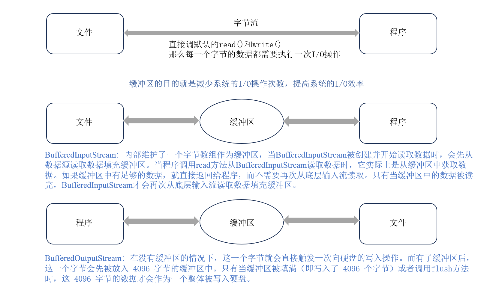
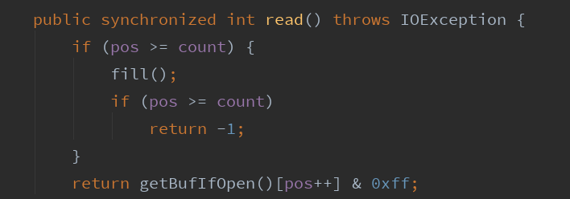
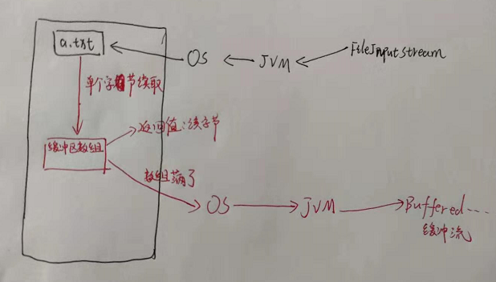
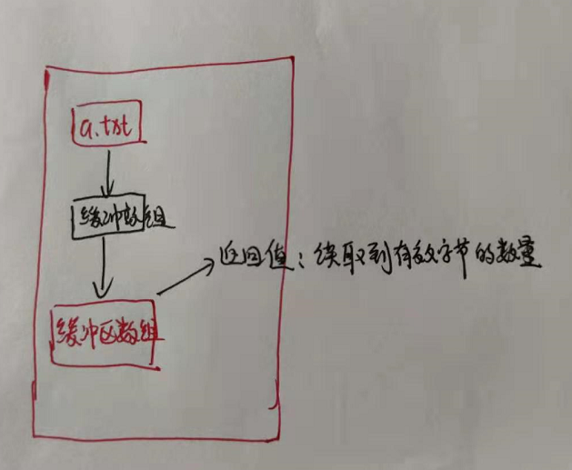
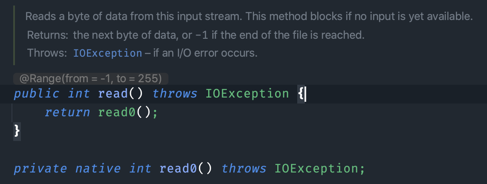
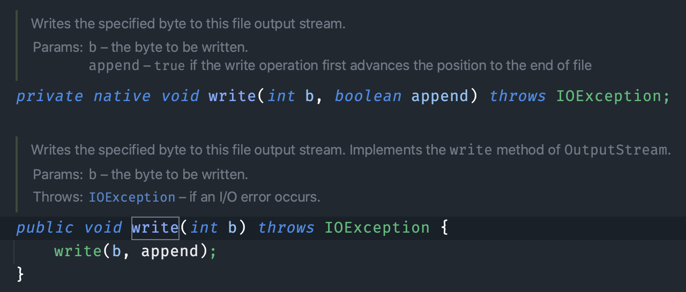
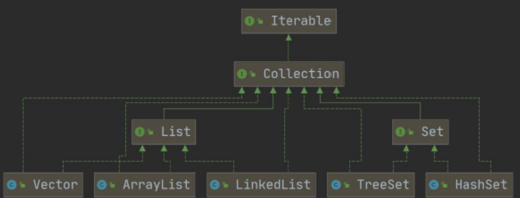
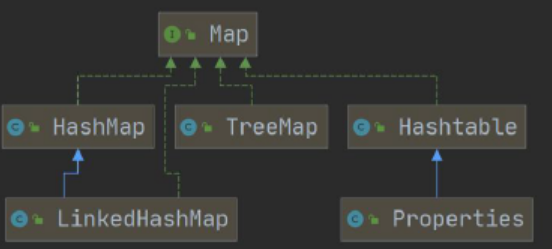

# 深拷贝与浅拷贝

1. 利用序列化和反序列化实现深拷贝的原理
   - 当对一个对象进行序列化时，对象的状态（包括基本数据类型成员变量的值和引用数据类型成员变量所指向对象的状态）会被转换为字节流。在反序列化过程中，会根据字节流重新构建对象。这个重新构建的过程实际上是创建了全新的对象，而不是简单地复制引用。
   - 对于引用数据类型的成员变量，会根据字节流中的信息重新创建这些对象，而不是共享原始对象的引用。这样就实现了深拷贝，即新对象和原始对象在内存中是完全独立的，修改其中一个对象不会影响到另一个对象。

# Java IO操作


IO 即 Input/Output，数据输入到计算机内存的过程即输入，反之输出到外部存储（比如数据库，文件，远程主机）的过程即输出。数据传输过程类似于水流，因此称为 IO 流。IO 流在 Java 中分为输入流和输出流，而根据数据的处理方式又分为字节流和字符流。

字节输入流FileInputStream（它用于从文件系统中的文件读取数据）。<u>当你实例化FileInputStream时，实际上是创建一个对象，这个对象可以用来打开一个到文件的输入流通道，以便后续从该文件中读取数据。</u>

```java
   FileInputStream fis = new FileInputStream("文件路径");
```



## InputStream（字节输入流）

常见的字节输入流FileInputStream（它用于从文件系统中的文件读取数据）。<u>当你实例化FileInputStream时，实际上是创建一个对象，这个对象可以用来打开一个到文件的输入流通道，以便后续从该文件中读取数据。</u>

```java
   FileInputStream fis = new FileInputStream("文件路径");
```

<font color=blue>值得注意的是</font>`InputStream`本身不会直接进行硬盘数据的读取操作，它只是在需要读取数据时，通过调用底层系统的 I/O 函数（这些函数会和硬件驱动等进行交互）来从已经定位的地址处获取数据。

InputStream常用方法：

（1）read():

```java
/*
从输入流中读取下一个数据字节。 值字节返回`int` ，范围为`0`至`255` 。 如果由于到达流末尾而没有可用字节，则返回值`-1` 。 此方法将阻塞，直到输入数据可用，检测到流的末尾或抛出异常。
- 结果
  数据的下一个字节，如果到达流的末尾， `-1` 。
- 异常
  `IOException` - 如果发生I / O错误。
*/
public abstract int read() throws IOException

```

<font color=blue>理解：</font>

read()方法没有缓冲区，每次的read操作会直接通过inputstream从磁盘读取到程序当中（程序运行时，也就是读取到内存当中），而read操作每次读取一个字节，那么意味着read方法会频繁地与硬盘进行交互，而若inputstream并没有准备好这一个字节的数据的地址，read则无法进行读取数据到内存当中，因而会阻塞（等待数据的地址定位）。


至于为什么read()读取一个字节却不是返回byte，而是将字节转为int返回，这涉及到计算机的编码问题：返回的int类型（32位bit）的-1可以表示为文件到了末尾，而如果是byte类型，如果文件的某个字节为-1，则无法判断是到了末尾还是文件本身存在-1的内容。https://www.bilibili.com/video/BV1L34y1R7Xs/?p=4&vd_source=f4c23eef1d4e259929ac8b44b97dd07b

Demo:

```java
public static void main(String[] args) {
		FileInputStream inputStream = null;
		try {
			// 111.txt中存储  helloworld世界
			inputStream = new FileInputStream("E:\\111.txt");
			int readdata;//每次读取一个字节，转成int类型返回
			while ( (readdata = inputStream.read()) != -1) {
				System.out.println((char)readdata);
			}
			
		
		}catch(FileNotFoundException e) {
			e.printStackTrace();
		}catch(IOException e) {
			e.printStackTrace();
		}finally {
			try {
				inputStream.close();
			} catch (IOException e) {
				// TODO Auto-generated catch block
				e.printStackTrace();
			}
		}
		
	}
```

返回的结果是`helloworld世ç`，出现乱码，这是因为windows的txt默认编码为utf-8，而英文字符占一个字节，中文字符占3个字节，因此无法打出世界这个两个中文

（2）read(byte[] b)

```java
/*
从输入流中读取一些字节数并将它们存储到缓冲区数组b 。 实际读取的字节数以整数形式返回。 此方法将阻塞，直到输入数据可用，检测到文件结尾或引发异常。
如果b的长度为零，则不读取任何字节，并返回0 ; 否则，尝试读取至少一个字节。 如果由于流位于文件末尾而没有可用字节，则返回值-1 ; 否则，至少读取一个字节并存储到b 。
参数
b - 读取数据的缓冲区。
结果
读入缓冲区的总字节数，如果由于已到达流末尾而没有更多数据， -1 。
*/
public int read(byte[] b) throws IOException
```

byte[]b缓冲区，之前read()，每一个字节的数据都需要调动一次IO操作，从硬盘再到内存当中，设立一个缓冲区，每次读取的数据存储在该缓冲区内（程序里自建当然在内存当中），再读取数据时候就可以直接从缓冲区中拿，内存之间的传输就很快了，避免了之前频繁访问硬盘的问题。

<font color=blue>这里需要注意的是:</font> byte[] b（假设你开辟了8个字节大小 byte[] b = new byte[8]）作为缓冲区是重复使用的，当到了文件的末尾，最后只剩下6个，那么b的前6个字节会被覆盖，而最后2个字节则仍然是上一次读取的数据，代码如下：

```java
public static void main(String[] args) {
		FileInputStream inputStream = null;
		try {
			// 111.txt中存储helloworld世界你好
			// 10个英文10个字节 + 4个中文每个中文3个字节12个字节 = 22
			inputStream = new FileInputStream("E:\\111.txt");
			int readlength;//读入到缓冲区的字节数，返回实际读取的字节数
			byte[] buf = new byte[8];
			while ( (readlength = inputStream.read(buf)) != -1) {
				System.out.print(readlength); // 886
				
			}
			
		
		}catch(FileNotFoundException e) {
			e.printStackTrace();
		}catch(IOException e) {
			e.printStackTrace();
		}finally {
			try {
				inputStream.close();
			} catch (IOException e) {
				// TODO Auto-generated catch block
				e.printStackTrace();
			}
		}
		
	}
```

最后一次实际的读取字节数为6，打印出来：

```java
			inputStream = new FileInputStream("E:\\111.txt");
			int readlength;//读入到缓冲区的字节数，返回实际读取的字节数
			byte[] buf = new byte[8];
			while ( (readlength = inputStream.read(buf)) != -1) {
				//System.out.print(readlength); // 886
				System.out.println(new String(buf,0,readlength));
				
				/*结果：（这里也是碰巧没有将中文三个字节分开来）
				 * hellowor
				   ld世界
				   你好
				 * */
			}
```

(3) available()

```java

// 返回可以从此输入流中无阻塞地读取（或跳过）的字节数的估计值，可以是0，或者在检测到流结束时为0。
// InputStream类的available()方法用于返回此输入流中可以无阻塞地读取的字节数估计值。注意这是一个估计值，在某些情况下可能并不准确。
public int available() throws IOException
```

## OutputStream（字节输入流）

和InputStream相似不多赘述

FileOutputStream 方法:

(1) `void write(int b)`： 写入一个字节，虽然参数是一个 int 类型，但只有低 8 位才会写入，高 24 位会舍弃

```java
// b - 要写入的字节
// 将指定的字节写入此文件输出流。 实现write的方法OutputStream 。
public void write(int b) throws IOException
```

(2) `void write(byte b[], int off, int len)`： 将数组 b 中的从 off 位置开始，长度为 len 的字节写入

```java
// 将指定字节数组中的 b.length个字节写入此文件输出流。
public void write(byte[] b) throws IOException
```

(3) `void flush()`： 强制刷新，将缓冲区的数据写入 ,<font color=red>FileOutputStream flush方法为空s</font>，原因是FileOutputStream没有使用任何的缓冲区，因此flush()为空

要写入字节数组，可以调用getBytes()方法

```java
outputStream.write("helloworld123".getBytes());
```

## 缓冲流

Java 的缓冲流是对字节流和字符流的一种封装，通过在内存中开辟缓冲区来提高 I/O 操作的效率。Java 通过 BufferedInputStream 和 BufferedOutputStream 来实现字节流的缓冲，通过 BufferedReader 和 BufferedWriter 来实现字符流的缓冲。

```java
public class BufferedInputStream extends FilterInputStream {

    private static int DEFAULT_BUFFER_SIZE = 8192;

    /**
     * The maximum size of array to allocate.
     * Some VMs reserve some header words in an array.
     * Attempts to allocate larger arrays may result in
     * OutOfMemoryError: Requested array size exceeds VM limit
     */
    private static int MAX_BUFFER_SIZE = Integer.MAX_VALUE - 8;
```

直接使用默认缓冲流读取：

```java
// 记录开始时间
long start = System.currentTimeMillis();
// 创建流对象
try (BufferedInputStream bis = new BufferedInputStream(new FileInputStream("py.mp4"));
        BufferedOutputStream bos = new BufferedOutputStream(new FileOutputStream("copyPy.mp4"));){
    // 读写数据
    int b;
    while ((b = bis.read()) != -1) {
        bos.write(b);
    }
}
// 记录结束时间
long end = System.currentTimeMillis(); 
System.out.println("缓冲流使用数组复制时间:"+(end - start)+" 毫秒"); // 8016ms
```

可以换数组的方式来读写，代码如下：

```java
// 记录开始时间
long start = System.currentTimeMillis();
// 创建流对象
try (BufferedInputStream bis = new BufferedInputStream(new FileInputStream("py.mp4"));
        BufferedOutputStream bos = new BufferedOutputStream(new FileOutputStream("copyPy.mp4"));){
    // 读写数据
    int len;
    byte[] bytes = new byte[8*1024];
    while ((len = bis.read(bytes)) != -1) {
        bos.write(bytes, 0 , len);
    }
}
// 记录结束时间
long end = System.currentTimeMillis();
System.out.println("缓冲流使用数组复制时间:"+(end - start)+" 毫秒"); // 521ms
```

### <font color=red>**缓冲流是内置了一个数组，增加了效率，不是内置了数组吗，为何还需要传递一个数组增加效率呢？**</font>

首先声明一下缓冲流的基本原理：是在创建流对象时，会创建一个内置的默认大小的缓冲区数组，<font color=red>通过缓冲区读写，减少系统IO次数，</font>从而提高读写的效率。通过看源码，知道了这个默认的缓冲区数组大小是8192。

标红的部分，减少的是 系统IO次数 ，但是 缓冲区读写  这个部分，缓冲流做了优化吗，答案是没有

我们回到源码，字节缓冲输入流的add()无参方法如下，看返回值我们知道它返回的是int，诶，为什么不是返回数组呢，不是内置了数组吗？



画一个示意图来说明吧，为什么说返回的是数组呢，因为返回给缓冲流的的确是数组，但是我们还有一个返回值就是我们每次读取的一个字节，源码的数据返回类型是int也证明了这一点，我们可以输出上面我提供的代码里面的b

就会知道的确每一次从被读取的文件中读数据是一个个字节读的，这样效率就很低下



因此就有了我提供的代码里面的那种写法，缓冲区数组不再一个个读取，而是一次读取一个字符数组，这样在缓冲区读写这个部分进行了再次优化，实际过程如下（部分）



缓冲流内置的缓冲区数组增加的效率的原因是在文件所在位置，也就是磁盘位置，到缓冲流这个部分的IO次数进行了优化，但是没有对读取磁盘文件这个步骤做优化，仍是单字节读取

我们可以使用数组读取的方式从磁盘读，进一步提升速度。

### 为什么字节缓冲流会加快

字节缓冲流解决的就是这个问题：**一次多读点多写点，减少读写的频率，用空间换时间**。

- 减少系统调用次数：在使用字节缓冲流时，数据不是立即写入磁盘或输出流，而是先写入缓冲区，当缓冲区满时再一次性写入磁盘或输出流。这样可以减少系统调用的次数，从而提高 I/O 操作的效率。
- 减少磁盘读写次数：在使用字节缓冲流时，当需要读取数据时，缓冲流会先从缓冲区中读取数据，如果缓冲区中没有足够的数据，则会一次性从磁盘或输入流中读取一定量的数据。同样地，当需要写入数据时，缓冲流会先将数据写入缓冲区，如果缓冲区满了，则会一次性将缓冲区中的数据写入磁盘或输出流。这样可以减少磁盘读写的次数，从而提高 I/O 操作的效率。
- 提高数据传输效率：在使用字节缓冲流时，由于数据是以块的形式进行传输，因此可以减少数据传输的次数，从而提高数据传输的效率。

我们来看 BufferedInputStream 的 read 方法：

```java
public synchronized int read() throws IOException {
    if (pos >= count) {     // 如果当前位置已经到达缓冲区末尾
        fill();             // 填充缓冲区
        if (pos >= count)   // 如果填充后仍然到达缓冲区末尾，说明已经读取完毕
            return -1;      // 返回 -1 表示已经读取完毕
    }
    return getBufIfOpen()[pos++] & 0xff; // 返回当前位置的字节，并将位置加 1
}
```

再来看 FileInputStream 的 read 方法：



在这段代码中，`read0()` 方法是一个[本地方法](https://javabetter.cn/oo/native-method.html)，它的实现是由底层操作系统提供的，并不是 Java 语言实现的。在不同的操作系统上，`read0()` 方法的实现可能会有所不同，但是它们的功能都是相同的，都是用于**读取一个字节**。

再来看一下 BufferedOutputStream 的 `write(byte b[], int off, int len)` 方法：


```
public synchronized void write(byte b[], int off, int len) throws IOException {
    if (len >= buf.length) {    // 如果写入的字节数大于等于缓冲区长度
        /* 如果请求的长度超过了输出缓冲区的大小，
           先刷新缓冲区，然后直接将数据写入。
           这样可以避免缓冲流级联时的问题。*/
        flushBuffer();          // 先刷新缓冲区
        out.write(b, off, len); // 直接将数据写入输出流
        return;
    }
    if (len > buf.length - count) { // 如果写入的字节数大于空余空间
        flushBuffer();              // 先刷新缓冲区
    }
    System.arraycopy(b, off, buf, count, len); // 将数据拷贝到缓冲区中
    count += len;                             // 更新计数器
}
```

首先，该方法会检查写入的字节数是否大于等于缓冲区长度，如果是，则先将缓冲区中的数据刷新到磁盘中，然后直接将数据写入输出流。这样做是为了避免缓冲流级联时的问题，即缓冲区的大小不足以容纳写入的数据时，可能会引发级联刷新，导致效率降低。

> 级联问题（Cascade Problem）是指在一组缓冲流（Buffered Stream）中，由于缓冲区的大小不足以容纳要写入的数据，导致数据被分割成多个部分，并分别写入到不同的缓冲区中，最终需要逐个刷新缓冲区，从而导致性能下降的问题。

其次，如果写入的字节数小于缓冲区长度，则检查缓冲区中剩余的空间是否足够容纳要写入的字节数，如果不够，则先将缓冲区中的数据刷新到磁盘中。然后，使用 `System.arraycopy()` 方法将要写入的数据拷贝到缓冲区中，并更新计数器 count。

最后，如果写入的字节数小于缓冲区长度且缓冲区中还有剩余空间，则直接将要写入的数据拷贝到缓冲区中，并更新计数器 count。

也就是说，只有当 buf 写满了，才会 flush，将数据刷到磁盘，默认一次刷 8192 个字节。


```
public BufferedOutputStream(OutputStream out) {
    this(out, 8192);
}
```

如果 buf 没有写满，会继续写 buf。

对比一下 FileOutputStream 的 write 方法，同样是本地方法，一次只能写入一个字节。



当把 BufferedOutputStream 和 BufferedInputStream 配合起来使用后，就减少了大量的读写次数，尤其是 `byte[] bytes = new byte[8*1024]`，就相当于缓冲区的空间有 8 个 1024 字节，那读写效率就会大大提高。


## 字符流Reader/Writer


字节流是将内容转为了字节形式进行传输，1字节=8二进制，二进制可以传输任何类型的数据，因此字节流可以传输任何类型的数据

字符流处理的是16位的unicode字符

字符输入流Reader方法：

(1) `read()`：从输入流读取一个字符。

(2) `read(char[] cbuf)`：从输入流中读取一些字符，并将它们存储到字符数组 `cbuf`中


# 数据结构





##  Java HashMap

#### <font color=blue>Java HashMap put() 方法</font>

put()方法将指定的键值对插入到HashMap中。若插入的key对应的value已经存在，则执行value替换操作，返回旧的value值，如果不存在则执行插入，返回null

语法为：

```java
hashmap.put（K key，V value）
```

Demo：

```java
	HashMap<Character, Integer> dic = new HashMap<>();
	System.out.println( dic.put('a', 0) ); // null
	System.out.println( dic.put('a', 1) ); // 1
	System.out.println(dic); // {a=1}
```

#### <font color=blue>Java HashMap getOrDefault() 方法</font>

getOrDefault()方法获取指定key对应value，如果找不到key，则返回设置的默认值。

语法为：

```java
hashmap.getOrDefault(Object key, V defaultValue)
```

Demo：

```java
HashMap<Character, Integer> dic = new HashMap<>();
		// 字符串的字符频率统计
		String str = "abcdefabc";
		
		for (int i = 0;i<str.length();i++) {
			dic.put(str.charAt(i), dic.getOrDefault(str.charAt(i), 0)+1);
		}
		
		System.out.println(dic); //  {a=2, b=2, c=2, d=1, e=1, f=1}
```

#### <font color=blue>Java HashMap containsValue() 方法</font>

containsValue() 方法检查 hashMap 中是否存在指定的 value 对应的映射关系。

语法：

```java
public boolean containsValue(Object value)
```

Demo：

```java
		// 创建一个 HashMap
        HashMap<Integer, String> sites = new HashMap<>();

        // 往 HashMap 添加一些元素
        sites.put(1, "Google");
        sites.put(2, "Runoob");
        sites.put(3, "Taobao");
        System.out.println("sites HashMap: " + sites);

        //检查映射中值value是否有Java
        if(sites.containsValue("Runoob")) {
            System.out.println("Runoob 存在于 sites 中");
        }
```

#### <font color=blue>Java HashMap containsKey() 方法</font>

containsKey() 方法检查 hashMap 中是否存在指定的 key 对应的映射关系。

语法：

```java
public boolean containsKey(Object key)
```

Demo：

```java
		// 创建一个 HashMap
        HashMap<Integer, String> sites = new HashMap<>();

        // 往 HashMap 添加一些元素
        sites.put(1, "Google");
        sites.put(2, "Runoob");
        sites.put(3, "Taobao");
        System.out.println("sites HashMap: " + sites);

        //检查 key 为 1 是否存在
        if(sites.containsKey(1)) {
            System.out.println("key 为 1 存在于 sites 中");
        }
```


#### <font color=blue>Java HashMap values() 方法 </font>

values() 方法返回映射中所有 value 组成的 Set 视图。

语法：

```java
public Collection<V> values()
```

Demo：

```java
		HashMap<Character, Integer> dic = new HashMap<>();
		// 字符串的字符频率统计
		String str = "abcdefabc";
		
		for (int i = 0;i<str.length();i++) {
			dic.put(str.charAt(i), dic.getOrDefault(str.charAt(i), 0)+1);
		}
		
		Collection<Integer> values = dic.values();
		System.out.println(values);
		for (Integer value:values) {
			System.out.print(value);
		}
```
## <font color=red>**Java HashSet**</font>

HashSet 基于 HashMap 来实现的，是一个不允许有重复元素的集合。
HashSet 允许有 null 值。
HashSet 是无序的，即不会记录插入的顺序。
HashSet 不是线程安全的， 如果多个线程尝试同时修改 HashSet，则最终结果是不确定的。 您必须在多线程访问时显式同步对 HashSet 的并发访问。
HashSet 实现了 Set 接口。

#### <font color=blue>Java HashSet add() 方法</font>

添加元素：

```java
    HashSet<Integer> set1 = new HashSet<Integer>();
    	
    set1.add(1);
    set1.add(1);
    System.out.println(set1); // [1]
```

#### <font color=blue>Java HashSet contains() 方法</font>

如果此set包含指定的元素，则返回`true` 。 更正式地说，返回`true`当且仅当此set包含的元素`e` ，使得`Objects.equals(o, e)` 。

语法：

```java
public boolean contains(Object o)
```

Demo：

```java
    HashSet<String> sites = new HashSet<String>();
        sites.add("Google");
        sites.add("Runoob");
        sites.add("Taobao");
        sites.add("Zhihu");
        sites.add("Runoob");  // 重复的元素不会被添加
        System.out.println(sites.contains("Taobao")); // true
    }
```

#### <font color=blue>Java HashSet size() 方法</font>
返回此集合中的元素数（基数）。
语法：

```java
public int size()
```


## <font color=red><u>Java String</u></font> 

**length——数组的属性；**

**length()——String的方法；**

**size()——集合的方法；**

#### <font color=blue>Java charAt() 方法</font>

charAt()方法用于返回指定索引处的字符。索引范围为从 0 到 length() - 1。

语法：

```java
public char charAt(int index)
```

Demo:

```java
	String s = "www.baidu.com";
	char result = s.charAt(6);
    System.out.println(result);// i 
```

#### <font color=blue>Java String 遍历方法</font>

使用toCharArray()，增强for：

```java
    	String str = "1243523";
    	for (char c:str.toCharArray()) {
    		System.out.println(c);
    	}
```

使用charAt()，普通for循环：

```java
    	String str = "1243523";
    	for (int i=0; i<str.length() ; i++) {
    		System.out.println(str.charAt(i));
    	}
```

### <font color=red>**<u>Java ArrayList</u>**</font>

ArrayList 和 Vector 都实现了List接口，List接口继承了Collection接口，都是有序集合

区别在于Vector使用了**Synchronized** 来实现[线程同步](https://so.csdn.net/so/search?q=线程同步&spm=1001.2101.3001.7020)，是线程安全的，而 ArrayList 是非线程安全的。

```java
import java.util.ArrayList; // 引入 ArrayList 类

// E:泛型数据类型，用于设置objectName的数据类型，只能为引用类型
ArrayList<E> objectName =new ArrayList<>();　 // 初始化
// 错误ArrayList<char> ==> 正确ArrayList<Character>
```

#### <font color=blue>ArrayList 添加元素add</font>

```java
ArrayList<String> sites = new ArrayList<String>();
        sites.add("Google");
        sites.add("Runoob");
        sites.add("Taobao");
        sites.add("Weibo");
        System.out.println(sites);
```

#### <font color=blue>ArrayList 访问元素get()</font>

```java
ArrayList<String> sites = new ArrayList<String>();
        sites.add("Google");
        sites.add("Runoob");
        sites.add("Taobao");
        sites.add("Weibo");
        System.out.println(sites.get(1));  // 访问第二个元素
```

#### <font color=blue>ArrayList 修改元素set(int index, E element)</font>

```java
ArrayList<String> sites = new ArrayList<String>();
        sites.add("Google");
        sites.add("Runoob");
        sites.add("Taobao");
        sites.add("Weibo");
        sites.set(2, "Wiki"); // 第一个参数为索引位置，第二个为要修改的值
        System.out.println(sites);
```

#### <font color=blue>ArrayList 删除元素remove()</font>

```java
ArrayList<String> sites = new ArrayList<String>();
        sites.add("Google");
        sites.add("Runoob");
        sites.add("Taobao");
        sites.add("Weibo");
        sites.remove(3); // 删除第四个元素
        System.out.println(sites);
```

#### <font color=blue>ArrayList 计算大小size()</font> Collection都是size()

```java
ArrayList<String> sites = new ArrayList<String>();
System.out.println(sites.size());
```

## <u>Java Arrays：专为数组而生的工具类</u>

#### <font color=blue>Arrays 创建数组</font>

1.  copyOf：复制指定的数组，截取或用 null 填充

   ```java
   String[] intro = new String[] { "沉", "默", "王", "二" };
   String[] revised = Arrays.copyOf(intro, 3);
   String[] expanded = Arrays.copyOf(intro, 5);
   System.out.println(Arrays.toString(revised));
   System.out.println(Arrays.toString(expanded));
   ```

2. copyOfRange，复制指定范围内的数组到一个新的数组：

   ```java
   String[] intro = new String[] { "沉", "默", "王", "二" };
   String[] abridgement = Arrays.copyOfRange(intro, 0, 3);
   System.out.println(Arrays.toString(abridgement));
   ```

3. fill，对数组进行填充：

   ```java
   String[] stutter = new String[4];
   Arrays.fill(stutter, "沉默王二");
   System.out.println(Arrays.toString(stutter)); 
   // [沉默王二, 沉默王二, 沉默王二, 沉默王二] 如果想要一个元素完全相同的数组时 fill() 方法就派上用场了
   ```

#### <font color=blue>Arrays 比较数组</font>

Arrays 类的 `equals()` 方法用来判断两个数组是否相等：

```java
String[] intro = new String[] { "沉", "默", "王", "二" };
boolean result = Arrays.equals(new String[] { "沉", "默", "王", "二" }, intro);
System.out.println(result);
boolean result1 = Arrays.equals(new String[] { "沉", "默", "王", "三" }, intro);
System.out.println(result1);
```

#### <font color=blue>Arrays 数组排序</font>

Arrays 类的 `sort()` 方法用来对数组进行排序：

```java
String[] intro1 = new String[] { "chen", "mo", "wang", "er" };
String[] sorted = Arrays.copyOf(intro1, 4);
Arrays.sort(sorted);
System.out.println(Arrays.toString(sorted));
```

#### <font color=blue>Arrays 数组检索</font>

数组排序后就可以使用 Arrays 类的 `binarySearch()` 方法进行二分查找了。否则的话，只能线性检索，效率就会低很多。

```java
String[] intro1 = new String[] { "chen", "mo", "wang", "er" };
String[] sorted = Arrays.copyOf(intro1, 4);
Arrays.sort(sorted);
int exact = Arrays.binarySearch(sorted, "wang");
System.out.println(exact);
int caseInsensitive = Arrays.binarySearch(sorted, "Wang", String::compareToIgnoreCase);
System.out.println(caseInsensitive);
```

#### <font color=blue>Arrays 数组打印</font>

```java
Arrays.toString()
```

#### <font color=blue>Arrays 数组转 List</font>

尽管数组非常强大，但它自身可以操作的工具方法很少，比如说判断数组中是否包含某个值。如果能转成 List 的话，就简便多了，因为 Java 的[集合框架 List](https://javabetter.cn/collection/gailan.html) 中封装了很多常用的方法。

```java
String[] intro = new String[] { "沉", "默", "王", "二" };
List<String> rets = Arrays.asList(intro);
System.out.println(rets.contains("二"));
```

不过需要注意的是，`Arrays.asList()` 返回的是 `java.util.Arrays.ArrayList`，并不是` java.util.ArrayList`，它的长度是固定的，无法进行元素的删除或者添加。

要想操作元素的话，需要多一步转化，转成真正的 `java.util.ArrayList`：

```java
List<String> rets1 = new ArrayList<>(Arrays.asList(intro));
rets1.add("三");
rets1.remove("二");
```

