#  MyBatis

MyBatis是一款优秀的持久型（JavaEE三层架构：表现层、业务层和持久层/数据访问层）框架，它支持自定义SQL、存储过程以及高级映射。MyBatis免除了几乎所有的JDBC代码以及设置参数和获取结果集的工作。MyBatis可以通过简单的XML或注解来配置和映射原始类型、接口和Java POJO（Plain Old Java Objects，普通老式Java对象）为数据库中的记录。

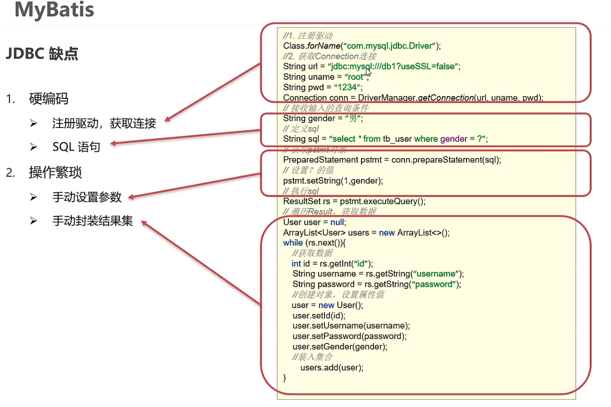
 ## MyBatis快速入门

### 创建user表，添加数据

```sql
create database mybatisDb; 
use mybatisDb;
drop table if exists tb_user;
create table tb_user( 
	id int primary key auto_increment, 
	username varchar(20), 
	password varchar(20), 
	gender char(1), 
	addr varchar(30) 
); 

INSERT INTO tb_user VALUES (1,'zhangsan','123','男','北京'); 
INSERT INTO tb_user VALUES (2,'李四','234','女','天津'); 
INSERT INTO tb_user VALUES (3,'王五','11','男','西安');
```

### 创建模块，导入坐标

通过maven创建java项目，pom.xml导入依赖：

```xml 
    <dependencies>
        <dependency>
            <groupId>org.mybatis</groupId>
            <artifactId>mybatis</artifactId>
            <version>3.5.9</version>
        </dependency>

        <dependency>
            <groupId>mysql</groupId>
            <artifactId>mysql-connector-java</artifactId>
            <version>8.0.28</version>
        </dependency>
    </dependencies>
```

### 编写MyBatis核心配置文件，--> 替换连接信息，解决硬编码问题


```xml
<?xml version="1.0" encoding="UTF-8" ?>
<!DOCTYPE configuration
        PUBLIC "-//mybatis.org//DTD Config 3.0//EN"
        "http://mybatis.org/dtd/mybatis-3-config.dtd">
<configuration>
    <environments default="development">
        <environment id="development">
            <transactionManager type="JDBC"/>
            <dataSource type="POOLED">
                <!-- 数据库连接信息-->
                <!--
                MySQL 8.0 以上 com.mysql.jdbc.Driver 更换为 com.mysql.cj.jdbc.Driver
                -->
                <property name="driver" value="com.mysql.cj.jdbc.Driver"/>
                <!--
                    mybatisDb是数据库名称
                    jdbc:mysql:// 是连接协议
                    在 xml 中 & 符合要转义成 &amp; 符号
                    MySQL 8.0 以上版本不需要建立 SSL 连接的，需要显示关闭。
                    allowPublicKeyRetrieval=true 允许客户端从服务器获取公钥。
                    最后还需要设置 CST(也就是设置时区)。
                -->
                <property name="url" value="jdbc:mysql://localhost:3306/mybatisDB?useSSL=false&amp;allowPublicKeyRetrieval=true&amp;serverTimezone=UTC"/>
                <property name="username" value="root"/>
                <property name="password" value="xxxx"/>
            </dataSource>
        </environment>
    </environments>
    <mappers>
        <!--
        加载映射文件。
        映射文件即SQL映射文件，该文件中配置了操作数据库的SQL语句，需要在MyBatis配置文件mybatis-config.xml中加载。
        mybatis-config.xml 文件可以加载多个映射文件，每个文件对应数据库中的一张表。
				一般会有个规范写法，操作User表就是 UserMapper.xml
        -->
        <mapper resource="mapper/UserMapper.xml"/>
    </mappers>
</configuration>
```

#### 创建 Mapper XML 文件

sql语句将通过namespace.sqlId获得sql语句。

```xml
<!DOCTYPE mapper
        PUBLIC "-//mybatis.org//DTD mapper 3.0//EN"
        "http://mybatis.org/dtd/mybatis-3-mapper.dtd">
<!-- UserMapper.xml -->
<!-- namespace 名称空间 通过namespace.sqlId获得sql语句 -->
<!-- com.sza.mapper.UserMapper.selectAll-->
<mapper namespace="com.sza.mapper.UserMapper">
    <!--  resultType指向封装的java类  -->
    <select id="selectAll" resultType="com.sza.pojo.User">
        SELECT * FROM tb_user;
    </select>
</mapper>
```

Mapper XML文件，通常存放在项目的classpath下的一个目录中，例如`resources/mapper/UserMapper.xml`。在上述示例中，我们定义了一个名为`selectAll`的查询操作，并将结果映射到`com.sza.pojo.User`类型（封装数据表的数据）的对象中。

#### 配置 MyBatis

要使用Mapper XML文件，需要在MyBatis的配置文件中引入它们。MyBatis的配置文件通常是mybatis-config.xml，您需要在其中配置Mapper XML文件的路径。

```xml
<!-- mybatis-config.xml -->
<configuration>
    <mappers>
        <mapper resource="mapper/UserMapper.xml"/>
    </mappers>
</configuration>
```

在上述配置中，我们使用`<mappers>`元素引入了Mapper XML文件，使用`<mapper>`元素的`resource`属性指定了XML文件的路径。

### 编码

### 定义POJO类

```java
package com.sza.pojo;

public class User {
    private Integer id;
    private String username;
    private String password;
    private String gender;
    private String address;


    public Integer getId() {
        return id;
    }

    public void setId(Integer id) {
        this.id = id;
    }

    public String getUsername() {
        return username;
    }

    public void setUsername(String username) {
        this.username = username;
    }

    public String getPassword() {
        return password;
    }

    public void setPassword(String password) {
        this.password = password;
    }

    public String getGender() {
        return gender;
    }

    public void setGender(String gender) {
        this.gender = gender;
    }

    public String getAddress() {
        return address;
    }

    public void setAddress(String address) {
        this.address = address;
    }

    @Override
    public String toString() {
        return "User{" +
                "id=" + id +
                ", username='" + username + '\'' +
                ", password='" + password + '\'' +
                ", gender='" + gender + '\'' +
                ", address='" + address + '\'' +
                '}';
    }
}
```

 ### 加载核心配置文件，获取sqlSessionFactory对象，执行sql语句

```java
package com.sza;

import com.sza.pojo.User;
import org.apache.ibatis.io.Resources;
import org.apache.ibatis.session.SqlSession;
import org.apache.ibatis.session.SqlSessionFactory;
import org.apache.ibatis.session.SqlSessionFactoryBuilder;

import java.io.IOException;
import java.io.InputStream;
import java.util.List;

public class MybatisDemo {
    public static void main(String[] args) throws IOException {

        // 1.加载mybatis的核心配置文件，获取sqlSessionFactory
        String resource = "mybatis-config.xml";
        InputStream inputStream = Resources.getResourceAsStream(resource);
        SqlSessionFactory sqlSessionFactory = new SqlSessionFactoryBuilder().build(inputStream);

        // 2.获取sqlSession对象，用它来执行sql
        SqlSession sqlSession = sqlSessionFactory.openSession();

        // 3.执行sql
        List<User> users = sqlSession.selectList("com.sza.mapper.UserMapper.selectAll");
        System.out.println(users);

        // 4.释放资源
        sqlSession.close();

    }
}
```

## 解决SQL映射文件的警告提示

产生原因：idea没和数据库建立连接，不识别表信息

解决方式：在idea中配置MySQL数据库连接

 
## Mapper代理开发

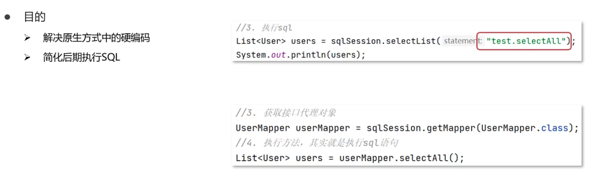

- 定义与SQL映射文件同名的Mapper接口，并且将Mapper接口与SQL映射文件放置在同一目录下

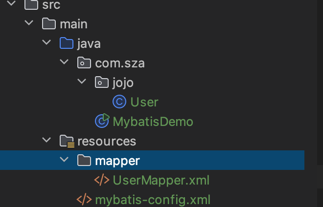
虽然在idea上配置文件和源代码是分离的，但编译过后`resources`和`java`两个是在一起的。

使用maven的compile编译一下：


因此：我们在`java`目录下和`resources`下创建相同的路径，最后编译就会在同一目录下：

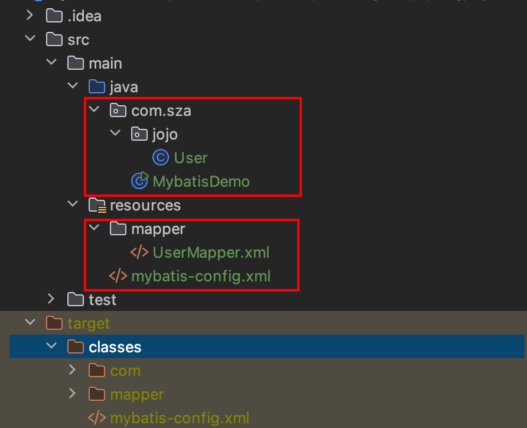

- 设置SQL映射文件的namespace属性为Mapper接口全限定名

```xml
<!-- 设置配置文件的namespace为对应接口全限定名-->
<mapper namespace="com.sza.mapper.UserMapper">
    <!--  resultType指向封装的java类  -->
    <select id="selectAll" resultType="com.sza.pojo.User">
        SELECT * FROM tb_user;
    </select>
</mapper>
```

- 在Mapper接口中定义方法，方法名就是SQL映射文件中sql语句的id，并保持参数类型和返回值类型一致

```java
public interface UserMapper {
    List<User> selectAll();
}
```

- 编码：通过SqlSession的getMapper方法获取Mapper接口的代理对象，调用对应方法完成sql的执行

```java
         // 3.1 获取UserMapper接口的代理对象
        UserMapper userMapper = sqlSession.getMapper(UserMapper.class);
        List<User> users = userMapper.selectAll();
        System.out.println(users);
```

- 此外。如果Mapper接口名称和SQL映射文件名称相同，并且在同一目录下，则可以使用包扫描的方式简化SQL映射文件的加载。

```xml
    <mappers>
        <!--
        加载映射文件。
        映射文件即SQL映射文件，该文件中配置了操作数据库的SQL语句，需要在MyBatis配置文件mybatis-config.xml中加载。
        mybatis-config.xml 文件可以加载多个映射文件，每个文件对应数据库中的一张表。

        -->
        <!--        <mapper resource="com/sza/mapper/UserMapper.xml"/>-->
        <!-- 使用包扫描的方式 -->
        <package name="com.sza.mapper"/>
    </mappers>
```

## Mybatis核心配置文件

```xml
<?xml version="1.0" encoding="UTF-8" ?>
<!DOCTYPE configuration
        PUBLIC "-//mybatis.org//DTD Config 3.0//EN"
        "http://mybatis.org/dtd/mybatis-3-config.dtd">
<configuration>
<!--
environments：配置数据库连接环境信息
可以配置多个environment，通过default属性切换不同的environment 例如不同的数据源
-->
    <environments default="development">
        <environment id="development">
<!--    transactionManager（事务管理器）-->
            <transactionManager type="JDBC"/>
<!--    dataSource（数据源）-->
            <dataSource type="POOLED">
                <!-- 数据库连接信息-->
                <!--
                MySQL 8.0 以上 com.mysql.jdbc.Driver 更换为 com.mysql.cj.jdbc.Driver
                -->
                <property name="driver" value="com.mysql.cj.jdbc.Driver"/>
                <!--
                    mybatisDb是数据库名称
                    jdbc:mysql:// 是连接协议
                    在 xml 中 & 符合要转义成 &amp; 符号
                    MySQL 8.0 以上版本不需要建立 SSL 连接的，需要显示关闭。
                    allowPublicKeyRetrieval=true 允许客户端从服务器获取公钥。
                    最后还需要设置 CST(也就是设置时区)。
                -->
                <property name="url" value="jdbc:mysql://localhost:3306/mybatisDb?useSSL=false&amp;allowPublicKeyRetrieval=true&amp;serverTimezone=UTC"/>
                <property name="username" value="root"/>
                <property name="password" value="sunZIANG0415!"/>
            </dataSource>
        </environment>
    </environments>
    <mappers>
        <!--
        加载映射文件。
        映射文件即SQL映射文件，该文件中配置了操作数据库的SQL语句，需要在MyBatis配置文件mybatis-config.xml中加载。
        mybatis-config.xml 文件可以加载多个映射文件，每个文件对应数据库中的一张表。

        -->
        <!--        <mapper resource="com/sza/mapper/UserMapper.xml"/>-->
        <!-- 使用包扫描的方式 -->
        <package name="com.sza.mapper"/>
    </mappers>
    
</configuration>
```

## Mybatis案例实操

### 数据准备

数据库表：

```sql
use mybatisDb;  
drop table if exists tb_brand;  
create table tb_brand( 
id int primary key auto_increment,  
brand_name varchar(20),  company_name varchar(20),  
orderd int,  
description varchar(100),  
status int  );  
insert into tb_brand(brand_name, company_name, orderd, description, status) VALUES('三只松鼠','三只松鼠有限',5,'好好',0), ('asd','asda',100,'sdasd',1); 
select *from tb_brand;
```

实体类：

```java
package com.sza.pojo;

public class Brand {
    private Integer id;
    private String BrandName;
    private String companyName;
    private Integer ordered;
    private String description;
    private Integer status;

    public Integer getId() {
        return id;
    }

    public void setId(Integer id) {
        this.id = id;
    }

    public String getBrandName() {
        return BrandName;
    }

    public void setBrandName(String brandName) {
        BrandName = brandName;
    }

    public String getCompanyName() {
        return companyName;
    }

    public void setCompanyName(String companyName) {
        this.companyName = companyName;
    }

    public Integer getOrdered() {
        return ordered;
    }

    public void setOrdered(Integer ordered) {
        this.ordered = ordered;
    }

    public String getDescription() {
        return description;
    }

    public void setDescription(String description) {
        this.description = description;
    }

    public Integer getStatus() {
        return status;
    }

    @Override
    public String toString() {
        return "Brand{" +
                "id=" + id +
                ", BrandName='" + BrandName + '\'' +
                ", companyName='" + companyName + '\'' +
                ", ordered=" + ordered +
                ", description='" + description + '\'' +
                ", status=" + status +
                '}';
    }

    public void setStatus(Integer status) {
        this.status = status;
    }

}
```

安装插件MybatisX：配置文件和源文件会有对应


### 功能实现

#### 查询：查询所有数据

- 编写接口方法：Mapper接口

```java
package com.sza.mapper;

import com.sza.pojo.Brand;

import java.util.List;

public interface BrandMapper {
    List<Brand> selectAll();
}
```

- 参数：无
- 结果：List<Brand> 

- 编写sql语句：sql映射文件

```java
<!DOCTYPE mapper
        PUBLIC "-//mybatis.org//DTD mapper 3.0//EN"
        "http://mybatis.org/dtd/mybatis-3-mapper.dtd">

<mapper namespace="com.sza.mapper.BrandMapper">

    <select id="selectAll" resultType="com.sza.pojo.Brand">
        select *
        from tb_brand;
    </select>
</mapper>
```

- 执行方法，测试

```java
public class MybatisTest {
    @Test
    public void testSelectAll() throws IOException {
        // 1.加载mybatis的核心配置文件，获取sqlSessionFactory
        String resource = "mybatis-config.xml";
        InputStream inputStream = Resources.getResourceAsStream(resource);
        SqlSessionFactory sqlSessionFactory = new SqlSessionFactoryBuilder().build(inputStream);


        // 2.获取sqlSession对象，用它来执行sql
        SqlSession sqlSession = sqlSessionFactory.openSession();

        // 3.1 获取BrandMapper接口的代理对象
        BrandMapper mapper = sqlSession.getMapper(BrandMapper.class);
        List<Brand> brands = mapper.selectAll();
        System.out.println(brands);
        // 4.释放资源
        sqlSession.close();
    }
}
```


我们发现BrandName和companyName的值都为null

- 数据表的column和封装类的属性对应不上：

  
  我们发现Brand类的BrandName和companyName和数据表中的字段brand_name和company_name对应不上，因此无法自动装填。

  使用`resultMap`对不一致的进行映射：

  ```xml
  <!--BrandMapper.xml-->
  <!DOCTYPE mapper
          PUBLIC "-//mybatis.org//DTD mapper 3.0//EN"
          "http://mybatis.org/dtd/mybatis-3-mapper.dtd">
  
  <mapper namespace="com.sza.mapper.BrandMapper">
  
  <!--
      将数据表的column与Brand类不对应的属性 一一对应起来
      id唯一标识
      type映射类型，支持别名
  -->
      <resultMap id="brandResultMap" type="com.sza.pojo.Brand">
  <!--
      id: 完成主键字段的映射
      <id column="id" property="id"/>
      result：完成一半字段的映射
        <result column="brand_name" property="brandName"/>
  
  -->
  
          <result column="brand_name" property="brandName"/>
          <result column="company_name" property="companyName"/>
      </resultMap>
  <!--  这里不再使用resultType，而是使用resultMap  -->
      <select id="selectAll" resultMap="brandResultMap">
          select *
          from tb_brand;
      </select>
  </mapper>
  ```

  再次运行结果：

  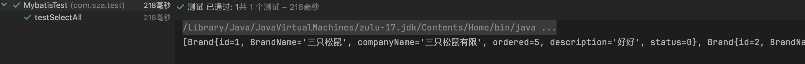

#### 查询：查询详情

- 编写接口方法：Mapper方法

```java
public interface BrandMapper {
    List<Brand> selectAll();

    Brand selectById(int id);
}
```

- 参数 ：id
- 结果：Brand
- 编写SQL语句

```java
<!--
    参数占位符：
    1. #{}: 会将这个地方替换为? 防止sql注入
    2. ${}: 会拼接sql语句  会存在sql注入问题
-->
		<select id="selectById" resultMap="brandResultMap">
        select *
        from tb_brand where id = #{id}
    </select>
```

- 执行方法，测试

```java
    @Test
    public void testSelectById() throws IOException {
        // 1.加载mybatis的核心配置文件，获取sqlSessionFactory
        String resource = "mybatis-config.xml";
        InputStream inputStream = Resources.getResourceAsStream(resource);
        SqlSessionFactory sqlSessionFactory = new SqlSessionFactoryBuilder().build(inputStream);


        // 2.获取sqlSession对象，用它来执行sql
        SqlSession sqlSession = sqlSessionFactory.openSession();

        // 3.1 获取BrandMapper接口的代理对象
        BrandMapper mapper = sqlSession.getMapper(BrandMapper.class);
        int id = 1;
        Brand brand = mapper.selectById(id);
        System.out.println(brand);
        // 4.释放资源
        sqlSession.close();
    }
```

#### 查询：多条件查询

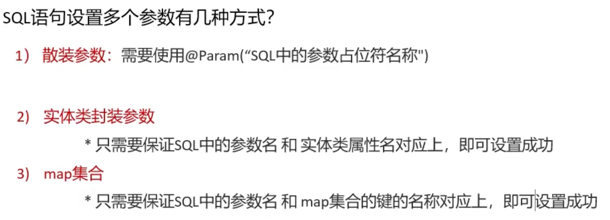

- 编写接口方法 ：Mapper接口

```java
//    @Param("xxx") 是为了匹配 sql语句中#{xxx}的占位符
    List<Brand> selectByCondition(@Param("status")int status,@Param("companyName")String companyName,@Param("brandName")String brandName);
```

```java
//  如果参数都属于同一个对象，那么其实可以封装成一个对象作为参数  那么sql语句中 #{xxx} 就会去找该对象中的属性
    List<Brand> selectByCondition(Brand brand);
```

```java
//  当然也可以传入键值对 sql语句中的#{xxx}就会找map中对应的key
    List<Brand> selectByCondition(Map map);
```

- 参数：多个参数
- 结果List<Brand>
- 编写SQL语句

在 SQL 中，`||`是一个字符串连接运算符。它用于将两个或多个字符串连接在一起，形成一个新的字符串。例如，在查询语句`select 'abc' || 'def';`中，结果将是`abcdef`，即将`'abc'`和`'def'`这两个字符串连接起来。

在 MySQL 中，字符串连接运算符是`CONCAT()`函数，而不是`||`。例如，在 MySQL 中上述的字符串连接操作可以写成`CONCAT(#{companyName}, '%')`

```xml
<!--    #{xxx} 中的xxx尽量与类中的属性保持一致，会省去很多麻烦  -->
    <select id="selectByCondition" resultMap="brandResultMap">
        select *
        from tb_brand
        where status= #{status}
        and company_name like concat('%',#{companyName},'%')
        and brand_name like concat('%',#{brandName},'%')
    </select>
```

- 执行方法，测试

散装参数，方法中有多个参数，需要使用@Param("SQL参数占位符")

```java
//    @Param("xxx") 是为了匹配 sql语句中#{xxx}的占位符
    List<Brand> selectByCondition(@Param("status")int status,@Param("companyName")String companyName,@Param("brandName")String brandName);
```

```java
    @Test
    public void testSelectByCondition() throws IOException {
        int status = 1;
        String conpanyName = "三只";
        String brandName = "松鼠";

        // 1.加载mybatis的核心配置文件，获取sqlSessionFactory
        String resource = "mybatis-config.xml";
        InputStream inputStream = Resources.getResourceAsStream(resource);
        SqlSessionFactory sqlSessionFactory = new SqlSessionFactoryBuilder().build(inputStream);


        // 2.获取sqlSession对象，用它来执行sql
        SqlSession sqlSession = sqlSessionFactory.openSession();

        // 3.1 获取BrandMapper接口的代理对象
        BrandMapper mapper = sqlSession.getMapper(BrandMapper.class);
        List<Brand> brands = mapper.selectByCondition(status, conpanyName, brandName);
        System.out.println(brands);
        // 4.释放资源
        sqlSession.close();
    }
```

对象参数：

```java
//  如果参数都属于同一个对象，那么其实可以封装成一个对象作为参数  那么sql语句中 #{xxx} 就会去找该对象中的属性
    List<Brand> selectByCondition(Brand brand);
```

```java
@Test
    public void testSelectByCondition() throws IOException {
        int status = 1;
        String conpanyName = "三只";
        String brandName = "松鼠";

        Brand brand = new Brand();
        brand.setBrandName(brandName);
        brand.setStatus(status);
        brand.setCompanyName(conpanyName);

        // 1.加载mybatis的核心配置文件，获取sqlSessionFactory
        String resource = "mybatis-config.xml";
        InputStream inputStream = Resources.getResourceAsStream(resource);
        SqlSessionFactory sqlSessionFactory = new SqlSessionFactoryBuilder().build(inputStream);


        // 2.获取sqlSession对象，用它来执行sql
        SqlSession sqlSession = sqlSessionFactory.openSession();

        // 3.1 获取BrandMapper接口的代理对象
        BrandMapper mapper = sqlSession.getMapper(BrandMapper.class);
//        List<Brand> brands = mapper.selectByCondition(status, conpanyName, brandName);
        List<Brand> brands = mapper.selectByCondition(brand);
        System.out.println(brands);
        // 4.释放资源
        sqlSession.close();
    }
```

map集合参数：

```java
//  当然也可以传入键值对 sql语句中的#{xxx}就会找map中对应的key
    List<Brand> selectByCondition(Map map);
```

```java
@Test
    public void testSelectByCondition() throws IOException {
        int status = 1;
        String conpanyName = "三只";
        String brandName = "松鼠";

//        Brand brand = new Brand();
//        brand.setBrandName(brandName);
//        brand.setStatus(status);
//        brand.setCompanyName(conpanyName);

        Map map = new HashMap();
        map.put("status", status);
        map.put("companyName", conpanyName);
        map.put("brandName", brandName);

        // 1.加载mybatis的核心配置文件，获取sqlSessionFactory
        String resource = "mybatis-config.xml";
        InputStream inputStream = Resources.getResourceAsStream(resource);
        SqlSessionFactory sqlSessionFactory = new SqlSessionFactoryBuilder().build(inputStream);


        // 2.获取sqlSession对象，用它来执行sql
        SqlSession sqlSession = sqlSessionFactory.openSession();

        // 3.1 获取BrandMapper接口的代理对象
        BrandMapper mapper = sqlSession.getMapper(BrandMapper.class);
//        List<Brand> brands = mapper.selectByCondition(status, conpanyName, brandName);
//        List<Brand> brands = mapper.selectByCondition(brand);
        List<Brand> brands = mapper.selectByCondition(map);
        System.out.println(brands);
        // 4.释放资源
        sqlSession.close();
    }
```

#### 查询：动态条件查询

SQL语句会随着用户的输入或外部条件的变化而变化，我们称为<font color=yellow>动态SQL</font>。

动态SQL是MyBatis的强大特性之一：

- `if`：使用动态 SQL 最常见情景是根据条件包含 where 子句的一部分

使用`test`进行逻辑判断，其中的变量是类中的属性，而不是数据库的字段。

```xml
    <select id="selectByCondition" resultMap="brandResultMap">
        select *
        from tb_brand
        where status= #{status}
        and company_name like concat('%',#{companyName},'%')
        and brand_name like concat('%',#{brandName},'%')
    </select>
```

例如在该where子句中，由三个条件组成，用户可能只勾选其中两个条件进行查询。我们可以使用`if`进行动态添加。

```xml
    <select id="selectByDynamicCondition" resultMap="brandResultMap">
        select *
        from tb_brand
        where
        <if test="status != null">
            status = #{status}
        </if>
        <if test="companyName != null and companyName != '' ">  -- 这里判断条件中的变量要是Brand类的属性，不要写成company_name
            and company_name like concat('%',#{companyName},'%')
        </if>
        <if test="brandName != null and brandName != '' ">
            and brand_name like concat('%',#{brandName},'%')
        </if>
    </select>
```

```java
// BrandMapper.java 中添加selectByDynamicCondition
List<Brand> selectByDynamicCondition(Brand brand);
```

假设我们给 status和companyName属性赋值

```java
@Test
    public void testSelectByDynamicCondition() throws IOException {
        int status = 1;
        String companyName = "三只";
        String brandName = "松鼠";


        Brand brand = new Brand();
        brand.setStatus(status);
        brand.setCompanyName(companyName);
//        brand.setBrandName(brandName);

        // 1.加载mybatis的核心配置文件，获取sqlSessionFactory
        String resource = "mybatis-config.xml";
        InputStream inputStream = Resources.getResourceAsStream(resource);
        SqlSessionFactory sqlSessionFactory = new SqlSessionFactoryBuilder().build(inputStream);


        // 2.获取sqlSession对象，用它来执行sql
        SqlSession sqlSession = sqlSessionFactory.openSession();

        // 3.1 获取BrandMapper接口的代理对象
        BrandMapper mapper = sqlSession.getMapper(BrandMapper.class);

        List<Brand> brands = mapper.selectByDynamicCondition(brand);
        System.out.println(brands);
        // 4.释放资源
        sqlSession.close();
    }
```

运行会发现生成的sql语句：


说明是有效的，选择了 status = #{status}和 and company_name like concat('%',#{companyName},'%')两个条件进行查询，但是现在出现一个问题：<font color=yellow>如果不选择status这个条件，那么where后接的会有and，如下：</font>

```java
        Brand brand = new Brand();
//        brand.setStatus(status);
        brand.setCompanyName(companyName);
        brand.setBrandName(brandName);
```

运行报错：

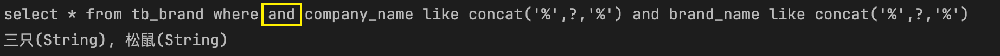

解决办法：使用`<where>`标签替换where关键字，`<whrer>`只会在它包含的标签中有返回值的情况下才插入 “WHERE” 子句。 而且，若子句的开头为 “AND” 或 “OR”，where标签也会将它们去除。

```xml
    <select id="selectByDynamicCondition" resultMap="brandResultMap">
        select *
        from tb_brand
        <where>
            <if test="status != null">
                status = #{status}
            </if>
            <if test="companyName != null and companyName != '' ">
                and company_name like concat('%',#{companyName},'%')
            </if>
            <if test="brandName != null and brandName != '' ">
                and brand_name like concat('%',#{brandName},'%')
            </if>
        </where>
    </select>
```


我们发现and被去除了，此外我们如果不设置任何的值：

```java
        Brand brand = new Brand();
//        brand.setStatus(status);
//        brand.setCompanyName(companyName);
//        brand.setBrandName(brandName);
```

运行，发现不会插入where子句：


- choose (when, otherwise) 选择 ，类似于Java中的switch语句，从多个条件中选择一个

```xml
    <select id="selectByConditionSingle" resultMap="brandResultMap">
        select *
        from tb_brand
        <where>
            <choose>
                <when test="status != null">
                    status = #{status}
                </when>
                <when test="companyName != null and companyName != '' ">
                    company_name like concat('%',#{companyName},'%')
                </when>
                <when test="brandName != null and brandName != '' ">
                    brand_name like concat('%',#{brandName},'%')
                </when>
                <otherwise>
                    1 = 1
                </otherwise>
            </choose>
        </where>
    </select>
```

`choose`相当于switch，`when`类似于case，`otherwise`类似于default。

- trim (where, set)
- foreach

####  添加

```xml
    <insert id="addBrand">
        INSERT into tb_brand (brand_name,company_name,ordered,description,status)
        VALUES (#{brandName},#{companyName},#{ordered},#{description},#{status})
    </insert>
```

需要执行sql语句后提交事务：

```java
       BrandMapper mapper = sqlSession.getMapper(BrandMapper.class);

        mapper.addBrand(brand);
        // 提交事务
        sqlSession.commit();
```

Mybatis事务，可以在openSession默认开启事务：

```java
        SqlSession sqlSession = sqlSessionFactory.openSession(true);
```

##### 主键返回

当我们添加东西，想要返回其主键id值：

```java
				mapper.addBrand(brand);
        // 提交事务
        sqlSession.commit();
        System.out.println(brand.getId()); // null
```

打印为null，及时数据库中添加了该数据

```xml
   <insert id="addBrand" useGeneratedKeys="true" keyProperty="id">
        INSERT into tb_brand (brand_name,company_name,ordered,description,status)
        VALUES (#{brandName},#{companyName},#{ordered},#{description},#{status})
    </insert>
```

添加useGeneratedKeys="true" keyProperty="id" id 为tb_brand的主键，添加该命令，返回添加数据的主键。再此添加，就会打印出添加的id。

#### 修改


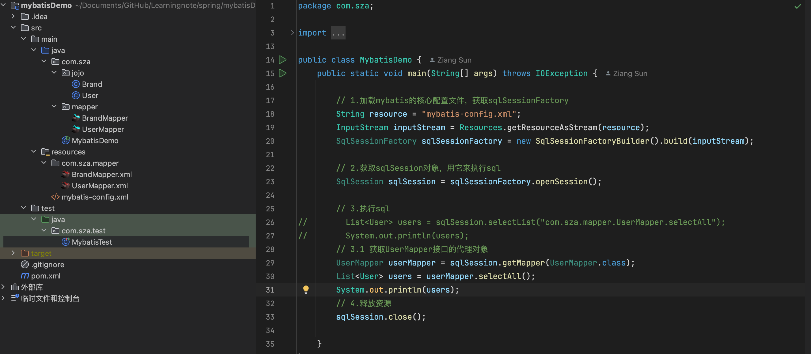

# Maven

Maven是apache旗下的一个开源项目，是一款用于管理和构建java项目的工具，它基于项目对象模型（POM，project object model）的概念，通过一小段描述信息来guan

Maven的作用：

- 方便快捷地管理项目依赖地资源jar包，避免版本冲突问题

- 提供统一、标准地项目结构

  - 一个使用Maven管理的普通的Java项目，它的目录结构默认如下：

  - ```xml
    a-maven-project
    ├── pom.xml
    ├── src
    │   ├── main
    │   │   ├── java
    │   │   └── resources
    │   └── test
    │       ├── java
    │       └── resources
    └── target
    ```

  - 项目的根目录`a-maven-project`是项目名，它有一个项目描述文件`pom.xml`，存放Java源码的目录是`src/main/java`，存放资源文件的目录是`src/main/resources`，存放测试源码的目录是`src/test/java`，存放测试资源的目录是`src/test/resources`，最后，所有编译、打包生成的文件都放在`target`目录里。这些就是一个Maven项目的标准目录结构。

    所有的目录结构都是约定好的标准结构，我们千万不要随意修改目录结构。使用标准结构不需要做任何配置，Maven就可以正常使用。

  - 最关键的一个项目描述文件`pom.xml`，它的内容长得像下面：

  - ```xml
    <project ...>
    	<modelVersion>4.0.0</modelVersion>
    	<groupId>com.itranswarp.learnjava</groupId>
    	<artifactId>hello</artifactId>
    	<version>1.0</version>
    	<packaging>jar</packaging>
    	<properties>
            <project.build.sourceEncoding>UTF-8</project.build.sourceEncoding>
    		<maven.compiler.release>17</maven.compiler.release>
    	</properties>
    	<dependencies>
            <dependency>
                <groupId>org.slf4j</groupId>
                <artifactId>slf4j-simple</artifactId>
                <version>2.0.16</version>
            </dependency>
    	</dependencies>
    </project>
    ```
  
    其中，`groupId`类似于Java的包名，通常是公司或组织名称，`artifactId`类似于Java的类名，通常是项目名称，再加上`version`，一个Maven工程就是由`groupId`，`artifactId`和`version`作为唯一标识。

    我们在引用其他第三方库的时候，也是通过这3个变量确定。例如，依赖`org.slfj4:slf4j-simple:2.0.16`：

    ```xml
    <dependency>
        <groupId>org.slf4j</groupId>
        <artifactId>slf4j-simple</artifactId>
        <version>2.0.16</version>
    </dependency>
    ```
  
    使用`<dependency>`声明一个依赖后，Maven就会自动下载这个依赖包并把它放到classpath中。

    另外，注意到`<properties>`定义了一些属性，常用的属性有：

    - `project.build.sourceEncoding`：表示项目源码的字符编码，通常应设定为`UTF-8`；
  - `maven.compiler.release`：表示使用的JDK版本，例如`21`；
    - `maven.compiler.source`：表示Java编译器读取的源码版本；
    - `maven.compiler.target`：表示Java编译器编译的Class版本。
  
    从Java 9开始，推荐使用`maven.compiler.release`属性，保证编译时输入的源码和编译输出版本一致。如果源码和输出版本不同，则应该分别设置`maven.compiler.source`和`maven.compiler.target`。

    通过`<properties>`定义的属性，就可以固定JDK版本，防止同一个项目的不同的开发者各自使用不同版本的JDK。

- 标准跨平台（Linux、Windows、MacOS）的自动化项目构建方式

  - 清理clean-->编译compile-->测试test-->打包package-->发布
  - 生成的文件会在target当中

  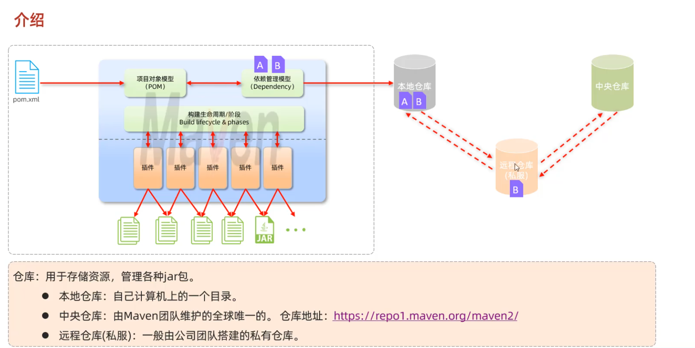

​	安装步骤：

1. 解压apache-maven-3.9.9-bin.zip 

2. 配置本地仓库，修改conf/setting.xml中的localRepository

   ```xml
     <!-- localRepository
      | The path to the local repository maven will use to store artifacts.
      |
      | Default: ${user.home}/.m2/repository
     <localRepository>/path/to/local/repo</localRepository>
     -->
     <localRepository>D:\APP\apache-maven-3.9.9-bin\apache-maven-3.9.9\mvn_repo</localRepository>
   ```

3. 配置阿里云的私服，修改con/setting.xml中的<mirrors>标签，为其添加如下子标签：

4. 配置环境变量：MAVEN_HOME为maven的解压目录，并将其bin目录加入PATH环境变量

5. 命令行中测试 

   ```shell
   mvn -v
   ```


IDEA创建Maven项目

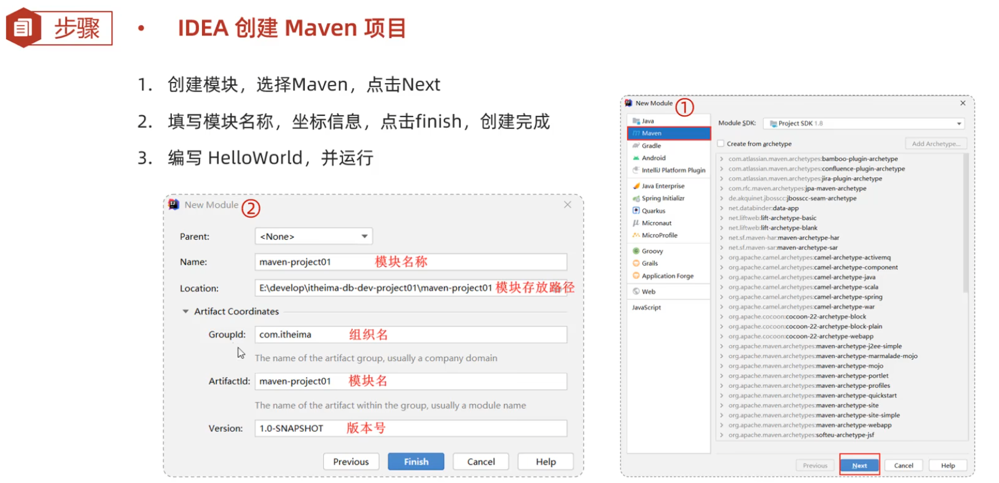

Maven中的坐标是<font color=red>资源的唯一标识，通过该坐标可以唯一定位资源的位置</font>

使用坐标来定义项目或引入项目中需要的依赖

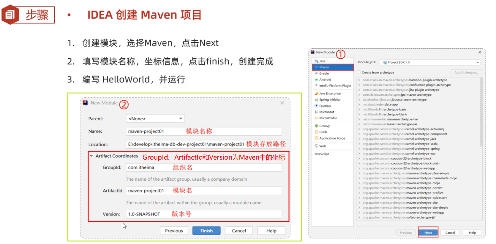

- groupId：定义当前Maven项目隶属组织名称
- artifactId：定义当前Maven项目名称（通常是模块名称）
- version：定义当前项目版本号

依赖配置：

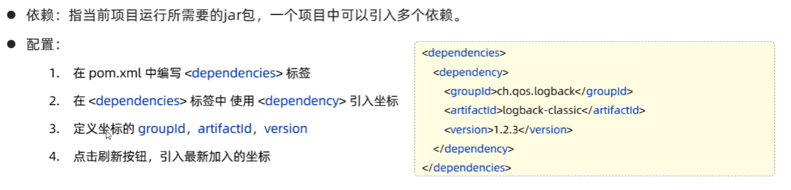

没有的话，可以直接去官方Maven去搜复制maven代码即可。

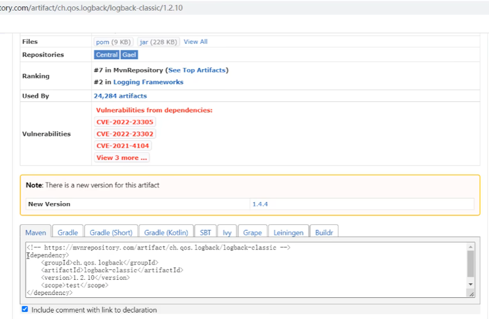

# Spring

## Spring Framework系统框架

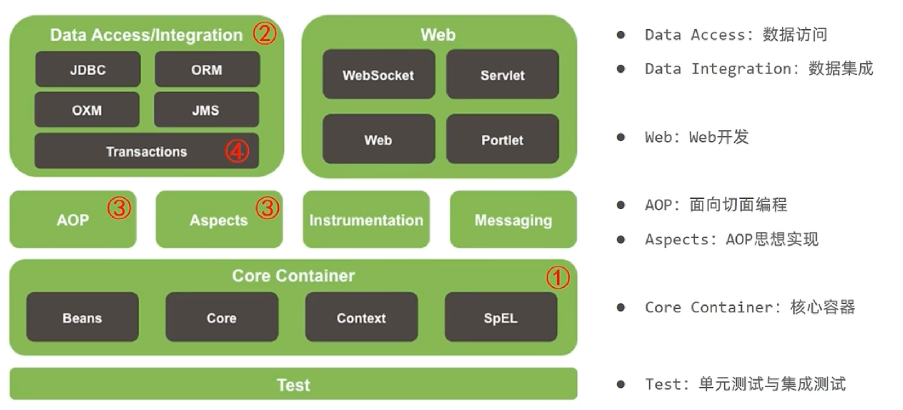

## IoC（Inversion of Control）控制反转

背景引入：

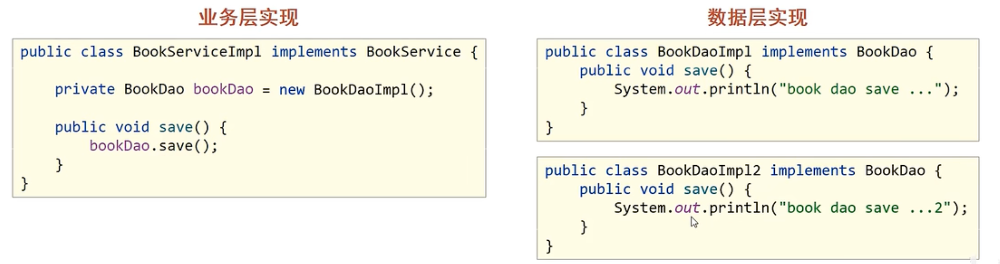

<font color=yellow>代码耦合度偏高：</font>原先在业务逻辑层的实现类（BookServiceImpl）中会new一个数据访问层的实现类（BookDaoImpl），当出现一个数据访问层迎来了一个全新的实现（BookDaoImpl2），业务逻辑层的相关代码就需要改变。

解决方案：使用对象时，在程序中不要主动使用new产生对象，转换为<font color=yellow>外部提供对象</font>，这就是IoC（Inversion of Control）控制反转 => <u>对象的创建控制权由程序转移到<font color=yellow>外部</font></u>

Spring技术对IoC思想进行了实现：

- Spring提供了一个容器，称为<font color=yellow>IoC容器
  </font>，用来充当IoC思想中的<font color=yellow>“外部”</font>
- IoC容器负责对象的创建、初始化等一系列的工作，被创建或管理的对象在IoC容器中统称为<font color=yellow>Bean</font>

业务逻辑层（service）的对象与数据访问层（dao）的对象都可以放入IoC容器当中

service层的对象的运行依赖于dao层对象

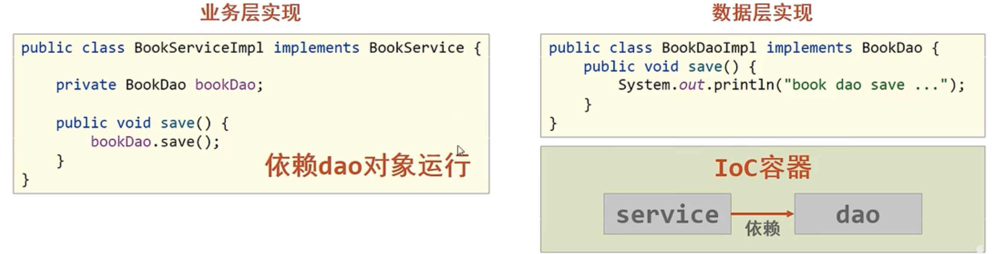

使用<font color=yellow>DI（Dependency Injection）依赖注入</font>进行解决：

- 依赖注入，在容器中建立bean于bean之间的依赖关系的整个过程。

步骤：

1. 使用IoC容器管理bean
2. 在IoC容器中将有依赖关系的bean进行关系绑定（DI）

最终效果：

使用对象时不仅可以直接从IoC容器中获取，并且获取到的bean已经绑定了所有的依赖关系

## IoC入门案例

#### 入门案例思路分析

1. Spring是使用容器来管理bean对象的，那么管什么?
   - 主要管理项目中所使用到的类对象，比如(Service和Dao)
2. 如何将被管理的对象告知IOC容器?
   - 使用配置文件
3. 被管理的对象交给IOC容器，要想从容器中获取对象，就先得思考如何获取到IOC容器?
   - Spring框架提供相应的接口
4. IOC容器得到后，如何从容器中获取bean?
   - 调用Spring框架提供对应接口中的方法
5. 使用Spring导入哪些坐标?
   - 用别人的东西，就需要在pom.xml添加对应的依赖


#### 入门案例代码实现

需求分析:将BookServiceImpl和BookDaoImpl交给Spring管理，并从容器中获取对应的bean对象进行方法调用。

1. 创建Maven的java项目

2. pom.xml添加Spring的依赖jar包

```xml
    <dependencies>
        
        <dependency>
            <groupId>org.springframework</groupId>
            <artifactId>spring-context</artifactId>
            <version>6.1.14</version>
        </dependency>
        
    </dependencies>

```

3. 创建BookDao，BookDaoImpl，BookService和BookServiceImpl四个类

```java
public interface BookDao {
    public void save();
}
```

```java
public class BookDaoImpl implements BookDao {
    public void save() {
        System.out.println("book dao save ...");
    }
}
```

```java
public interface BookService {
    public void save();
}
```

```java
public class BookServiceImpl implements BookService {
    private BookDao bookDao = new BookDaoImpl();
    public void save() {
        System.out.println("book service save ...");
        bookDao.save();
    }
}
```

4. resources下添加spring配置文件，这个spring配置文件就是将被管理的类告知IoC容器

```xml
<?xml version="1.0" encoding="UTF-8"?>
<beans xmlns="http://www.springframework.org/schema/beans"
       xmlns:xsi="http://www.w3.org/2001/XMLSchema-instance"
       xsi:schemaLocation="http://www.springframework.org/schema/beans http://www.springframework.org/schema/beans/spring-beans.xsd">
    <!-- applicationContext.xml spring配置文件 => 将所要管理的类添加至配置文件当中   -->

    <!-- bean标签配置bean   -->
    <!-- id属性在同一个上下文中(配置文件)不能重复 标识bean    -->
    <!-- class属性给bean定义类型 得是具体的实现类 IoC通过调用该类创造对象 -->
    <bean id="bookDao" class="org.example.dao.impl.BookDaoImpl"/>

    <bean id="bookService" class="org.example.service.impl.BookServiceImpl"/>

</beans>
```

5. 获取IOC容器，从容器中获取对象进行方法调用

```java
// main.java 调用service方法
package org.sza;
import org.springframework.context.ApplicationContext;
import org.springframework.context.support.ClassPathXmlApplicationContext;
import org.sza.dao.bookDao;
import org.sza.service.bookService;

public class Main {
    public static void main(String[] args) {
//        使用Spring ClassPathXmlApplicationContext 完成IOC容器的创建
        ApplicationContext context = new ClassPathXmlApplicationContext("applicationContext.xml");
//        使用getBean(String name)方法，其name参数就是我们在bean配置的id，通过这个id来创造对象
        bookService bookService = (bookService)context.getBean("bookService");
        bookService.save();
    }
}
```

```java
// bookServiceImpl.java 调用 Dao层方法
package org.sza.service.impl;

import org.springframework.context.ApplicationContext;
import org.springframework.context.support.ClassPathXmlApplicationContext;
import org.sza.dao.bookDao;
import org.sza.service.bookService;

public class bookServiceImpl implements bookService {
    private bookDao bookDao;
    @Override
    public void save() {
        System.out.println("save book service");
        ApplicationContext context = new ClassPathXmlApplicationContext("applicationContext.xml");
        bookDao = (bookDao) context.getBean("bookDao");
        bookDao.save();
    }
}
```

至此，Spring的IOC入门案例已经完成，但是在`BookServiceImpl`的类中依然存在`BookDaoImpl`对象的new操作（如如果你不使用IoC容器调用的话），它们之间的耦合度还是比较高，这块该如何解决，就需要用到下面的`DI(依赖注入)`来解决bean与bean之间的依赖关系。

## DI入门案例

#### 入门案例思路分析

1. 要想实现依赖注入，必须要基于IOC管理Bean
   - DI的入门案例要依赖于前面的IOC入门案例
2. Service中使用new形式创建的Dao对象是否保留？
   - 不保留，这样才能解耦合，最终要使用IOC容器中的bean对象
3. Service中需要的Dao对象如何进入到Service中？
   - 在Service中提供一个方法（例如提供一个set方法），让Spring的IOC容器可以通过该方法传入bean对象，也就达到了不是自己new，而是外部提供
4. Service与Dao之间的关系如何描述？
   - 使用配置文件

#### 入门案例代码实现

需求：基于IOC入门案例，在BookServiceImpl类中删除new对象的方式，使用Spring的DI完成Dao层的注入

1. 删除业务层中使用new的方式创建的dao对象，在业务层提供BookDao的setter方法

```java
package org.sza.service.impl;

import org.sza.dao.BookDao;
import org.sza.service.BookService;

public class BookServiceImpl implements BookService {
    private BookDao bookDao;
    @Override
    public void save() {
        System.out.println("save book service");

    }

    public void setBookDao(BookDao bookDao) {
        this.bookDao = bookDao;
    }
}
```

2. 在配置文件中添加依赖注入的配置

```xml
<?xml version="1.0" encoding="UTF-8"?>
<beans xmlns="http://www.springframework.org/schema/beans"
       xmlns:xsi="http://www.w3.org/2001/XMLSchema-instance"
       xsi:schemaLocation="http://www.springframework.org/schema/beans http://www.springframework.org/schema/beans/spring-beans.xsd">

    <bean id="bookDao" class="org.sza.dao.impl.BookDaoImpl"/>
    <bean id="bookService" class="org.sza.service.impl.BookServiceImpl">
        <!-- 配置Service与Dao之间的关系 -->
        <property name="bookDao" ref="bookDao"/>
    </bean>
</beans>
```

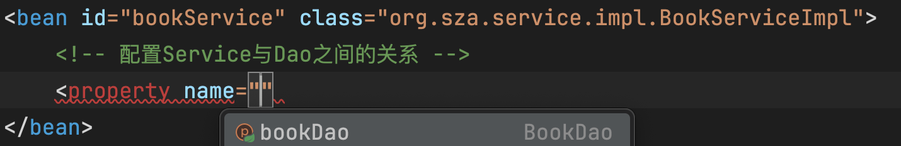

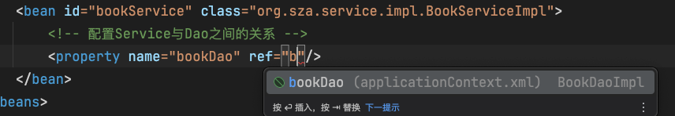

- 注意:配置中的两个bookDao的含义是不一样的，一个提供方法 一个提供对象
  - name=”bookDao”中`bookDao`的作用是让Spring的IOC容器在获取到名称后，将首字母大写，前面加set找对应的`setBookDao()`方法进行对象注入
  - ref=”bookDao”中`bookDao`的作用是让Spring能在IOC容器中找到id为`bookDao`的Bean对象给`bookService`进行注入

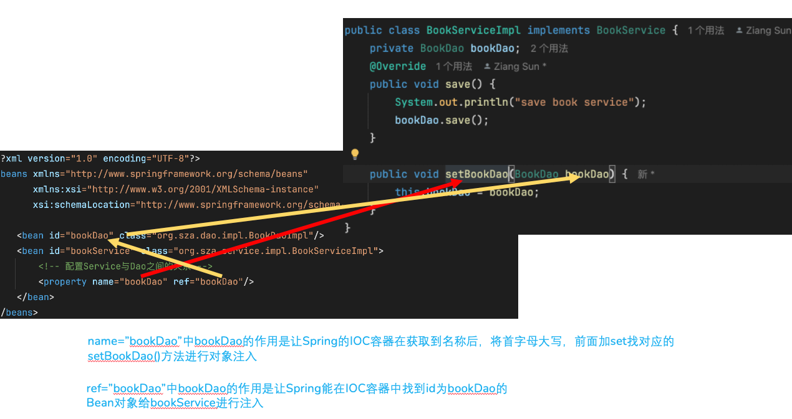

## IOC相关内容

### bean基础配置

- bean的基础配置 id class

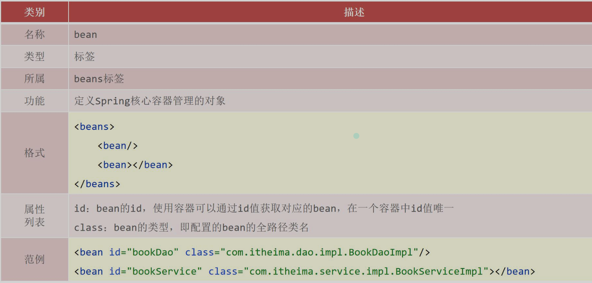

也可以在bean标签中配置name属性，来充当别名：

```xml
<?xml version="1.0" encoding="UTF-8"?>
<beans xmlns="http://www.springframework.org/schema/beans"
       xmlns:xsi="http://www.w3.org/2001/XMLSchema-instance"
       xsi:schemaLocation="http://www.springframework.org/schema/beans http://www.springframework.org/schema/beans/spring-beans.xsd">
    <bean id="bookDao" class="com.blog.dao.impl.BookDaoImpl"/>
    <!--name:为bean指定别名，别名可以有多个，使用逗号，分号，空格进行分隔-->
    <bean id="bookService" name="service1 service2 service3" class="com.blog.service.impl.BookServiceImpl">
        <property name="bookDao" ref="bookDao"></property>
    </bean>
</beans>
```

注意事项：bean依赖注入的ref属性指定bean，必须在容器中存在，而ref的值也可以是name里的别名，不过还是建议用id值来注入。

### bean作用范围scope配置

bean的scope有两个取值：

- singleton：单例（默认）
- prototype：非单例

```java
public class App {
    public static void main(String[] args) {
        ApplicationContext context = new ClassPathXmlApplicationContext("applicationContext.xml");
        //我这里使用了别名，其实还是同一个bean
        BookService bookService2 = (BookService) context.getBean("service2");
        BookService bookService3 = (BookService) context.getBean("service3");
        System.out.println(bookService2);
        System.out.println(bookService3);
    }
}
```

输出结果如下，地址值一致，确实是单例的

> com.blog.service.impl.BookServiceImpl@25bbe1b6
> com.blog.service.impl.BookServiceImpl@25bbe1b6

在Spring配置文件中，配置scope属性来实现bean的非单例创建

- 在Spring的配置文件中，修改<bean>的scope属性

  ```
  <bean id="bookService" name="service1 service2 service3" class="com.blog.service.impl.BookServiceImpl" scope="prototype">
      <property name="bookDao" ref="bookDao"></property>
  </bean>
  ```

- 为什么bean默认为单例?
  - bean为单例的意思是在Spring的IOC容器中只会有该类的一个对象
  - bean对象只有一个就避免了对象的频繁创建与销毁，达到了bean对象的复用，性能高
- bean在容器中是单例的，会不会产生线程安全问题?
  - 如果对象是有状态对象，即该对象有成员变量可以用来存储数据的，
  - 因为所有请求线程共用一个bean对象，所以会存在线程安全问题。
  - 如果对象是无状态对象，即该对象没有成员变量没有进行数据存储的，
  - 因方法中的局部变量在方法调用完成后会被销毁，所以不会存在线程安全问题。
- 哪些bean对象适合交给容器进行管理?
  - 表现层对象（controller）
  - 业务层对象（service）
  - 数据层对象（dao）
  - 工具对象（util）
- 哪些bean对象不适合交给容器进行管理?
  - 封装实例的域对象（domain，pojo），因为会引发线程安全问题，所以不适合。

### bean实例化

实例化bean的三种方式，`构造方法（常用）`,`静态工厂`和`实例工厂`（用到工厂实例再去了解）

### bean生命周期设置

具体的控制有两个阶段:

- bean创建之后，想要添加内容，比如用来初始化需要用到资源
- bean销毁之前，想要添加内容，比如用来释放用到的资源

1. 添加初始化和销毁方法

   针对这两个阶段，我们在BookDaoImpl类中分别添加两个方法，方法名随便取

   ```java
   public class BookDaoImpl implements BookDao {
       public void save() {
           System.out.println("book dao save ...");
       }
   
       public void init() {
           System.out.println("init ... ");
       }
   
       public void destroy() {
           System.out.println("destroy ... ");
       }
   }
   ```

2. 配置生命周期，修改bookDao的配置

   ```xml
   <bean id="bookDao" class="com.blog.dao.impl.BookDaoImpl" init-method="init" destroy-method="destroy"></bean>
   ```

3. 运行程序，输出结果如下：

   > init …
   > book dao save …

从结果中可以看出，init方法执行了，但是destroy方法却未执行，这是为什么呢?

- Spring的IOC容器是运行在JVM中
- 运行main方法后,JVM启动,Spring加载配置文件生成IOC容器,从容器获取bean对象，然后调方法执行
- main方法执行完后，JVM退出，这个时候IOC容器中的bean还没有来得及销毁就已经结束了
- 所以没有调用对应的destroy方法

#### close关闭容器

- ApplicationContext中没有close方法，它的子类中有close方法

- 所以需要将ApplicationContext更换成ClassPathXmlApplicationContext，然后调用close方法就好啦

  ```java
  public class App {
      public static void main(String[] args) {
          //ApplicationContext context = new ClassPathXmlApplicationContext("applicationContext.xml");
          ClassPathXmlApplicationContext context = new ClassPathXmlApplicationContext("applicationContext.xml");
          BookDao bookDao = (BookDao) context.getBean("bookDao");
          bookDao.save();
          context.close();
      }
  }
  ```

- 运行程序，输出如下，可以看到destroy正常输出

  > init …
  > book dao save …
  > destroy … 

#### 注册钩子关闭容器

- 在容器未关闭之前，提前设置好回调函数，让JVM在退出之前回调此函数来关闭容器

- 调用context的registerShutdownHook()方法

  ```java
  public class App {
      public static void main(String[] args) {
          ClassPathXmlApplicationContext context = new ClassPathXmlApplicationContext("applicationContext.xml");
          BookDao bookDao = (BookDao) context.getBean("bookDao");
          bookDao.save();
          context.registerShutdownHook();
      }
  }
  ```

  注意：registerShutdownHook在ApplicationContext中也没有

- 运行后，查询打印结果

  > init …
  > book dao save …
  > destroy … 

- 那两种方式介绍完后，close和registerShutdownHook选哪个?

  - 相同点:这两种都能用来关闭容器

  - 不同点:close()是在调用的时候关闭，registerShutdownHook()是在JVM退出前调用关闭。

    - 那么registerShutdownHook()方法可以在任意位置调用，下面的代码中将其放在了第二行，仍能正常输出，但要是将其换成close()方法，则会报错，BeanFactory not initialized or already closed，这里就是already closed

      ```java
      public class App {
          public static void main(String[] args) {
              ClassPathXmlApplicationContext context = new ClassPathXmlApplicationContext("applicationContext.xml");
              context.registerShutdownHook();
              BookDao bookDao = (BookDao) context.getBean("bookDao");
              bookDao.save();
          }
      }
      ```

- 开发中到底用哪个呢？

  - 答案是两个都不用
  - 分析上面的实现过程，会发现添加初始化和销毁方法，即需要编码也需要配置，实现起来步骤比较多也比较乱。

#### bean生命周期控制接口

Spring给我们提供了两个接口来完成生命周期的控制，好处是可以不用再进行配置`init-method`和`destroy-method`

- 接下来在BookServiceImpl和BookDaoImpl完成这两个接口的使用

  - 修改BookServiceImpl和BookDaoImpl类，添加两个接口

    `InitializingBean` `DisposableBean`

    并实现接口中的两个方法`afterPropertiesSet`和`destroy`

    ```java
    package org.sza.dao.impl;
    
    import org.springframework.beans.factory.DisposableBean;
    import org.springframework.beans.factory.InitializingBean;
    import org.sza.dao.BookDao;
    
    public class BookDaoImpl implements BookDao , InitializingBean , DisposableBean {
    
        public BookDaoImpl() {
            System.out.println("BookDaoImpl");
        }
    
        @Override
        public void destroy() throws Exception {
            System.out.println("destroy book dao");
        }
    
        @Override
        public void afterPropertiesSet() throws Exception {
            System.out.println("afterPropertiesSet book dao");
        }
    
    
        @Override
        public void save() {
            System.out.println("save book dao");
        }
    
    }
    ```

    

    ```java
    package org.sza.service.impl;
    import org.springframework.beans.factory.DisposableBean;
    import org.springframework.beans.factory.InitializingBean;
    import org.sza.dao.BookDao;
    import org.sza.service.BookService;
    
    public class BookServiceImpl implements BookService, InitializingBean , DisposableBean {
        private BookDao bookDao;
    
        public BookServiceImpl() {
            System.out.println("BookServiceImpl");
        }
    
        @Override
        public void save() {
            System.out.println("save book service");
            bookDao.save();
        }
    
        public void setBookDao(BookDao bookDao) {
            this.bookDao = bookDao;
            System.out.println("BookServiceImpl setBookDao");
        }
    
        @Override
        public void destroy() throws Exception {
            System.out.println("destroy book service");
        }
    
        @Override
        public void afterPropertiesSet() throws Exception {
            System.out.println("after properties set book service");
        }
    }
    ```

- applicationContext.xml中BookServiceImpl的bean配置如下

  ```xml
  <?xml version="1.0" encoding="UTF-8"?>
  <beans xmlns="http://www.springframework.org/schema/beans"
         xmlns:xsi="http://www.w3.org/2001/XMLSchema-instance"
         xsi:schemaLocation="http://www.springframework.org/schema/beans http://www.springframework.org/schema/beans/spring-beans.xsd">
  
      <bean id="bookDao" class="org.sza.dao.impl.BookDaoImpl"/>
      <bean id="bookService" class="org.sza.service.impl.BookServiceImpl">
          <!-- 配置Service与Dao之间的关系 -->
          <property name="bookDao" ref="bookDao"/>
      </bean>
  </beans>
  
  ```

- 重新运行Main类，输出结果如下

  ```java
  public class Main {
      public static void main(String[] args) {
  //        使用Spring ClassPathXmlApplicationContext 完成IOC容器的创建
          ApplicationContext context = new ClassPathXmlApplicationContext("applicationContext.xml");
  //        使用getBean(String name)方法，其name参数就是我们在bean配置的id，通过这个id来创造对象
          BookService bookService = (BookService) context.getBean("bookService");
          bookService.save();
      }
  }
  ```

  > BookDaoImpl 
  > afterPropertiesSet book dao
  > BookServiceImpl
  > BookServiceImpl setBookDao
  > after properties set book service
  > save book service
  > save book dao

值的注意的是，BookDaoImpl的构造函数和BookServiceImpl的构造函数并没有实质上的前后关系，<font color=yellow>因为BookDaoImpl使用的是依赖注入中的通过setter方法进行注入</font>：如果某个依赖是通过 **setter 方法** 注入的，Spring 不需要立即初始化这个依赖，而是在注入时才会实例化。

依赖注入的bean与bean之间是通过setter进行注入，那么bean的构造函数取决于applicationContext.xml中bean的声明顺序。从上面的bean的声明顺序为bookDao在前，因此其构造函数会在bookService的前面。

我们把 顺序调换：

```xml
    <bean id="bookService" class="org.sza.service.impl.BookServiceImpl">
        <!-- 配置Service与Dao之间的关系 -->
        <property name="bookDao" ref="bookDao"/>
    </bean>
    <bean id="bookDao" class="org.sza.dao.impl.BookDaoImpl"/>
```

再次运行：

> BookServiceImpl
> BookDaoImpl
> afterPropertiesSet book dao
> BookServiceImpl setBookDao
>
> after properties set book service
> save book service
> save book dao

分析：

```java
BookService bookService = (BookService) context.getBean("bookService");
```

在获取IoC容器bo

因此也会获取IoC容器中bookDao bean的实例。bookDao bean实例化采用构造方法的方式，因此第一个调用的是bookDaoImpl的构造函数。

> BookDaoImpl // 执行bookDaoImpl的构造函数

BookDaoImpl 先调用构造函数，初始化类的属性，后调用bookDao bean生命周期的初始化init方法，<font color=yellow>你从afterPropertiesSet名字也可以看出来其含义</font>

> afterPropertiesSet book dao // bookDao bean生命周期的初始化init方法

执行bookService bean的实例化（如果是setter注入他们之间与依赖注入的类并没有先后关系，因为注入是调用setter方法进行注入的），调用bookService的构造函数：

> BookServiceImpl // 执行bookServiceImpl的构造函数

bookService bean有属性bookdao对象，执行bookServices属性依赖注入方法

> BookServiceImpl setBookDao //执行setBookDao依赖注入方法

属性初始化完毕后，调用bookService bean的生命周期的初始化init方法

> after properties set book service //  bookService bean生命周期的初始化init方法

然后bookService bean算是初始化完毕，回到main方法，调用save方法：

> save book service
> save book dao

执行完后会执行bookService bean的生命周期方法 销毁，然后是bookDao Bean的销毁。

## DI相关内容

依赖注入描述了在容器中建立bean与bean之间的依赖关系的过程。

Spring为我们提供了两种注入方式，分别是

- `setter注入（简单类型/引用类型）`
- `构造器注入（简单类型/引用类型）`

### setter注入

setter注入方式的基本使用

- 对于引用数据类型使用的是`<property name="" ref=""/>`
- 对于简单数据类型使用的是`<property name="" value=""/>`

#### setter注入引用数据类型 实例

- 对于setter方式注入引用类型的方式之前已经学习过，快速回顾下:

- 在bean中定义引用类型属性，并提供可访问的set方法

  ```java
  public class BookServiceImpl implements BookService {
      private BookDao bookDao;
      public void setBookDao(BookDao bookDao) {
          this.bookDao = bookDao;
      }
  }
  ```

- 配置中使用property标签ref属性注入引用类型对象

  ```xml
  <bean id="bookService" class="com.blog.service.impl.BookServiceImpl">
      <property name="bookDao" ref="bookDao"></property>
  </bean>
  ```

- 我们再来回顾一下配置中的两个bookDao的含义

  > 配置中的两个bookDao的含义是不一样的
  >
  > - name=”bookDao”中bookDao的作用是让Spring的IOC容器在获取到名称后，将首字母大写，前面加set找对应的setBookDao()方法进行对象注入
  > - ref=”bookDao”中bookDao的作用是让Spring能在IOC容器中找到id为bookDao的Bean对象给bookService进行注入

总结：

> 需求:在bookServiceImpl对象中注入bookDao
>
> 1. 在BookServiceImpl中声明bookDao属性
> 2. 为bookDao属性提供setter方法
> 3. 在配置文件中使用property标签注入

注入多个引用类型数据：

1. 在BookServiceImpl中声明bookDao属性和userDao属性并提供对应的setter方法

```java
package org.sza.service.impl;
import org.springframework.beans.factory.DisposableBean;
import org.springframework.beans.factory.InitializingBean;
import org.sza.dao.BookDao;
import org.sza.dao.UserDao;
import org.sza.service.BookService;

public class BookServiceImpl implements BookService, InitializingBean , DisposableBean {
    private UserDao userDao;
    private BookDao bookDao;


    public BookServiceImpl() {
        System.out.println("BookServiceImpl");
    }

    public void setBookDao(BookDao bookDao) {
        this.bookDao = bookDao;
        System.out.println("BookServiceImpl setBookDao");
    }
    public void setUserDao(UserDao userDao) {
        this.userDao = userDao;
        System.out.println("BookServiceImpl setUserDao");
    }

}
```

2. 在配置文件中使用property标签注入

```xml
		<bean id="bookDao" class="org.sza.dao.impl.BookDaoImpl"/>
    <bean id="userDao" class="org.sza.dao.impl.UserDaoImpl"/>
    <bean id="bookService" class="org.sza.service.impl.BookServiceImpl">
        <property name="userDao" ref="userDao"/>
        <property name="bookDao" ref="bookDao"/>
    </bean>
```

#### setter注入简单数据类型 实例

- 引用类型使用的是`<property name="" ref=""/>`,简单数据类型还是使用ref吗?
- ref是指向Spring的IOC容器中的另一个bean对象的，对于简单数据类型，使用value来配置`<property name="" value=""/>`

1. 步骤一：BookServiceImpl声明属性并提供setter方法

```java
		private int connectionCount;

    public void setConnectionCount(int connectionCount) {
        this.connectionCount = connectionCount;
    }
```

2. 步骤二：在配置文件中进行注入配置，在applicationContext.xml配置文件中使用property标签注入

```xml
<?xml version="1.0" encoding="UTF-8"?>
<beans xmlns="http://www.springframework.org/schema/beans"
       xmlns:xsi="http://www.w3.org/2001/XMLSchema-instance"
       xsi:schemaLocation="http://www.springframework.org/schema/beans http://www.springframework.org/schema/beans/spring-beans.xsd">


    <bean id="bookDao" class="org.sza.dao.impl.BookDaoImpl"/>
    <bean id="userDao" class="org.sza.dao.impl.UserDaoImpl"/>
    <bean id="bookService" class="org.sza.service.impl.BookServiceImpl">
        <property name="userDao" ref="userDao"/>
        <property name="bookDao" ref="bookDao"/>
        <property name="connectionCount" value="123"/>
    </bean>

</beans>
```

> value:后面跟的是简单数据类型，对于参数类型，Spring在注入的时候会自动转换，但是不能写一个错误的类型，例如`connectionCount`是`int`类型，你却给他传一个`abc`，这样的话，spring在将`abc`转换成int类型的时候就会报错。

### 构造器注入

1. 步骤一：删除setter方法并提供构造方法，在BookServiceImpl类中将bookDao的setter方法删除掉,并添加带有bookDao参数的构造方法

```java
public class BookServiceImpl implements BookService{
    private BookDao bookDao;

    public BookServiceImpl(BookDao bookDao) {
        this.bookDao = bookDao;
    }
}
```

2. 步骤二：配置文件中进行配置构造方式注入，在applicationContext.xml中配置

```xml
<?xml version="1.0" encoding="UTF-8"?>
<beans xmlns="http://www.springframework.org/schema/beans"
       xmlns:xsi="http://www.w3.org/2001/XMLSchema-instance"
       xsi:schemaLocation="http://www.springframework.org/schema/beans http://www.springframework.org/schema/beans/spring-beans.xsd">

    <bean id="bookDao" class="com.blog.dao.impl.BookDaoImpl"/>
    <bean id="bookService" class="com.blog.service.impl.BookServiceImpl">
        <constructor-arg name="bookDao" ref="bookDao"/>
    </bean>
</beans>
```

> 说明：在标签`<constructor-arg>`中
>
> - name属性对应的值为构造函数中方法`形参的参数名`，必须要保持一致。
> - ref属性指向的是spring的IOC容器中其他bean对象。

#### 构造器注入多个引用数据类型

需求：在BookServiceImpl使用构造函数注入多个引用数据类型，比如userDao

> 1. 声明userDao属性
> 2. 生成一个带有bookDao和userDao参数的构造函数
> 3. 在applicationContext.xml中配置注入
>

1. 步骤一：提供多个属性的构造函数

```java
public class BookServiceImpl implements BookService {
    private BookDao bookDao;
    private UserDao userDao;

    public BookServiceImpl(BookDao bookDao, UserDao userDao) {
        this.bookDao = bookDao;
        this.userDao = userDao;
    }
}
```

2. 步骤二：在配置文件中配置多参数注入

```xml
<?xml version="1.0" encoding="UTF-8"?>
<beans xmlns="http://www.springframework.org/schema/beans"
       xmlns:xsi="http://www.w3.org/2001/XMLSchema-instance"
       xsi:schemaLocation="http://www.springframework.org/schema/beans http://www.springframework.org/schema/beans/spring-beans.xsd">

    <bean id="userDao" class="com.blog.dao.impl.UserDaoImpl"/>
    <bean id="bookDao" class="com.blog.dao.impl.BookDaoImpl"/>
    <bean id="bookService" class="com.blog.service.impl.BookServiceImpl">
        <constructor-arg name="bookDao" ref="bookDao"/>
        <constructor-arg name="userDao" ref="userDao"/>
    </bean>
</beans>
```

#### 构造器注入多个简单数据类型

> 需求:在BookDaoImpl中，使用构造函数注入databaseName和connectionNum两个参数。
> 参考引用数据类型的注入，我们可以推出具体的步骤为:
>
> 1. 提供一个包含这两个参数的构造方法
> 2. 在applicationContext.xml中进行注入配置

1. 步骤一：添加多个简单属性并提供构造方法：

```java
public class BookDaoImpl implements BookDao {

    private String databaseName;
    private int connectionNum;

    public BookDaoImpl(String databaseName, int connectionNum) {
        this.databaseName = databaseName;
        this.connectionNum = connectionNum;
    }
}
```

2. 步骤二：配置完成多个属性构造器注入

```xml
<?xml version="1.0" encoding="UTF-8"?>
<beans xmlns="http://www.springframework.org/schema/beans"
       xmlns:xsi="http://www.w3.org/2001/XMLSchema-instance"
       xsi:schemaLocation="http://www.springframework.org/schema/beans http://www.springframework.org/schema/beans/spring-beans.xsd">
    <bean id="bookDao" class="com.blog.dao.impl.BookDaoImpl">
        <constructor-arg name="databaseName" value="mysql"></constructor-arg>
        <constructor-arg name="connectionNum" value="100"></constructor-arg>
    </bean>
</beans>
```

还可以按照按照类型注入和按照索引下标注入：

- 方式一：删除name属性，添加type属性，按照类型注入

  - 这种方式可以解决构造函数形参名发生变化带来的耦合问题

  - 但是如果构造方法参数中有类型相同的参数，这种方式就不太好实现了

    ```xml
    <bean id="bookDao" class="com.blog.dao.impl.BookDaoImpl">
        <constructor-arg type="java.lang.String" value="mysql"></constructor-arg>
        <constructor-arg type="int" value="9421"></constructor-arg>
    </bean>
    ```

- 方式二：删除type属性，添加index属性，按照索引下标注入，下标从0开始

  - 这种方式可以解决参数类型重复问题

  - 但是如果构造方法参数顺序发生变化后，这种方式又带来了耦合问题

    ```xml
    <bean id="bookDao" class="com.blog.dao.impl.BookDaoImpl">
        <constructor-arg index="0" value="mysql"></constructor-arg>
        <constructor-arg index="1" value="9421"></constructor-arg>
    </bean>
    ```

> 介绍完两种参数的注入方式，具体我们该如何选择呢?
>
> 1. 强制依赖使用构造器进行，使用setter注入有概率不进行注入导致null对象出现
>    - 强制依赖指对象在创建的过程中必须要注入指定的参数
> 2. 可选依赖使用setter注入进行，灵活性强
>    - 可选依赖指对象在创建过程中注入的参数可有可无
> 3. Spring框架倡导使用构造器，第三方框架内部大多数采用构造器注入的形式进行数据初始化，相对严谨
> 4. 如果有必要可以两者同时使用，使用构造器注入完成强制依赖的注入，使用setter注入完成可选依赖的注入
> 5. 实际开发过程中还要根据实际情况分析，如果受控对象没有提供setter方法就必须使用构造器注入
> 6. 自己开发的模块推荐使用setter注入

### 自动装配

IOC容器根据bean所依赖的资源在容器中<font color=yellow>自动查找并注入</font>到bean中的过程称为自动装配

> 自动装配方式有哪些:
>
> - 按类型（常用）
> - 按名称
> - 按构造方法
> - 不启用自动装配

自动装配只需要修改applicationContext.xml配置文件即可:

1. 将`<property>`标签删除
2. 在`<bean>`标签中添加autowire属性

- 首先来实现按照类型注入的配置

  ```xml
  <?xml version="1.0" encoding="UTF-8"?>
  <beans xmlns="http://www.springframework.org/schema/beans"
         xmlns:xsi="http://www.w3.org/2001/XMLSchema-instance"
         xsi:schemaLocation="http://www.springframework.org/schema/beans http://www.springframework.org/schema/beans/spring-beans.xsd">
  
      <bean id="bookDao" class="org.sza.dao.impl.BookDaoImpl"/>
      <bean id="userDao" class="org.sza.dao.impl.UserDaoImpl"/>
      <bean id="bookService" class="org.sza.service.impl.BookServiceImpl" autowire="byType">
  <!--        <property name="userDao" ref="userDao"/>-->
  <!--        <property name="bookDao" ref="bookDao"/>-->
      </bean>
  
  </beans>
  
  ```

> 注意事项：
>
> - 需要注入属性的类中对应属性的`setter`方法不能省略
> - 被注入的对象必须要被Spring的IOC容器管理
> - 按照类型在Spring的IOC容器中如果找到多个对象，会报`NoUniqueBeanDefinitionException`

当一个类型在IOC中有多个对象，还想要注入成功，这个时候就需要按照名称注入，配置方式如下:

```xml
<?xml version="1.0" encoding="UTF-8"?>
<beans xmlns="http://www.springframework.org/schema/beans"
       xmlns:xsi="http://www.w3.org/2001/XMLSchema-instance"
       xsi:schemaLocation="http://www.springframework.org/schema/beans http://www.springframework.org/schema/beans/spring-beans.xsd">


    <bean id="bookDao" class="org.sza.dao.impl.BookDaoImpl"/>
    <bean id="userDao" class="org.sza.dao.impl.UserDaoImpl"/>
    <bean id="bookService" class="org.sza.service.impl.BookServiceImpl" autowire="byName">
<!--        <property name="userDao" ref="userDao"/>-->
<!--        <property name="bookDao" ref="bookDao"/>-->
    </bean>

</beans>
```

### 集合注入

还有一种数据类型`集合`，集合中既可以装简单数据类型也可以装引用数据类型，对于集合，在Spring中该如何注入呢?

先来回顾下，常见的集合类型有哪些?

- 数组
- List
- Set
- Map
- Properties

#### 注入数组类型

```xml
<property name="array">
    <array>
        <value>100</value>
        <value>200</value>
        <value>300</value>
    </array>
</property>
```

#### 注入List类型

```xml
<property name="list">
    <list>
        <value>张三</value>
        <value>ABC</value>
        <value>123</value>
    </list>
</property>
```

#### 注入Set类型

```xml
<property name="set">
    <set>
        <value>100</value>
        <value>200</value>
        <value>ABC</value>
        <value>ABC</value>
    </set>
</property>
```

#### 注入Map类型

```xml
<property name="map">
    <map>
        <entry key="探路者" value="马文"/>
        <entry key="次元游记兵" value="恶灵"/>
        <entry key="易位窃贼" value="罗芭"/>
    </map>
</property>
```

#### 注入Properties类型

```xml
<property name="properties">
    <props>
        <prop key="暴雷">沃尔特·菲茨罗伊</prop>
        <prop key="寻血猎犬">布洛特·亨德尔</prop>
        <prop key="命脉">阿杰·切</prop>
    </props>
</property>
```

> 说明：
>
> - property标签表示setter方式注入，构造方式注入constructor-arg标签内部也可以写`<array>`、`<list>`、`<set>`、`<map>`、`<props>`标签
> - List的底层也是通过数组实现的，所以`<list>`和`<array>`标签是可以混用
> - 集合中要添加引用类型，只需要把`<value>`标签改成`<ref>`标签，这种方式用的比较少

## IOC/DI配置管理第三方bean

> 需求：使用Spring的IOC容器来管理Druid连接池对象
>
> 1. 使用第三方的技术，需要在pom.xml添加依赖
> 2. 在配置文件中将`第三方的类`制作成一个bean，让IOC容器进行管理
> 3. 数据库连接需要基础的四要素`驱动`、`连接`、`用户名`和`密码`，`如何注入`到对应的bean中
> 4. 从IOC容器中获取对应的bean对象，将其打印到控制台查看结果

1. 步骤一：导入druid依赖

```xml
<dependency>
    <groupId>com.alibaba</groupId>
    <artifactId>druid</artifactId>
    <version>1.1.16</version>
</dependency>
```

2. 步骤二：配置第三方bean

那么到底是使用setter注入还是构造器注入呢？这个就需要我们来看看第三方类给我们提供了什么
通过查看源码，我们发现`DruidDataSource`只给我们提供了两个构造器如下：

```java
public DruidDataSource()

public DruidDataSource(boolean fairLock) 
```

显然这两个构造器不能满足我们的需求，因为我们需要注入数据库连接的四要素，构造器的参数中没有提供
那么我们继续来看看给我们提供了什么setter方法

```java
public void setUsername(String username) {
    if (!StringUtils.equals(this.username, username)) {
        if (this.inited) {
            throw new UnsupportedOperationException();
        } else {
            this.username = username;
        }
    }
}

public void setPassword(String password) {
    if (!StringUtils.equals(this.password, password)) {
        if (this.inited) {
            LOG.info("password changed");
        }

        this.password = password;
    }
}

···
```

通过查看源码，我们发现已经给我们提供了许多的setter方法，其中包括了连接四要素，所以这里我们需要使用setter注入（使用property），在applicationContext.xml配置文件中添加`DruidDataSource`的配置：

```xml
    <bean class="com.alibaba.druid.pool.DruidDataSource">
        <property name="driverClassName" value="com.mysql.jdbc.Driver"/>
        <property name="url" value="jdbc:mysql://localhost:3306/mybatisDb"/>
        <property name="username" value="root"/>
        <property name="password" value="xxxxxx"/>
    </bean>  
```

3. 步骤三：从IOC容器中获取对应的bean对象

```java
public class Main {
    public static void main(String[] args) {
//        使用Spring ClassPathXmlApplicationContext 完成IOC容器的创建
        ApplicationContext context = new ClassPathXmlApplicationContext("applicationContext.xml");
        DruidDataSource dataSource = context.getBean(DruidDataSource.class);
        System.out.println(dataSource);
    }
}
```

### 加载properties文件

> 刚刚我们完成了druid数据源的配置，但其中包含了一些问题，我们来分析一下：
>
> - 这两个数据源中都用到了一些固定的常量（如数据库连接四要素），把这些值加载到Spring的配置文件中，不利于后期的维护
> - 那我们现在就需要将这些值提取到一个外部的properties配置文件中，在之前我们也是这样做的
> - 那么如何在Spring框架中读取配置文件来进行配置，就是我们接下来要解决的问题

#### 第三方bean属性优化

> 需求:将数据库连接四要素提取到properties配置文件，spring来加载配置信息并使用这些信息来完成属性注入。
>
> 1. 在resources下创建一个jdbc.properties(文件的名称可以任意)
> 2. 将数据库连接四要素配置到配置文件中
> 3. 在Spring的配置文件中加载properties文件
> 4. 使用加载到的值实现属性注入

1. 步骤一：准备properties配置文件，resources下创建一个jdbc.properties文件,并添加对应的属性键值对

```properties
jdbc.driverClass=com.mysql.jdbc.Driver
jdbc.url=jdbc:mysql://localhost:3306/mybatisDb
jdbc.username=root
jdbc.password=xxxxx
```

2. 步骤二：开启`context`命名空间，在applicationContext.xml中开`context`命名空间。

```xml
<beans xmlns="http://www.springframework.org/schema/beans"
       xmlns:xsi="http://www.w3.org/2001/XMLSchema-instance"
       xmlns:context="http://www.springframework.org/schema/context"
       xsi:schemaLocation="
       http://www.springframework.org/schema/beans
       http://www.springframework.org/schema/beans/spring-beans.xsd
       http://www.springframework.org/schema/context
       http://www.springframework.org/schema/beans/spring-context.xsd
       ">
```

3. 步骤三：加载properties配置文件，在配置文件中使用`context`命名空间下的标签来加载properties配置文件

```xml
<context:property-placeholder location="jdbc.properties"/>
```

4. 步骤四：完成属性注入，使用`${key}`来读取properties配置文件中的内容并完成属性注入

```xml
    <context:property-placeholder location="jdbc.properties"/>

    <bean class="com.alibaba.druid.pool.DruidDataSource">
        <property name="driverClassName" value="${jdbc.driverClass}"/>
        <property name="url" value="${jdbc.url}"/>
        <property name="username" value="${jdbc.username}"/>
        <property name="password" value="${jdbc.password}"/>
    </bean>
```

`<context:property-placeholder/>`标签会加载系统的环境变量，而且环境变量的值会被优先加载，可能会与系统的环境变量产生冲突：

解决方案，将system-properties-mode设置为NEVER，表示不加载系统环境变量，这样就可以解决上面的问题了，当然还有一个解决方案就是避免使用`username`作为属性的`key`。

```xml
<context:property-placeholder location="jdbc.properties" system-properties-mode="NEVER"/>
```

当有多个properties配置文件需要被加载：

- 修改applicationContext.xml

  ```xml
  <!--方式一 -->
  <context:property-placeholder location="jdbc.properties,jdbc2.properties" system-properties-mode="NEVER"/>
  <!--方式二-->
  <context:property-placeholder location="*.properties" system-properties-mode="NEVER"/>
  <!--方式三 -->
  <context:property-placeholder location="classpath:*.properties" system-properties-mode="NEVER"/>
  <!--方式四-->
  <context:property-placeholder location="classpath*:*.properties" system-properties-mode="NEVER"/>
  ```

- 说明：

  - 方式一：可以实现，如果配置文件多的话，每个都需要配置
  - 方式二：`*.properties`代表所有以properties结尾的文件都会被加载，可以解决方式一的问题，但是不标准
  - 方式三：标准的写法，`classpath:`代表的是从根路径下开始查找，但是只能查询当前项目的根路径
  - 方式四：不仅可以加载当前项目还可以加载当前项目所依赖的所有项目的根路径下的properties配置文件

## 核心容器

这里所说的核心容器，我们可以把它简单的理解为`ApplicationContex`

#### 容器的创建方式

- 案例中创建`ApplicationContext`的方式如下

- 这种方式翻译为：类路径下的XML配置文件

  ```java
  ApplicationContext ctx = new ClassPathXmlApplicationContext("applicationContext.xml");
  ```

- 除了上面这种方式，Spring还提供了另外一种创建方式

- 这种方式翻译为：文件系统下的XML配置文件，路径需要写绝对路径

- 这种方式虽能实现，但是当项目的位置发生变化后，代码也需要跟着改，耦合度高，不推荐使用。

  ```java
  ApplicationContext ctx = new FileSystemXmlApplicationContext("D:\xxx/xxx\applicationContext.xml");
  ```

#### 获取bean的三种方式

- 方式一，就是我们之前用的方式

- 这种方式存在的问题是每次获取的时候都需要进行类型转换，有没有更简单的方式呢?

  ```java
  BookDao bookDao = (BookDao) ctx.getBean("bookDao");
  ```

- 方式二
  这种方式可以解决类型强转问题，但是参数又多加了一个，相对来说没有简化多少。

  ```java
  BookDao bookDao = ctx.getBean("bookDao"，BookDao.class);
  ```

- 方式三

- 这种方式就类似我们之前所学习依赖注入中的按类型注入。必须要确保IOC容器中该类型对应的bean对象只能有一个。

  ```java
  BookDao bookDao = ctx.getBean(BookDao.class);
  ```

#### BeanFactory的使用

容器的最上级的父接口为`BeanFactory`
使用`BeanFactory`也可以创建IOC容器

```java
public class AppForBeanFactory {
    public static void main(String[] args) {
        Resource resources = new ClassPathResource("applicationContext.xml");
        BeanFactory bf = new XmlBeanFactory(resources);
        BookDao bookDao = bf.getBean(BookDao.class);
        bookDao.save();
    }
}
```

为了更好的看出`BeanFactory`和`ApplicationContext`之间的区别，在BookDaoImpl添加如下构造函数

```java
public class BookDaoImpl implements BookDao {
    public BookDaoImpl() {
        System.out.println("constructor");
    }
    public void save() {
        System.out.println("book dao save ..." );
    }
}
```

如果不去获取bean对象，打印会发现：

- BeanFactory是延迟加载，只有在获取bean对象的时候才会去创建

- ApplicationContext是立即加载，容器加载的时候就会创建bean对象

- ApplicationContext要想成为延迟加载，只需要将lazy-init设为true

  ```xml
  <?xml version="1.0" encoding="UTF-8"?>
  <beans xmlns="http://www.springframework.org/schema/beans"
         xmlns:xsi="http://www.w3.org/2001/XMLSchema-instance"
         xsi:schemaLocation="
              http://www.springframework.org/schema/beans http://www.springframework.org/schema/beans/spring-beans.xsd">
      <bean id="bookDao" class="com.blog.dao.impl.BookDaoImpl"  lazy-init="true"/>
  </beans>
  ```

总结

> - BeanFactory是IoC容器的顶层接口，初始化BeanFactory对象时，加载的bean延迟加载
> - ApplicationContext接口是Spring容器的核心接口，初始化时bean立即加载
> - ApplicationContext接口提供基础的bean操作相关方法，通过其他接口扩展其功能
> - ApplicationContext接口常用初始化类
>   - ClassPathXmlApplicationContext(常用)
>   - FileSystemXmlApplicationContext

#### bean相关

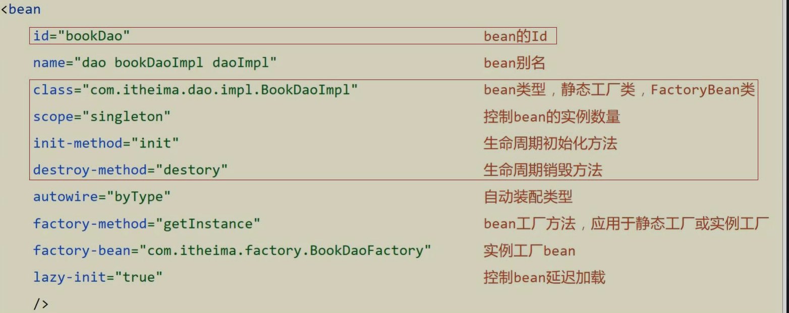

#### 依赖注入相关

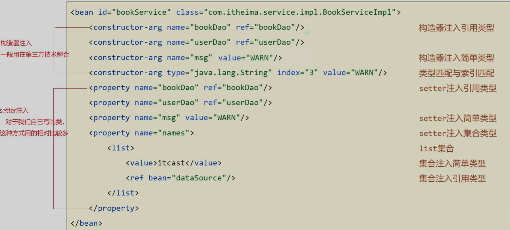

## IOC/DI注解开发

Spring的IOC/DI对应的配置开发就已经讲解完成，但是使用起来相对来说还是比较复杂的，复杂的地方在`配置文件`。

两块内容`注解开发定义bean`和`纯注解开发`。

### 注解开发定义bean

- `步骤一：`删除原有的XML配置，将配置文件中的bean标签删除掉

```xml
<bean id="bookDao" class="com.blog.dao.impl.BookDaoImpl"/>
```

- `步骤二：`在Dao上添加注解，在BookDaoImpl类上添加`@Component`注解

```java
@Component("bookDao")
public class BookDaoImpl implements BookDao {
    public void save() {
        System.out.println("book dao save ...");
    }
}
```

> 注意：@Component注解不可以添加在接口上，因为接口是无法创建对象的

- `步骤三：`配置Spring的注解包扫描，为了让Spring框架能够扫描到写在类上的注解，需要在配置文件上进行包扫描

```xml
<?xml version="1.0" encoding="UTF-8"?>
<beans xmlns="http://www.springframework.org/schema/beans"
       xmlns:xsi="http://www.w3.org/2001/XMLSchema-instance"
       xmlns:context="http://www.springframework.org/schema/context"
       xsi:schemaLocation="
            http://www.springframework.org/schema/beans
            http://www.springframework.org/schema/beans/spring-beans.xsd
            http://www.springframework.org/schema/context
            http://www.springframework.org/schema/context/spring-context.xsd
        ">
    <context:component-scan base-package="org.sza.dao.impl"/>
</beans>
```

- > 说明：component-scan
  >
  > - component:组件,Spring将管理的bean视作自己的一个组件
  > - scan:扫描 base-package指定Spring框架扫描的包路径，它会扫描指定包及其子包中的所有类上的注解。
  > - 包路径越多`如:org.sza.dao.impl`，扫描的范围越小速度越快
  > - 包路径越少`如:org.sza`,扫描的范围越大速度越慢
  > - 一般扫描到项目的组织名称即Maven的groupId下`如:ora.sza`即可。

- `步骤四：`Service上添加注解

```java
@Component
public class BookServiceImpl implements BookService {
    public void save() {
        System.out.println("book service save ...");
    }
}
```

- BookServiceImpl类没有起名称，所以在App中是按照类型来获取bean对象。`@Component`注解如果不起名称，会有一个默认值就是`当前类名首字母小写`，所以也可以按照名称获取，如

```java
BookService bookService = (BookService) context.getBean("bookServiceImpl");
```

对于@Component注解，还衍生出了其他三个注解`@Controller`、`@Service`、`@Repository`
通过查看源码会发现：这三个注解和@Component注解的作用是一样的，为什么要衍生出这三个呢?
这是方便我们后期在编写类的时候能很好的区分出这个类是属于`表现层`、`业务层`还是`数据层`的类。

### 纯注解开发模式

上面已经可以使用注解来配置bean,但是依然有用到配置文件，在配置文件中对包进行了扫描，Spring在3.0版已经支持纯注解开发，使用Java类替代配置文件

使用注解完成Spring的bean管理，但是并没有实现依赖注入。

BookDao、BookDaoImpl、BookService、BookServiceImpl类 设置为最原始的状态 没有bean与bean之间的依赖。

- BookDao

```java
public class BookDaoImpl implements BookDao {
    public void save() {
        System.out.println("book dao save ..." );
    }
}
```

- BookDaoImpl

```java
public class BookDaoImpl implements BookDao {
    public void save() {
        System.out.println("book dao save ..." );
    }
}
```

- BookService

```java
public interface BookService {
    public void save();
}
```

- BookServiceImpl

```java
public class BookServiceImpl implements BookService {
    public void save() {
        System.out.println("book service save ...");
    }
}
```

> 实现思路为：
>
> - 将配置文件applicationContext.xml删掉，用类来替换

- 步骤一：创建配置类，创建一个配置类SpringConfig

```java
public class SpringConfig {
}
```

- 步骤二：标识该类为配置类，在配置类上面加一个@Configuration注解，将其标识为一个配置类，用于替换掉applicationContext.XML

```java
@Configuration
public class SpringConfig {
}
```

- 步骤三：用注解替换包扫描配置，在配置类上添加包扫描注解@ComponentScan替换<context:component-scan base-package=""/>

```java
@Configuration
@ComponentScan("com.blog")
public class SpringConfig {
}
```

也可以扫描多个包

```java
@Configuration
@ComponentScan({"org.sza.dao","org.sza.service"})
public class SpringConfig {
}
```

- 知识点：`@Configuration`

| 名称 |       @Configuration        |
| :--: | :-------------------------: |
| 类型 |           类注解            |
| 位置 |         类定义上方          |
| 作用 |   设置该类为spring配置类    |
| 属性 | value（默认）：定义bean的id |

- 知识点：`@ComponentScan`

| 名称 |                      @ComponentScan                      |
| :--: | :------------------------------------------------------: |
| 类型 |                          类注解                          |
| 位置 |                        类定义上方                        |
| 作用 | 设置spring配置类扫描路径，用于加载使用注解格式定义的bean |
| 属性 |     value（默认）：扫描路径，此路径可以逐层向下扫描      |

这时候并没有依赖注入。

#### 小结

这部分要重点掌握的是使用注解完成Spring的bean管理，需要掌握的内容为:

- 记住`@Component`、`@Controller`、`@Service`、`@Repository`这四个注解
- applicationContext.xml中`<context:component-san/>`的作用是指定扫描包路径，注解为`@ComponentScan`
- `@Configuration`标识该类为配置类，使用类替换`applicationContext.xml`文件
- `ClassPathXmlApplicationContext`是加载XML配置文件
- `AnnotationConfigApplicationContext`是加载配置类

### 注解开发bean的作用范围和生命周期

使用注解已经完成了bean的管理，接下来按照前面所学习的内容，将通过配置实现的内容都换成对应的注解实现，包含两部分内容:`bean作用范围(scope)`和`bean生命周期(init和destroy)`

要想将BookDaoImpl变成非单例，只需要在其类上添加`@scope`注解

```java
@Component("bookDao")
@Scope("prototype")
public class BookDaoImpl implements BookDao {
    public void save() {
        System.out.println("book dao save ...");
    }
}
```

@scope：

| 名称 |                            @Scope                            |
| :--: | :----------------------------------------------------------: |
| 类型 |                            类注解                            |
| 位置 |                          类定义上方                          |
| 作用 | 设置该类创建对象的作用范围，可用于设置创建出的bean是否为单例对象 |
| 属性 | value（默认）：定义bean作用范围，默认值singleton（单例），可选值prototype（非单例） |

#### bean的生命周期

- 在BookDaoImpl中添加两个方法，`init`和`destroy`，方法名可以任意，再添加一个构造方法

```java
@Component("bookDao")
public class BookDaoImpl implements BookDao {
    
    public BookDaoImpl() {
        System.out.println("construct ... ");
    }

    public void save() {
        System.out.println("book dao save ...");
    }

    public void init() {
        System.out.println("init ... ");
    }

    public void destroy() {
        System.out.println("destroy ... ");
    }
}
```

如何对方法进行标识，哪个是初始化方法，哪个是销毁方法?
只需要在对应的方法上添加`@PostConstruct`和`@PreDestroy`注解即可。

```java
@Component("bookDao")
public class BookDaoImpl implements BookDao {

    public BookDaoImpl() {
        System.out.println("construct ... ");
    }

    public void save() {
        System.out.println("book dao save ...");
    }

    @PostConstruct  // 在构造方法之后执行，替换 init-method
    public void init() {
        System.out.println("init ... ");
    }

    @PreDestroy // 在销毁方法之前执行,替换 destroy-method
    public void destroy() {
        System.out.println("destroy ... ");
    }
}
```

知识点`@PostConstruct`

| 名称 |     @PostConstruct     |
| :--: | :--------------------: |
| 类型 |        方法注解        |
| 位置 |         方法上         |
| 作用 | 设置该方法为初始化方法 |
| 属性 |           无           |

知识点`@PreDestroy`

| 名称 |     @PreDestroy      |
| :--: | :------------------: |
| 类型 |       方法注解       |
| 位置 |        方法上        |
| 作用 | 设置该方法为销毁方法 |
| 属性 |          无          |

> 配置文件中的bean标签中的
> `id`对应`@Component("")`，`@Controller("")`，`@Service("")`，`@Repository("")`
> `scope`对应`@scope()`
> `init-method`对应`@PostConstruct`
> `destroy-method`对应`@PreDestroy`

### 注解开发依赖注入

Spring为了使用注解简化开发，并没有提供`构造函数注入`、`setter注入`对应的注解，只提供了自动装配的注解实现。

#### 注解实现按照类型注入

在BookServiceImpl类的bookDao属性上添加`@Autowired`注解：

```java
@Service
public class BookServiceImpl implements BookService {
    @Autowired
    private BookDao bookDao;

//    public void setBookDao(BookDao bookDao) {
//        this.bookDao = bookDao;
//    }

    public void save() {
        System.out.println("book service save ...");
        bookDao.save();
    }
}
```

> **注意:**
>
> - `@Autowired`可以写在属性上，也可也写在setter方法上，最简单的处理方式是`写在属性上并将setter方法删除掉`
> - 为什么setter方法可以删除呢?
>   - 自动装配基于反射设计创建对象并通过`暴力反射`为私有属性进行设值
>   - 普通反射只能获取public修饰的内容
>   - 暴力反射除了获取public修饰的内容还可以获取private修改的内容
>   - 所以此处无需提供setter方法

`@Autowired`是按照类型注入，那么对应BookDao接口如果有多个实现类，比如添加BookDaoImpl2

```java
@Repository
public class BookDaoImpl2 implements BookDao {
    public void save() {
        System.out.println("book dao save ...2");
    }
}
```

#### 注解实现按照名称注入

先给两个Dao类分别起个名称

```java
@Repository("bookDao")
public class BookDaoImpl implements BookDao {
    public void save() {
        System.out.println("book dao save ..." );
    }
}
@Repository("bookDao2")
public class BookDaoImpl2 implements BookDao {
    public void save() {
        System.out.println("book dao save ...2" );
    }
}
```

- 此时就可以注入成功，但是得思考个问题: 
- @Autowired是按照类型注入的，给BookDao的两个实现起了名称，它还是有两个bean对象，为什么不报错?
- @Autowired默认按照类型自动装配，如果IOC容器中同类的Bean找到多个，就按照变量名和Bean的名称匹配。因为变量名叫`bookDao`而容器中也有一个`bookDao`，所以可以成功注入。

那下面这种情况可以成功注入吗

```java
@Repository("bookDao1")
public class BookDaoImpl implements BookDao {
    public void save() {
        System.out.println("book dao save ..." );
    }
}
@Repository("bookDao2")
public class BookDaoImpl2 implements BookDao {
    public void save() {
        System.out.println("book dao save ...2" );
    }
}
```

还是不行的，因为按照类型会找到多个bean对象，此时会按照`bookDao`名称去找，因为IOC容器只有名称叫`bookDao1`和`bookDao2`，所以找不到，会报`NoUniqueBeanDefinitionException`

当根据类型在容器中找到多个bean,注入参数的属性名又和容器中bean的名称不一致，这个时候该如何解决，就需要使用到`@Qualifier`来指定注入哪个名称的bean对象。`@Qualifier`注解后的值就是需要注入的bean的名称。

```java
@Service
public class BookServiceImpl implements BookService {
    @Autowired
    @Qualifier("bookDao1")
    private BookDao bookDao;
    
    public void save() {
        System.out.println("book service save ...");
        bookDao.save();
    }
}
```

注意:@Qualifier不能独立使用，必须和@Autowired一起使用

#### 注解简单数据类型注入

引用类型看完，简单类型注入就比较容易懂了。简单类型注入的是基本数据类型或者字符串类型，下面在`BookDaoImpl`类中添加一个`name`属性，用其进行简单类型注入

```java
@Repository
public class BookDaoImpl implements BookDao {
    private String name;
    public void save() {
        System.out.println("book dao save ..." + name);
    }
}
```

数据类型换了，对应的注解也要跟着换，这次使用`@Value`注解，将值写入注解的参数中就行了

```java
@Repository
public class BookDaoImpl implements BookDao {
    @Value("Stephen")
    private String name;
    public void save() {
        System.out.println("book dao save ..." + name);
    }
}
```

注意数据格式要匹配，如将”abc”注入给int值，这样程序就会报错。
介绍完后，会有一种感觉就是这个注解好像没什么用，跟直接赋值是一个效果，还没有直接赋值简单。

#### 注解读取properties配置文件

`@Value`一般会被用在从properties配置文件中读取内容进行使用，具体如何实现?

- `步骤一：`在resource下准备一个properties文件

  ```properties
  name=Stephen
  ```

- `步骤二：`使用注解加载properties配置文件，在配置类上添加`@PropertySource`注解

  ```java
  @Configuration
  @ComponentScan("com.blog")
  @PropertySource("jdbc.properties")
  public class SpringConfig {
  }
  ```

- `步骤三：`使用@Value读取配置文件中的内容

  ```java
  @Repository
  public class BookDaoImpl implements BookDao {
      @Value("${name}")
      private String name;
      public void save() {
          System.out.println("book dao save ..." + name);
      }
  }
  ```

> **注意:**
>
> - 如果读取的properties配置文件有多个，可以使用`@PropertySource`的属性来指定多个
>
>   ```java
>   @PropertySource({"jdbc.properties","xxx.properties"})
>   ```
>
> - `@PropertySource`注解属性中不支持使用通配符*,运行会报错
>
>   ```java
>   @PropertySource({"*.properties"}) // 报错
>   ```
>
> - `@PropertySource`注解属性中可以把`classpath:`加上,代表从当前项目的根路径找文件
>
>   ```java
>   @PropertySource({"classpath:jdbc.properties"})
>   ```

知识点1：`@Autowired`

| 名称 |                          @Autowired                          |
| :--: | :----------------------------------------------------------: |
| 类型 |     属性注解 或 方法注解（了解） 或 方法形参注解（了解）     |
| 位置 | 属性定义上方 或 标准set方法上方 或 类set方法上方 或 方法形参前面 |
| 作用 |                     为引用类型属性设置值                     |
| 属性 |        required：true/false，定义该属性是否允许为null        |

知识点2：`@Qualifier`

| 名称 |                    @Qualifier                    |
| :--: | :----------------------------------------------: |
| 类型 |           属性注解 或 方法注解（了解）           |
| 位置 | 属性定义上方 或 标准set方法上方 或 类set方法上方 |
| 作用 |          为引用类型属性指定注入的beanId          |
| 属性 |         value（默认）：设置注入的beanId          |

知识点3：`@Value`

| 名称 |                      @Value                      |
| :--: | :----------------------------------------------: |
| 类型 |           属性注解 或 方法注解（了解）           |
| 位置 | 属性定义上方 或 标准set方法上方 或 类set方法上方 |
| 作用 |     为 基本数据类型 或 字符串类型 属性设置值     |
| 属性 |          value（默认）：要注入的属性值           |

知识点4：`@PropertySource`

| 名称 |                       @PropertySource                        |
| :--: | :----------------------------------------------------------: |
| 类型 |                            类注解                            |
| 位置 |                          类定义上方                          |
| 作用 |                 加载properties文件中的属性值                 |
| 属性 | value（默认）：设置加载的properties文件对应的文件名或文件名组成的数组 |

## IOC/DI注解开发管理第三方bean

前面定义bean的时候都是在自己开发的类上面写个注解就完成了，但如果是第三方的类，这些类都是在jar包中，我们没有办法在类上面添加注解：

遇到上述问题，我们就需要有一种更加灵活的方式来定义bean,这种方式不能在原始代码上面书写注解，一样能定义bean,这就用到了一个全新的注解`@Bean`。

### 注解开发管理第三方bean

在上述环境中完成对`Druid`数据源的管理，具体的实现步骤为

- 步骤一：导入对应的jar包

  ```xml
  <dependency>
      <groupId>com.alibaba</groupId>
      <artifactId>druid</artifactId>
      <version>1.1.16</version>
  </dependency>
  ```

- 步骤二：在配置类中添加一个方法，注意该方法的返回值就是要创建的Bean对象类型

  ```java
  @Configuration
  public class SpringConfig {
      public DataSource dataSource() {
          DruidDataSource dataSource = new DruidDataSource();
          dataSource.setDriverClassName("com.mysql.jdbc.Driver");
          dataSource.setUrl("jdbc:mysql://localhost:13306/spring_db");
          dataSource.setUsername("root");
          dataSource.setPassword("PASSWORD");
          return dataSource;
      }
  }
  ```

- 步骤三：在方法上添加`@Bean`注解，注解的作用是将方法的返回值作为一个Spring管理的bean对象

  ```java
  @Configuration
  public class SpringConfig {
      @Bean
      public DataSource dataSource() {
          DruidDataSource dataSource = new DruidDataSource();
          dataSource.setDriverClassName("com.mysql.jdbc.Driver");
          dataSource.setUrl("jdbc:mysql://localhost:13306/spring_db");
          dataSource.setUsername("root");
          dataSource.setPassword("PASSWORD");
          return dataSource;
      }
  }
  ```

- 步骤四：从IOC容器中获取对象并打印

  ```java
  public class App {
      public static void main(String[] args) {
          AnnotationConfigApplicationContext ctx = new AnnotationConfigApplicationContext(SpringConfig.class);
          DataSource dataSource = ctx.getBean(DataSource.class);
          System.out.println(dataSource);
      }
  }
  ```

- 至此使用`@Bean`来管理第三方bean的案例就已经完成。
- 如果有多个bean要被Spring管理，直接在配置类中多写几个方法，方法上添加@Bean注解即可。

### 引入外部配置类

如果把所有的第三方bean都配置到Spring的配置类`SpringConfig`中，虽然可以，但是不利于代码阅读和分类管理，所有我们就想能不能按照类别将这些bean配置到不同的配置类中?

那么对于数据源的bean，我们可以把它的配置单独放倒一个`JdbcConfig`类中

```java
public class JdbcConfig {
    @Bean
    public DataSource dataSource() {
        DruidDataSource dataSource = new DruidDataSource();
        dataSource.setDriverClassName("com.mysql.jdbc.Driver");
        dataSource.setUrl("jdbc:mysql://localhost:13306/spring_db");
        dataSource.setUsername("root");
        dataSource.setPassword("PASSWORD");
        return dataSource;
    }
}
```

那现在又有了一个新问题，这个配置类如何能被Spring配置类加载到，并创建DataSource对象在IOC容器中?针对这个问题，有两个解决方案，接着往下看

#### 使用包扫描引入

- `步骤一：`在Spring的配置类上添加包扫描，注意要将JdbcConfig类放在包扫描的地址下

  ```java
  @Configuration
  @ComponentScan("com.blog.config")
  public class SpringConfig {
  }
  ```

- `步骤二：`在JdbcConfig上添加`@Configuration`注解
  JdbcConfig类要放入到`com.blog.config`包下，需要被Spring的配置类扫描到即可

  ```java
  @Configuration
  public class JdbcConfig {
      @Bean
      public DataSource dataSource(){
          DruidDataSource ds = new DruidDataSource();
          ds.setDriverClassName("com.mysql.jdbc.Driver");
          ds.setUrl("jdbc:mysql://localhost:3306/spring_db");
          ds.setUsername("root");
          ds.setPassword("root");
          return ds;
      }
  }
  ```

#### 使用@Import引入

方案一实现起来有点小复杂，Spring早就想到了这一点，于是又给我们提供了第二种方案。
这种方案可以不用加`@Configuration`注解，但是必须在Spring配置类上使用`@Import`注解手动引入需要加载的配置类

- `步骤一：`去除JdbcConfig类上的注解

  ```java
  public class JdbcConfig {
      @Bean
      public DataSource dataSource() {
          DruidDataSource dataSource = new DruidDataSource();
          dataSource.setDriverClassName("com.mysql.jdbc.Driver");
          dataSource.setUrl("jdbc:mysql://localhost:13306/spring_db");
          dataSource.setUsername("root");
          dataSource.setPassword("PASSWORD");
          return dataSource;
      }
  }
  ```

- `步骤二：`在Spring配置类中引入

  ```java
  @Configuration
  @Import(JdbcConfig.class)
  public class SpringConfig {
  }
  ```

> **注意:**
>
> - 扫描注解可以移除
> - @Import参数需要的是一个数组，可以引入多个配置类。
> - @Import注解在配置类中只能写一次

知识点1：`@Bean`

| 名称 |                 @Bean                  |
| :--: | :------------------------------------: |
| 类型 |                方法注解                |
| 位置 |              方法定义上方              |
| 作用 | 设置该方法的返回值作为spring管理的bean |
| 属性 |      value（默认）：定义bean的id       |

知识点2：`@Import`

| 名称 |                           @Import                            |
| :--: | :----------------------------------------------------------: |
| 类型 |                            类注解                            |
| 位置 |                          类定义上方                          |
| 作用 |                          导入配置类                          |
| 属性 | value（默认）：定义导入的配置类类名， 当配置类有多个时使用数组格式一次性导入多个配置类 |

### 注解开发实现为第三方bean注入资源

在使用@Bean创建bean对象的时候，如果方法在创建的过程中需要其他资源该怎么办?

这些资源会有两大类，分别是`简单数据类型` 和`引用数据类型`。

#### 简单数据类型

对于下面代码关于数据库的四要素不应该写死在代码中，应该是从properties配置文件中读取。如何来优化下面的代码?

```java
public class JdbcConfig {
    @Bean
    public DataSource dataSource() {
        DruidDataSource dataSource = new DruidDataSource();
        dataSource.setDriverClassName("com.mysql.jdbc.Driver");
        dataSource.setUrl("jdbc:mysql://localhost:13306/spring_db");
        dataSource.setUsername("root");
        dataSource.setPassword("PASSWORD");
        return dataSource;
    }
}
```

- `步骤一：`提供对应的四个属性

  ```java
  public class JdbcConfig {
  
      private String driver;
      private String url;
      private String username;
      private String password;
  
      @Bean
      public DataSource dataSource() {
          DruidDataSource dataSource = new DruidDataSource();
          dataSource.setDriverClassName(driver);
          dataSource.setUrl(url);
          dataSource.setUsername(username);
          dataSource.setPassword(password);
          return dataSource;
      }
  }
  ```

- `步骤二：`使用`@Value`注解

  ```java
  public class JdbcConfig {
      @Value("com.mysql.jdbc.Driver")
      private String driver;
      @Value("jdbc:mysql://localhost:13306/spring_db")
      private String url;
      @Value("root")
      private String username;
      @Value("PASSWORD")
      private String password;
  
      @Bean
      public DataSource dataSource() {
          DruidDataSource dataSource = new DruidDataSource();
          dataSource.setDriverClassName(driver);
          dataSource.setUrl(url);
          dataSource.setUsername(username);
          dataSource.setPassword(password);
          return dataSource;
      }
  }
  ```

- 扩展
  现在的数据库连接四要素还是写在代码中，需要做的是将这些内容提取到jdbc.properties配置文件，在上面我们已经实现过了，这里再来复习一遍

1. resources目录下添加jdbc.properties

2. 配置文件中提供四个键值对分别是数据库的四要素

   ```properties
   jdbc.driver=com.mysql.jdbc.Driver
   jdbc.url=jdbc:mysql://localhost:13306/spring_db
   jdbc.username=root
   jdbc.password=PASSWORD.
   ```

3. 使用@PropertySource加载jdbc.properties配置文件

4. 修改@Value注解属性的值，将其修改为`${key}`，key就是键值对中的键的值

   ```java
   @PropertySource("jdbc.properties")
   public class JdbcConfig {
       @Value("${jdbc.driver}")
       private String driver;
       @Value("${jdbc.url}")
       private String url;
       @Value("${jdbc.username}")
       private String username;
       @Value("${jdbc.password}")
       private String password;
   
       @Bean
       public DataSource dataSource() {
           DruidDataSource dataSource = new DruidDataSource();
           dataSource.setDriverClassName(driver);
           dataSource.setUrl(url);
           dataSource.setUsername(username);
           dataSource.setPassword(password);
           return dataSource;
       }
   }
   ```

#### 引用数据类型

假设在构建DataSource对象的时候，需要用到BookDao对象，该如何把BookDao对象注入进方法内让其使用呢?

- `步骤一：`在SpringConfig中扫描BookDao
  扫描的目的是让Spring能管理到BookDao，也就是要让IOC容器中有一个BookDao对象

  ```java
  @Configuration
  @ComponentScan("com.blog.dao")
  @Import(JdbcConfig.class)
  public class SpringConfig {
  }
  ```

- `步骤二：`在JdbcConfig类  的方法上添加参数
  引用类型注入只需要为bean定义方法设置形参即可，容器会`根据类型`自动装配对象。

  ```java
  @Bean
  public DataSource dataSource(BookDao bookDao) {
      bookDao.save();
      DruidDataSource dataSource = new DruidDataSource();
      dataSource.setDriverClassName(driver);
      dataSource.setUrl(url);
      dataSource.setUsername(username);
      dataSource.setPassword(password);
      return dataSource;
  }
  ```

## 注解开发总结

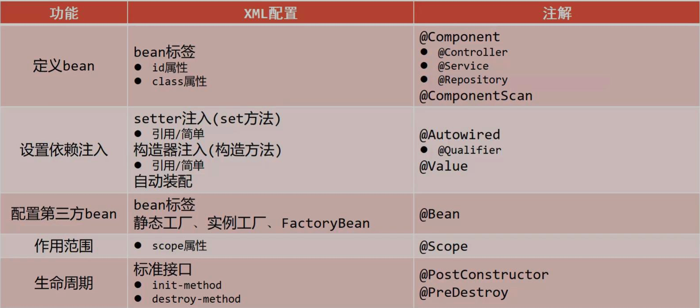

## Spring整合

### Spring整合MyBatis

- 步骤一：准备数据库表，MyBatis是用来操作数据库表的，所以我们先来创建库和表

  ```sql
  create database spring_db character set utf8;
  use spring_db;
  create table tbl_account(
      id int primary key auto_increment,
      name varchar(35),
      money double
  );
  
  INSERT INTO tbl_account(`name`,money) VALUES
  ('Tom',2800),
  ('Jerry',3000),
  ('Jhon',3100);
  ```

- 导入依赖

  ```xml
      <dependencies>
          <dependency>
              <groupId>org.springframework</groupId>
              <artifactId>spring-context</artifactId>
              <version>6.1.11</version>
          </dependency>
          <dependency>
              <groupId>com.alibaba</groupId>
              <artifactId>druid</artifactId>
              <version>1.1.16</version>
          </dependency>
  
          <dependency>
              <groupId>org.mybatis</groupId>
              <artifactId>mybatis</artifactId>
              <version>3.5.9</version>
          </dependency>
  
          <dependency>
              <groupId>mysql</groupId>
              <artifactId>mysql-connector-java</artifactId>
              <version>8.0.28</version>
          </dependency>
          <dependency>
              <groupId>junit</groupId>
              <artifactId>junit</artifactId>
              <version>RELEASE</version>
              <scope>test</scope>
          </dependency>
      </dependencies>
  ```

- 步骤三：根据表创建模型类

  ```java
  package org.sza.pojo;
  
  public class Account {
      private Integer id;
      private String name;
      private Double money;
  
      public Account() {
      }
  
      public Account(Integer id, String name, double money) {
          this.id = id;
          this.name = name;
          this.money = money;
      }
  
      public Integer getId() {
          return id;
      }
  
      public void setId(Integer id) {
          this.id = id;
      }
  
      public String getName() {
          return name;
      }
  
      public void setName(String name) {
          this.name = name;
      }
  
      public double getMoney() {
          return money;
      }
  
      public void setMoney(double money) {
          this.money = money;
      }
  
      @Override
      public String toString() {
          return "Account{" +
                  "id=" + id +
                  ", name='" + name + '\'' +
                  ", money=" + money +
                  '}';
      }
  }
  ```

- 步骤四：创建Mapper接口，一般是要配置一个对应的xml文件，不过这里没涉及到复杂的sql语句，所以没配置xml文件，采用注解开发）

  ```java
  public interface AccountMapper {
      @Insert("insert into tbl_account(name, money) VALUES (#{name}, #{money})")
      void save(Account account);
  
      @Delete("delete from tbl_account where id = #{id}")
      void delete(Integer id);
  
      @Update("update tbl_account set `name` = #{name}, money = #{money}")
      void update(Account account);
  
      @Select("select * from tbl_account")
      List<Account> findAll();
  
      @Select("select * from tbl_account where id = #{id}")
      Account findById(Integer id);
  }
  ```

  


