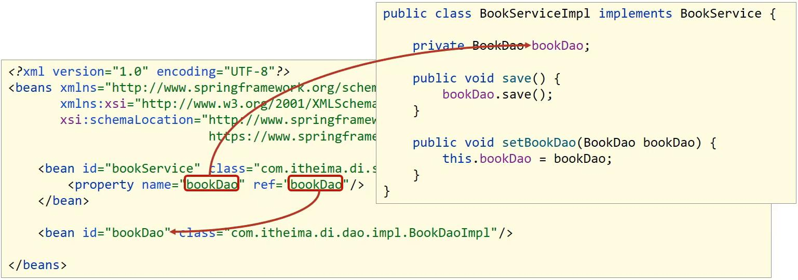

# MyBatis

MyBatis是一款优秀的持久型（JavaEE三层架构：表现层、业务层和持久层/数据访问层）框架，它支持自定义SQL、存储过程以及高级映射。MyBatis免除了几乎所有的JDBC代码以及设置参数和获取结果集的工作。MyBatis可以通过简单的XML或注解来配置和映射原始类型、接口和Java POJO（Plain Old Java Objects，普通老式Java对象）为数据库中的记录。


 ## MyBatis快速入门

### 创建user表，添加数据

```sql
create database mybatisDb; 
use mybatisDb;
drop table if exists tb_user;
create table tb_user( 
	id int primary key auto_increment, 
	username varchar(20), 
	password varchar(20), 
	gender char(1), 
	addr varchar(30) 
); 

INSERT INTO tb_user VALUES (1,'zhangsan','123','男','北京'); 
INSERT INTO tb_user VALUES (2,'李四','234','女','天津'); 
INSERT INTO tb_user VALUES (3,'王五','11','男','西安');
```

### 创建模块，导入坐标

通过maven创建java项目，pom.xml导入依赖：

```xml 
    <dependencies>
        <dependency>
            <groupId>org.mybatis</groupId>
            <artifactId>mybatis</artifactId>
            <version>3.5.9</version>
        </dependency>

        <dependency>
            <groupId>mysql</groupId>
            <artifactId>mysql-connector-java</artifactId>
            <version>8.0.28</version>
        </dependency>
    </dependencies>
```

### 编写MyBatis核心配置文件，--> 替换连接信息，解决硬编码问题


```xml
<?xml version="1.0" encoding="UTF-8" ?>
<!DOCTYPE configuration
        PUBLIC "-//mybatis.org//DTD Config 3.0//EN"
        "http://mybatis.org/dtd/mybatis-3-config.dtd">
<configuration>
    <environments default="development">
        <environment id="development">
            <transactionManager type="JDBC"/>
            <dataSource type="POOLED">
                <!-- 数据库连接信息-->
                <!--
                MySQL 8.0 以上 com.mysql.jdbc.Driver 更换为 com.mysql.cj.jdbc.Driver
                -->
                <property name="driver" value="com.mysql.cj.jdbc.Driver"/>
                <!--
                    mybatisDb是数据库名称
                    jdbc:mysql:// 是连接协议
                    在 xml 中 & 符合要转义成 &amp; 符号
                    MySQL 8.0 以上版本不需要建立 SSL 连接的，需要显示关闭。
                    allowPublicKeyRetrieval=true 允许客户端从服务器获取公钥。
                    最后还需要设置 CST(也就是设置时区)。
                -->
                <property name="url" value="jdbc:mysql://localhost:3306/mybatisDB?useSSL=false&amp;allowPublicKeyRetrieval=true&amp;serverTimezone=UTC"/>
                <property name="username" value="root"/>
                <property name="password" value="xxxx"/>
            </dataSource>
        </environment>
    </environments>
    <mappers>
        <!--
        加载映射文件。
        映射文件即SQL映射文件，该文件中配置了操作数据库的SQL语句，需要在MyBatis配置文件mybatis-config.xml中加载。
        mybatis-config.xml 文件可以加载多个映射文件，每个文件对应数据库中的一张表。
				一般会有个规范写法，操作User表就是 UserMapper.xml
        -->
        <mapper resource="mapper/UserMapper.xml"/>
    </mappers>
</configuration>
```

#### 创建 Mapper XML 文件

sql语句将通过namespace.sqlId获得sql语句。

```xml
<!DOCTYPE mapper
        PUBLIC "-//mybatis.org//DTD mapper 3.0//EN"
        "http://mybatis.org/dtd/mybatis-3-mapper.dtd">
<!-- UserMapper.xml -->
<!-- namespace 名称空间 通过namespace.sqlId获得sql语句 -->
<!-- com.sza.mapper.UserMapper.selectAll-->
<mapper namespace="com.sza.mapper.UserMapper">
    <!--  resultType指向封装的java类  -->
    <select id="selectAll" resultType="com.sza.jojo.User">
        SELECT * FROM tb_user;
    </select>
</mapper>
```

Mapper XML文件，通常存放在项目的classpath下的一个目录中，例如`resources/mapper/UserMapper.xml`。在上述示例中，我们定义了一个名为`selectAll`的查询操作，并将结果映射到`com.sza.pojo.User`类型（封装数据表的数据）的对象中。

#### 配置 MyBatis

要使用Mapper XML文件，需要在MyBatis的配置文件中引入它们。MyBatis的配置文件通常是mybatis-config.xml，您需要在其中配置Mapper XML文件的路径。

```xml
<!-- mybatis-config.xml -->
<configuration>
    <mappers>
        <mapper resource="mapper/UserMapper.xml"/>
    </mappers>
</configuration>
```

在上述配置中，我们使用`<mappers>`元素引入了Mapper XML文件，使用`<mapper>`元素的`resource`属性指定了XML文件的路径。

### 编码

### 定义POJO类

```java
package com.sza.jojo;

public class User {
    private Integer id;
    private String username;
    private String password;
    private String gender;
    private String address;


    public Integer getId() {
        return id;
    }

    public void setId(Integer id) {
        this.id = id;
    }

    public String getUsername() {
        return username;
    }

    public void setUsername(String username) {
        this.username = username;
    }

    public String getPassword() {
        return password;
    }

    public void setPassword(String password) {
        this.password = password;
    }

    public String getGender() {
        return gender;
    }

    public void setGender(String gender) {
        this.gender = gender;
    }

    public String getAddress() {
        return address;
    }

    public void setAddress(String address) {
        this.address = address;
    }

    @Override
    public String toString() {
        return "User{" +
                "id=" + id +
                ", username='" + username + '\'' +
                ", password='" + password + '\'' +
                ", gender='" + gender + '\'' +
                ", address='" + address + '\'' +
                '}';
    }
}
```

 ### 加载核心配置文件，获取sqlSessionFactory对象，执行sql语句

```java
package com.sza;

import com.sza.jojo.User;
import org.apache.ibatis.io.Resources;
import org.apache.ibatis.session.SqlSession;
import org.apache.ibatis.session.SqlSessionFactory;
import org.apache.ibatis.session.SqlSessionFactoryBuilder;

import java.io.IOException;
import java.io.InputStream;
import java.util.List;

public class MybatisDemo {
    public static void main(String[] args) throws IOException {

        // 1.加载mybatis的核心配置文件，获取sqlSessionFactory
        String resource = "mybatis-config.xml";
        InputStream inputStream = Resources.getResourceAsStream(resource);
        SqlSessionFactory sqlSessionFactory = new SqlSessionFactoryBuilder().build(inputStream);

        // 2.获取sqlSession对象，用它来执行sql
        SqlSession sqlSession = sqlSessionFactory.openSession();

        // 3.执行sql
        List<User> users = sqlSession.selectList("com.sza.mapper.UserMapper.selectAll");
        System.out.println(users);

        // 4.释放资源
        sqlSession.close();

    }
}
```

## 解决SQL映射文件的警告提示

产生原因：idea没和数据库建立连接，不识别表信息

解决方式：在idea中配置MySQL数据库连接

 
## Mapper代理开发


- 定义与SQL映射文件同名的Mapper接口，并且将Mapper接口与SQL映射文件放置在同一目录下


虽然在idea上配置文件和源代码是分离的，但编译过后`resources`和`java`两个是在一起的。

使用maven的compile编译一下：


因此：我们在`java`目录下和`resources`下创建相同的路径，最后编译就会在同一目录下：


- 设置SQL映射文件的namespace属性为Mapper接口全限定名

```xml
<!-- 设置配置文件的namespace为对应接口全限定名-->
<mapper namespace="com.sza.mapper.UserMapper">
    <!--  resultType指向封装的java类  -->
    <select id="selectAll" resultType="com.sza.jojo.User">
        SELECT * FROM tb_user;
    </select>
</mapper>
```

- 在Mapper接口中定义方法，方法名就是SQL映射文件中sql语句的id，并保持参数类型和返回值类型一致

```java
public interface UserMapper {
    List<User> selectAll();
}
```

- 编码：通过SqlSession的getMapper方法获取Mapper接口的代理对象，调用对应方法完成sql的执行

```java
         // 3.1 获取UserMapper接口的代理对象
        UserMapper userMapper = sqlSession.getMapper(UserMapper.class);
        List<User> users = userMapper.selectAll();
        System.out.println(users);
```

- 此外。如果Mapper接口名称和SQL映射文件名称相同，并且在同一目录下，则可以使用包扫描的方式简化SQL映射文件的加载。

```xml
    <mappers>
        <!--
        加载映射文件。
        映射文件即SQL映射文件，该文件中配置了操作数据库的SQL语句，需要在MyBatis配置文件mybatis-config.xml中加载。
        mybatis-config.xml 文件可以加载多个映射文件，每个文件对应数据库中的一张表。

        -->
        <!--        <mapper resource="com/sza/mapper/UserMapper.xml"/>-->
        <!-- 使用包扫描的方式 -->
        <package name="com.sza.mapper"/>
    </mappers>
```

## Mybatis核心配置文件

```xml
<?xml version="1.0" encoding="UTF-8" ?>
<!DOCTYPE configuration
        PUBLIC "-//mybatis.org//DTD Config 3.0//EN"
        "http://mybatis.org/dtd/mybatis-3-config.dtd">
<configuration>
<!--
environments：配置数据库连接环境信息
可以配置多个environment，通过default属性切换不同的environment 例如不同的数据源
-->
    <environments default="development">
        <environment id="development">
<!--    transactionManager（事务管理器）-->
            <transactionManager type="JDBC"/>
<!--    dataSource（数据源）-->
            <dataSource type="POOLED">
                <!-- 数据库连接信息-->
                <!--
                MySQL 8.0 以上 com.mysql.jdbc.Driver 更换为 com.mysql.cj.jdbc.Driver
                -->
                <property name="driver" value="com.mysql.cj.jdbc.Driver"/>
                <!--
                    mybatisDb是数据库名称
                    jdbc:mysql:// 是连接协议
                    在 xml 中 & 符合要转义成 &amp; 符号
                    MySQL 8.0 以上版本不需要建立 SSL 连接的，需要显示关闭。
                    allowPublicKeyRetrieval=true 允许客户端从服务器获取公钥。
                    最后还需要设置 CST(也就是设置时区)。
                -->
                <property name="url" value="jdbc:mysql://localhost:3306/mybatisDb?useSSL=false&amp;allowPublicKeyRetrieval=true&amp;serverTimezone=UTC"/>
                <property name="username" value="root"/>
                <property name="password" value="sunZIANG0415!"/>
            </dataSource>
        </environment>
    </environments>
    <mappers>
        <!--
        加载映射文件。
        映射文件即SQL映射文件，该文件中配置了操作数据库的SQL语句，需要在MyBatis配置文件mybatis-config.xml中加载。
        mybatis-config.xml 文件可以加载多个映射文件，每个文件对应数据库中的一张表。

        -->
        <!--        <mapper resource="com/sza/mapper/UserMapper.xml"/>-->
        <!-- 使用包扫描的方式 -->
        <package name="com.sza.mapper"/>
    </mappers>
    
</configuration>
```

## Mybatis案例实操

### 数据准备

数据库表：

```sql
use mybatisDb;  
drop table if exists tb_brand;  
create table tb_brand( 
id int primary key auto_increment,  
brand_name varchar(20),  company_name varchar(20),  
orderd int,  
description varchar(100),  
status int  );  
insert into tb_brand(brand_name, company_name, orderd, description, status) VALUES('三只松鼠','三只松鼠有限',5,'好好',0), ('asd','asda',100,'sdasd',1); 
select *from tb_brand;
```

实体类：

```java
package com.sza.jojo;

public class Brand {
    private Integer id;
    private String BrandName;
    private String companyName;
    private Integer ordered;
    private String description;
    private Integer status;

    public Integer getId() {
        return id;
    }

    public void setId(Integer id) {
        this.id = id;
    }

    public String getBrandName() {
        return BrandName;
    }

    public void setBrandName(String brandName) {
        BrandName = brandName;
    }

    public String getCompanyName() {
        return companyName;
    }

    public void setCompanyName(String companyName) {
        this.companyName = companyName;
    }

    public Integer getOrdered() {
        return ordered;
    }

    public void setOrdered(Integer ordered) {
        this.ordered = ordered;
    }

    public String getDescription() {
        return description;
    }

    public void setDescription(String description) {
        this.description = description;
    }

    public Integer getStatus() {
        return status;
    }

    @Override
    public String toString() {
        return "Brand{" +
                "id=" + id +
                ", BrandName='" + BrandName + '\'' +
                ", companyName='" + companyName + '\'' +
                ", ordered=" + ordered +
                ", description='" + description + '\'' +
                ", status=" + status +
                '}';
    }

    public void setStatus(Integer status) {
        this.status = status;
    }

}
```

安装插件MybatisX：配置文件和源文件会有对应


### 功能实现

#### 查询：查询所有数据

- 编写接口方法：Mapper接口

```java
package com.sza.mapper;

import com.sza.jojo.Brand;

import java.util.List;

public interface BrandMapper {
    List<Brand> selectAll();
}
```

- 参数：无
- 结果：List<Brand> 

- 编写sql语句：sql映射文件

```java
<!DOCTYPE mapper
        PUBLIC "-//mybatis.org//DTD mapper 3.0//EN"
        "http://mybatis.org/dtd/mybatis-3-mapper.dtd">

<mapper namespace="com.sza.mapper.BrandMapper">

    <select id="selectAll" resultType="com.sza.jojo.Brand">
        select *
        from tb_brand;
    </select>
</mapper>
```

- 执行方法，测试

```java
public class MybatisTest {
    @Test
    public void testSelectAll() throws IOException {
        // 1.加载mybatis的核心配置文件，获取sqlSessionFactory
        String resource = "mybatis-config.xml";
        InputStream inputStream = Resources.getResourceAsStream(resource);
        SqlSessionFactory sqlSessionFactory = new SqlSessionFactoryBuilder().build(inputStream);


        // 2.获取sqlSession对象，用它来执行sql
        SqlSession sqlSession = sqlSessionFactory.openSession();

        // 3.1 获取BrandMapper接口的代理对象
        BrandMapper mapper = sqlSession.getMapper(BrandMapper.class);
        List<Brand> brands = mapper.selectAll();
        System.out.println(brands);
        // 4.释放资源
        sqlSession.close();
    }
}
```


我们发现BrandName和companyName的值都为null

- 数据表的column和封装类的属性对应不上：

  
  我们发现Brand类的BrandName和companyName和数据表中的字段brand_name和company_name对应不上，因此无法自动装填。

  使用`resultMap`对不一致的进行映射：

  ```xml
  <!--BrandMapper.xml-->
  <!DOCTYPE mapper
          PUBLIC "-//mybatis.org//DTD mapper 3.0//EN"
          "http://mybatis.org/dtd/mybatis-3-mapper.dtd">
  
  <mapper namespace="com.sza.mapper.BrandMapper">
  
  <!--
      将数据表的column与Brand类不对应的属性 一一对应起来
      id唯一标识
      type映射类型，支持别名
  -->
      <resultMap id="brandResultMap" type="com.sza.jojo.Brand">
  <!--
      id: 完成主键字段的映射
      <id column="id" property="id"/>
      result：完成一半字段的映射
        <result column="brand_name" property="brandName"/>
  
  -->
  
          <result column="brand_name" property="brandName"/>
          <result column="company_name" property="companyName"/>
      </resultMap>
  <!--  这里不再使用resultType，而是使用resultMap  -->
      <select id="selectAll" resultMap="brandResultMap">
          select *
          from tb_brand;
      </select>
  </mapper>
  ```

  再次运行结果：

  

#### 查询：查询详情

- 编写接口方法：Mapper方法

```java
public interface BrandMapper {
    List<Brand> selectAll();

    Brand selectById(int id);
}
```

- 参数 ：id
- 结果：Brand
- 编写SQL语句

```java
<!--
    参数占位符：
    1. #{}: 会将这个地方替换为? 防止sql注入
    2. ${}: 会拼接sql语句  会存在sql注入问题
-->
		<select id="selectById" resultMap="brandResultMap">
        select *
        from tb_brand where id = #{id}
    </select>
```

- 执行方法，测试

```java
    @Test
    public void testSelectById() throws IOException {
        // 1.加载mybatis的核心配置文件，获取sqlSessionFactory
        String resource = "mybatis-config.xml";
        InputStream inputStream = Resources.getResourceAsStream(resource);
        SqlSessionFactory sqlSessionFactory = new SqlSessionFactoryBuilder().build(inputStream);


        // 2.获取sqlSession对象，用它来执行sql
        SqlSession sqlSession = sqlSessionFactory.openSession();

        // 3.1 获取BrandMapper接口的代理对象
        BrandMapper mapper = sqlSession.getMapper(BrandMapper.class);
        int id = 1;
        Brand brand = mapper.selectById(id);
        System.out.println(brand);
        // 4.释放资源
        sqlSession.close();
    }
```

#### 查询：多条件查询


- 编写接口方法 ：Mapper接口

```java
//    @Param("xxx") 是为了匹配 sql语句中#{xxx}的占位符
    List<Brand> selectByCondition(@Param("status")int status,@Param("companyName")String companyName,@Param("brandName")String brandName);
```

```java
//  如果参数都属于同一个对象，那么其实可以封装成一个对象作为参数  那么sql语句中 #{xxx} 就会去找该对象中的属性
    List<Brand> selectByCondition(Brand brand);
```

```java
//  当然也可以传入键值对 sql语句中的#{xxx}就会找map中对应的key
    List<Brand> selectByCondition(Map map);
```

- 参数：多个参数
- 结果List<Brand>
- 编写SQL语句

在 SQL 中，`||`是一个字符串连接运算符。它用于将两个或多个字符串连接在一起，形成一个新的字符串。例如，在查询语句`select 'abc' || 'def';`中，结果将是`abcdef`，即将`'abc'`和`'def'`这两个字符串连接起来。

在 MySQL 中，字符串连接运算符是`CONCAT()`函数，而不是`||`。例如，在 MySQL 中上述的字符串连接操作可以写成`CONCAT(#{companyName}, '%')`

```xml
<!--    #{xxx} 中的xxx尽量与类中的属性保持一致，会省去很多麻烦  -->
    <select id="selectByCondition" resultMap="brandResultMap">
        select *
        from tb_brand
        where status= #{status}
        and company_name like concat('%',#{companyName},'%')
        and brand_name like concat('%',#{brandName},'%')
    </select>
```

- 执行方法，测试

散装参数，方法中有多个参数，需要使用@Param("SQL参数占位符")

```java
//    @Param("xxx") 是为了匹配 sql语句中#{xxx}的占位符
    List<Brand> selectByCondition(@Param("status")int status,@Param("companyName")String companyName,@Param("brandName")String brandName);
```

```java
    @Test
    public void testSelectByCondition() throws IOException {
        int status = 1;
        String conpanyName = "三只";
        String brandName = "松鼠";

        // 1.加载mybatis的核心配置文件，获取sqlSessionFactory
        String resource = "mybatis-config.xml";
        InputStream inputStream = Resources.getResourceAsStream(resource);
        SqlSessionFactory sqlSessionFactory = new SqlSessionFactoryBuilder().build(inputStream);


        // 2.获取sqlSession对象，用它来执行sql
        SqlSession sqlSession = sqlSessionFactory.openSession();

        // 3.1 获取BrandMapper接口的代理对象
        BrandMapper mapper = sqlSession.getMapper(BrandMapper.class);
        List<Brand> brands = mapper.selectByCondition(status, conpanyName, brandName);
        System.out.println(brands);
        // 4.释放资源
        sqlSession.close();
    }
```

对象参数：

```java
//  如果参数都属于同一个对象，那么其实可以封装成一个对象作为参数  那么sql语句中 #{xxx} 就会去找该对象中的属性
    List<Brand> selectByCondition(Brand brand);
```

```java
@Test
    public void testSelectByCondition() throws IOException {
        int status = 1;
        String conpanyName = "三只";
        String brandName = "松鼠";

        Brand brand = new Brand();
        brand.setBrandName(brandName);
        brand.setStatus(status);
        brand.setCompanyName(conpanyName);

        // 1.加载mybatis的核心配置文件，获取sqlSessionFactory
        String resource = "mybatis-config.xml";
        InputStream inputStream = Resources.getResourceAsStream(resource);
        SqlSessionFactory sqlSessionFactory = new SqlSessionFactoryBuilder().build(inputStream);


        // 2.获取sqlSession对象，用它来执行sql
        SqlSession sqlSession = sqlSessionFactory.openSession();

        // 3.1 获取BrandMapper接口的代理对象
        BrandMapper mapper = sqlSession.getMapper(BrandMapper.class);
//        List<Brand> brands = mapper.selectByCondition(status, conpanyName, brandName);
        List<Brand> brands = mapper.selectByCondition(brand);
        System.out.println(brands);
        // 4.释放资源
        sqlSession.close();
    }
```

map集合参数：

```java
//  当然也可以传入键值对 sql语句中的#{xxx}就会找map中对应的key
    List<Brand> selectByCondition(Map map);
```

```java
@Test
    public void testSelectByCondition() throws IOException {
        int status = 1;
        String conpanyName = "三只";
        String brandName = "松鼠";

//        Brand brand = new Brand();
//        brand.setBrandName(brandName);
//        brand.setStatus(status);
//        brand.setCompanyName(conpanyName);

        Map map = new HashMap();
        map.put("status", status);
        map.put("companyName", conpanyName);
        map.put("brandName", brandName);

        // 1.加载mybatis的核心配置文件，获取sqlSessionFactory
        String resource = "mybatis-config.xml";
        InputStream inputStream = Resources.getResourceAsStream(resource);
        SqlSessionFactory sqlSessionFactory = new SqlSessionFactoryBuilder().build(inputStream);


        // 2.获取sqlSession对象，用它来执行sql
        SqlSession sqlSession = sqlSessionFactory.openSession();

        // 3.1 获取BrandMapper接口的代理对象
        BrandMapper mapper = sqlSession.getMapper(BrandMapper.class);
//        List<Brand> brands = mapper.selectByCondition(status, conpanyName, brandName);
//        List<Brand> brands = mapper.selectByCondition(brand);
        List<Brand> brands = mapper.selectByCondition(map);
        System.out.println(brands);
        // 4.释放资源
        sqlSession.close();
    }
```

#### 查询：动态条件查询

SQL语句会随着用户的输入或外部条件的变化而变化，我们称为<font color=yellow>动态SQL</font>。

动态SQL是MyBatis的强大特性之一：

- `if`：使用动态 SQL 最常见情景是根据条件包含 where 子句的一部分

使用`test`进行逻辑判断，其中的变量是类中的属性，而不是数据库的字段。

```xml
    <select id="selectByCondition" resultMap="brandResultMap">
        select *
        from tb_brand
        where status= #{status}
        and company_name like concat('%',#{companyName},'%')
        and brand_name like concat('%',#{brandName},'%')
    </select>
```

例如在该where子句中，由三个条件组成，用户可能只勾选其中两个条件进行查询。我们可以使用`if`进行动态添加。

```xml
    <select id="selectByDynamicCondition" resultMap="brandResultMap">
        select *
        from tb_brand
        where
        <if test="status != null">
            status = #{status}
        </if>
        <if test="companyName != null and companyName != '' ">  -- 这里判断条件中的变量要是Brand类的属性，不要写成company_name
            and company_name like concat('%',#{companyName},'%')
        </if>
        <if test="brandName != null and brandName != '' ">
            and brand_name like concat('%',#{brandName},'%')
        </if>
    </select>
```

```java
// BrandMapper.java 中添加selectByDynamicCondition
List<Brand> selectByDynamicCondition(Brand brand);
```

假设我们给 status和companyName属性赋值

```java
@Test
    public void testSelectByDynamicCondition() throws IOException {
        int status = 1;
        String companyName = "三只";
        String brandName = "松鼠";


        Brand brand = new Brand();
        brand.setStatus(status);
        brand.setCompanyName(companyName);
//        brand.setBrandName(brandName);

        // 1.加载mybatis的核心配置文件，获取sqlSessionFactory
        String resource = "mybatis-config.xml";
        InputStream inputStream = Resources.getResourceAsStream(resource);
        SqlSessionFactory sqlSessionFactory = new SqlSessionFactoryBuilder().build(inputStream);


        // 2.获取sqlSession对象，用它来执行sql
        SqlSession sqlSession = sqlSessionFactory.openSession();

        // 3.1 获取BrandMapper接口的代理对象
        BrandMapper mapper = sqlSession.getMapper(BrandMapper.class);

        List<Brand> brands = mapper.selectByDynamicCondition(brand);
        System.out.println(brands);
        // 4.释放资源
        sqlSession.close();
    }
```

运行会发现生成的sql语句：


说明是有效的，选择了 status = #{status}和 and company_name like concat('%',#{companyName},'%')两个条件进行查询，但是现在出现一个问题：<font color=yellow>如果不选择status这个条件，那么where后接的会有and，如下：</font>

```java
        Brand brand = new Brand();
//        brand.setStatus(status);
        brand.setCompanyName(companyName);
        brand.setBrandName(brandName);
```

运行报错：


解决办法：使用`<where>`标签替换where关键字，`<whrer>`只会在它包含的标签中有返回值的情况下才插入 “WHERE” 子句。 而且，若子句的开头为 “AND” 或 “OR”，where标签也会将它们去除。

```xml
    <select id="selectByDynamicCondition" resultMap="brandResultMap">
        select *
        from tb_brand
        <where>
            <if test="status != null">
                status = #{status}
            </if>
            <if test="companyName != null and companyName != '' ">
                and company_name like concat('%',#{companyName},'%')
            </if>
            <if test="brandName != null and brandName != '' ">
                and brand_name like concat('%',#{brandName},'%')
            </if>
        </where>
    </select>
```


我们发现and被去除了，此外我们如果不设置任何的值：

```java
        Brand brand = new Brand();
//        brand.setStatus(status);
//        brand.setCompanyName(companyName);
//        brand.setBrandName(brandName);
```

运行，发现不会插入where子句：


- choose (when, otherwise)
- trim (where, set)
- foreach

# Maven

Maven是apache旗下的一个开源项目，是一款用于管理和构建java项目的工具，它基于项目对象模型（POM，project object model）的概念，通过一小段描述信息来guan

Maven的作用：

- 方便快捷地管理项目依赖地资源jar包，避免版本冲突问题

- 提供统一、标准地项目结构

  - 一个使用Maven管理的普通的Java项目，它的目录结构默认如下：

  - ```xml
    a-maven-project
    ├── pom.xml
    ├── src
    │   ├── main
    │   │   ├── java
    │   │   └── resources
    │   └── test
    │       ├── java
    │       └── resources
    └── target
    ```

  - 项目的根目录`a-maven-project`是项目名，它有一个项目描述文件`pom.xml`，存放Java源码的目录是`src/main/java`，存放资源文件的目录是`src/main/resources`，存放测试源码的目录是`src/test/java`，存放测试资源的目录是`src/test/resources`，最后，所有编译、打包生成的文件都放在`target`目录里。这些就是一个Maven项目的标准目录结构。

    所有的目录结构都是约定好的标准结构，我们千万不要随意修改目录结构。使用标准结构不需要做任何配置，Maven就可以正常使用。

  - 最关键的一个项目描述文件`pom.xml`，它的内容长得像下面：

  - ```xml
    <project ...>
    	<modelVersion>4.0.0</modelVersion>
    	<groupId>com.itranswarp.learnjava</groupId>
    	<artifactId>hello</artifactId>
    	<version>1.0</version>
    	<packaging>jar</packaging>
    	<properties>
            <project.build.sourceEncoding>UTF-8</project.build.sourceEncoding>
    		<maven.compiler.release>17</maven.compiler.release>
    	</properties>
    	<dependencies>
            <dependency>
                <groupId>org.slf4j</groupId>
                <artifactId>slf4j-simple</artifactId>
                <version>2.0.16</version>
            </dependency>
    	</dependencies>
    </project>
    ```
  
    其中，`groupId`类似于Java的包名，通常是公司或组织名称，`artifactId`类似于Java的类名，通常是项目名称，再加上`version`，一个Maven工程就是由`groupId`，`artifactId`和`version`作为唯一标识。

    我们在引用其他第三方库的时候，也是通过这3个变量确定。例如，依赖`org.slfj4:slf4j-simple:2.0.16`：

    ```xml
    <dependency>
        <groupId>org.slf4j</groupId>
        <artifactId>slf4j-simple</artifactId>
        <version>2.0.16</version>
    </dependency>
    ```
  
    使用`<dependency>`声明一个依赖后，Maven就会自动下载这个依赖包并把它放到classpath中。

    另外，注意到`<properties>`定义了一些属性，常用的属性有：

    - `project.build.sourceEncoding`：表示项目源码的字符编码，通常应设定为`UTF-8`；
  - `maven.compiler.release`：表示使用的JDK版本，例如`21`；
    - `maven.compiler.source`：表示Java编译器读取的源码版本；
    - `maven.compiler.target`：表示Java编译器编译的Class版本。
  
    从Java 9开始，推荐使用`maven.compiler.release`属性，保证编译时输入的源码和编译输出版本一致。如果源码和输出版本不同，则应该分别设置`maven.compiler.source`和`maven.compiler.target`。

    通过`<properties>`定义的属性，就可以固定JDK版本，防止同一个项目的不同的开发者各自使用不同版本的JDK。

- 标准跨平台（Linux、Windows、MacOS）的自动化项目构建方式

  - 清理clean-->编译compile-->测试test-->打包package-->发布
  - 生成的文件会在target当中

  

​	安装步骤：

1. 解压apache-maven-3.9.9-bin.zip 

2. 配置本地仓库，修改conf/setting.xml中的localRepository

   ```xml
     <!-- localRepository
      | The path to the local repository maven will use to store artifacts.
      |
      | Default: ${user.home}/.m2/repository
     <localRepository>/path/to/local/repo</localRepository>
     -->
     <localRepository>D:\APP\apache-maven-3.9.9-bin\apache-maven-3.9.9\mvn_repo</localRepository>
   ```

3. 配置阿里云的私服，修改con/setting.xml中的<mirrors>标签，为其添加如下子标签：

4. 配置环境变量：MAVEN_HOME为maven的解压目录，并将其bin目录加入PATH环境变量

5. 命令行中测试 

   ```shell
   mvn -v
   ```


IDEA创建Maven项目


Maven中的坐标是<font color=red>资源的唯一标识，通过该坐标可以唯一定位资源的位置</font>

使用坐标来定义项目或引入项目中需要的依赖


- groupId：定义当前Maven项目隶属组织名称
- artifactId：定义当前Maven项目名称（通常是模块名称）
- version：定义当前项目版本号

依赖配置：


没有的话，可以直接去官方Maven去搜复制maven代码即可。


# Spring

## Spring Framework系统框架


## IoC（Inversion of Control）控制反转

背景引入：


<font color=yellow>代码耦合度偏高：</font>原先在业务逻辑层的实现类（BookServiceImpl）中会new一个数据访问层的实现类（BookDaoImpl），当出现一个数据访问层迎来了一个全新的实现（BookDaoImpl2），业务逻辑层的相关代码就需要改变。

解决方案：使用对象时，在程序中不要主动使用new产生对象，转换为<font color=yellow>外部提供对象</font>，这就是IoC（Inversion of Control）控制反转 => <u>对象的创建控制权由程序转移到<font color=yellow>外部</font></u>

Spring技术对IoC思想进行了实现：

- Spring提供了一个容器，称为<font color=yellow>IoC容器
  </font>，用来充当IoC思想中的<font color=yellow>“外部”</font>
- IoC容器负责对象的创建、初始化等一系列的工作，被创建或管理的对象在IoC容器中统称为<font color=yellow>Bean</font>

业务逻辑层（service）的对象与数据访问层（dao）的对象都可以放入IoC容器当中

service层的对象的运行依赖于dao层对象


使用<font color=yellow>DI（Dependency Injection）依赖注入</font>进行解决：

- 依赖注入，在容器中建立bean于bean之间的依赖关系的整个过程。

步骤：

1. 使用IoC容器管理bean
2. 在IoC容器中将有依赖关系的bean进行关系绑定（DI）

最终效果：

使用对象时不仅可以直接从IoC容器中获取，并且获取到的bean已经绑定了所有的依赖关系

## IoC入门案例

#### 入门案例思路分析

1. Spring是使用容器来管理bean对象的，那么管什么?
   - 主要管理项目中所使用到的类对象，比如(Service和Dao)
2. 如何将被管理的对象告知IOC容器?
   - 使用配置文件
3. 被管理的对象交给IOC容器，要想从容器中获取对象，就先得思考如何获取到IOC容器?
   - Spring框架提供相应的接口
4. IOC容器得到后，如何从容器中获取bean?
   - 调用Spring框架提供对应接口中的方法
5. 使用Spring导入哪些坐标?
   - 用别人的东西，就需要在pom.xml添加对应的依赖


#### 入门案例代码实现

需求分析:将BookServiceImpl和BookDaoImpl交给Spring管理，并从容器中获取对应的bean对象进行方法调用。

1. 创建Maven的java项目

2. pom.xml添加Spring的依赖jar包

```xml
    <dependencies>
        
        <dependency>
            <groupId>org.springframework</groupId>
            <artifactId>spring-context</artifactId>
            <version>6.1.14</version>
        </dependency>
        
    </dependencies>

```

3. 创建BookDao，BookDaoImpl，BookService和BookServiceImpl四个类

```java
public interface BookDao {
    public void save();
}
```

```java
public class BookDaoImpl implements BookDao {
    public void save() {
        System.out.println("book dao save ...");
    }
}
```

```java
public interface BookService {
    public void save();
}
```

```java
public class BookServiceImpl implements BookService {
    private BookDao bookDao = new BookDaoImpl();
    public void save() {
        System.out.println("book service save ...");
        bookDao.save();
    }
}
```

4. resources下添加spring配置文件，这个spring配置文件就是将被管理的类告知IoC容器

```xml
<?xml version="1.0" encoding="UTF-8"?>
<beans xmlns="http://www.springframework.org/schema/beans"
       xmlns:xsi="http://www.w3.org/2001/XMLSchema-instance"
       xsi:schemaLocation="http://www.springframework.org/schema/beans http://www.springframework.org/schema/beans/spring-beans.xsd">
    <!-- applicationContext.xml spring配置文件 => 将所要管理的类添加至配置文件当中   -->

    <!-- bean标签配置bean   -->
    <!-- id属性在同一个上下文中(配置文件)不能重复 标识bean    -->
    <!-- class属性给bean定义类型 得是具体的实现类 IoC通过调用该类创造对象 -->
    <bean id="bookDao" class="org.example.dao.impl.BookDaoImpl"/>

    <bean id="bookService" class="org.example.service.impl.BookServiceImpl"/>

</beans>
```

5. 获取IOC容器，从容器中获取对象进行方法调用

```java
// main.java 调用service方法
package org.sza;
import org.springframework.context.ApplicationContext;
import org.springframework.context.support.ClassPathXmlApplicationContext;
import org.sza.dao.bookDao;
import org.sza.service.bookService;

public class Main {
    public static void main(String[] args) {
//        使用Spring ClassPathXmlApplicationContext 完成IOC容器的创建
        ApplicationContext context = new ClassPathXmlApplicationContext("applicationContext.xml");
//        使用getBean(String name)方法，其name参数就是我们在bean配置的id，通过这个id来创造对象
        bookService bookService = (bookService)context.getBean("bookService");
        bookService.save();
    }
}
```

```java
// bookServiceImpl.java 调用 Dao层方法
package org.sza.service.impl;

import org.springframework.context.ApplicationContext;
import org.springframework.context.support.ClassPathXmlApplicationContext;
import org.sza.dao.bookDao;
import org.sza.service.bookService;

public class bookServiceImpl implements bookService {
    private bookDao bookDao;
    @Override
    public void save() {
        System.out.println("save book service");
        ApplicationContext context = new ClassPathXmlApplicationContext("applicationContext.xml");
        bookDao = (bookDao) context.getBean("bookDao");
        bookDao.save();
    }
}
```

至此，Spring的IOC入门案例已经完成，但是在`BookServiceImpl`的类中依然存在`BookDaoImpl`对象的new操作（如如果你不使用IoC容器调用的话），它们之间的耦合度还是比较高，这块该如何解决，就需要用到下面的`DI(依赖注入)`来解决bean与bean之间的依赖关系。

## DI入门案例

#### 入门案例思路分析

1. 要想实现依赖注入，必须要基于IOC管理Bean
   - DI的入门案例要依赖于前面的IOC入门案例
2. Service中使用new形式创建的Dao对象是否保留？
   - 不保留，这样才能解耦合，最终要使用IOC容器中的bean对象
3. Service中需要的Dao对象如何进入到Service中？
   - 在Service中提供一个方法（例如提供一个set方法），让Spring的IOC容器可以通过该方法传入bean对象，也就达到了不是自己new，而是外部提供
4. Service与Dao之间的关系如何描述？
   - 使用配置文件

#### 入门案例代码实现

需求：基于IOC入门案例，在BookServiceImpl类中删除new对象的方式，使用Spring的DI完成Dao层的注入

1. 删除业务层中使用new的方式创建的dao对象，在业务层提供BookDao的setter方法

```java
package org.sza.service.impl;

import org.sza.dao.BookDao;
import org.sza.service.BookService;

public class BookServiceImpl implements BookService {
    private BookDao bookDao;
    @Override
    public void save() {
        System.out.println("save book service");

    }

    public void setBookDao(BookDao bookDao) {
        this.bookDao = bookDao;
    }
}
```

2. 在配置文件中添加依赖注入的配置

```xml
<?xml version="1.0" encoding="UTF-8"?>
<beans xmlns="http://www.springframework.org/schema/beans"
       xmlns:xsi="http://www.w3.org/2001/XMLSchema-instance"
       xsi:schemaLocation="http://www.springframework.org/schema/beans http://www.springframework.org/schema/beans/spring-beans.xsd">

    <bean id="bookDao" class="org.sza.dao.impl.BookDaoImpl"/>
    <bean id="bookService" class="org.sza.service.impl.BookServiceImpl">
        <!-- 配置Service与Dao之间的关系 -->
        <property name="bookDao" ref="bookDao"/>
    </bean>
</beans>
```


- 注意:配置中的两个bookDao的含义是不一样的，一个提供方法 一个提供对象
  - name=”bookDao”中`bookDao`的作用是让Spring的IOC容器在获取到名称后，将首字母大写，前面加set找对应的`setBookDao()`方法进行对象注入
  - ref=”bookDao”中`bookDao`的作用是让Spring能在IOC容器中找到id为`bookDao`的Bean对象给`bookService`进行注入


