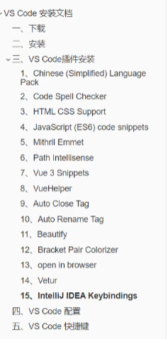

## HTML

### <u><font color=blue>HTML 全称 Hypertext Markup Lanuage 超文本标记语言</font></u>

XML的标签可以由自己定义，而HTML的标签都是预定义好的

HTML代码直接在浏览器中运行，HTML标签由浏览器解析

HTML 的作用是为网页提供结构，它告诉浏览器哪些部分是标题，哪些部分是段落，哪些是列表......

HTML通过一系列的标签（也称为元素）来定义文本、图像、链接等等。HTML标签可以通过属性来提供更多的信息。

HTML标签是由尖括号包围起来的关键字。

标签通常成对出现，包括开始标签和结束标签（也称为双标签），内容位于这两个标签之间，例如：

```html
    <p>这是一个段落</p>
    <h1>这是一个标题</h1>
    <a href="www.baidu.com">这是一个超链接</a>
```

除了双标签，也存在单标签，顾名思义，单标签没有结束标签，例如input、换行、分割线标签：

```java
    <input type="text">
    <br> 
    <hr>
```

区别在于：单表签用于没有内容的元素，双标签用于有内容的元素

### <font color=blue><u>HTML文本结构</u></font>

```html
<!DOCTYPE html> 
<!-- 告诉浏览器 这是一个 HTML文件-->
<html lang="en"> 
    <!-- html标签对 也是咱HTML文档的根元素 
    意思就是 它是我们这个HTML文档的起始点 也是这个文档的最外层容器 包含了整个文档的结构 -->
<head> 
    <!-- head标签对 表示我们这个文档的头部 包含了一些文件的原信息 
    比如文档的标题 title 文档的编码格式 <meta charset>
    以及外部样式表CSS和JS文件
    -->
    <meta charset="UTF-8">
    <meta name="viewport" content="width=device-width, initial-scale=1.0">
    <title>HTML 练习1</title>
</head>
<body> 
    <!-- body标签对 包含了实际显示在流浪器中页面的内容 
    比如一些文本、图像和链接等等
    -->
    <p>这是一个段落</p>
    <h1>这是一个标题</h1>
    <a href="https://www.baidu.com">这是一个超链接</a>

    <input type="text">
    <br>
    <hr>
</body>
</html>
```

#### 常用文本标签

```html
<!DOCTYPE html> 
<!-- 告诉浏览器 这是一个 HTML文件-->
<html lang="en"> 
    <!-- html标签对 也是咱HTML文档的根元素 
    意思就是 它是我们这个HTML文档的起始点 也是这个文档的最外层容器 包含了整个文档的结构 -->
<head> 
    <!-- head标签对 表示我们这个文档的头部 包含了一些文件的原信息 
    比如文档的标题 title 文档的编码格式 <meta charset>
    以及外部样式表CSS和JS文件
    -->
    <meta charset="UTF-8">
    <meta name="viewport" content="width=device-width, initial-scale=1.0">
    <title>HTML 练习1</title>
</head>
<body> 
    <!-- body标签对 包含了实际显示在流浪器中页面的内容 
    比如一些文本、图像和链接等等
    -->
    <p>这是一个段落</p>
    <h1>一级标题</h1>
    <h2>二级标签</h2>

    <p>段落标签</p>
    <p>更改文本样式： <b>字体加粗</b> <i>斜体</i> <u>下划线</u> </p>
    
    <ul>
    <!-- 无序列表 unordered list 包裹着几个<li> 标签 -->
        <li> 1 </li>
        <li> 2 </li> 
    </ul>
    
    <ol>
    <!-- 有序列表 ordered list 包裹着几个<li>标签 -->
        <li> 1 </li>
        <li> 2 </li> 
    </ol>


    <!-- 我们也可以为表格添加边框，方法就是在table标签
    里添加border属性 -->
    <table border="2">
        <!-- tr: table row -->
        <!-- 第一行为列标题，用<th>包裹而不是<td>-->
        <!-- td: table data -->
        <tr>
            <th>列标题1</th>
            <th>列标题2</th>
            <th>列标题3</th>
        </tr>
        <tr>
            <td> 元素1 </td>
            <td> 元素2 </td>
            <td> 元素3 </td>
        </tr>
    </table>

</body>
</html>
```

#### HTML标签属性

属性在 HTML 中起到非常重要的作用，它们用于定义元素的行为和外观，以及与其他元素的关系。下面是 HTML 属性的一些基本概念和常见用法。

在 HTML 中，每个元素都可以有一个或多个属性，用于描述元素的特征和行为。属性的基本语法是：`<开始标签 属性名="属性值">`，其中属性名用于标识该属性，属性值则定义该属性的值。属性名和属性值之间用等号 `=` 隔开，属性值一般要用引号将其括起来，可以是单引号或双引号，示例：

```html

```

其中，`src` 是指定图片的文件路径的属性，`alt` 是指定在无法加载图片时显示的替代文本的属性。这些属性可以让用户了解图像的内容，同时也有助于调整图片的大小和位置。

属性是用来定义元素的性质和功能的。它们可以指定元素的尺寸、颜色、文字方向、链接目标等，有助于页面的定位和布局。下面是一些常见的属性用法：

1. `class` 属性：`class` 属性是用于向元素添加一个或多个类名，以便通过 CSS 样式表定义样式。此外，类名还可以用来实现 JavaScript 的交互效果。例如：

```html
<p class="note">这是一个带有 note 类属性的 p 标签</p>
```

1. `id` 属性：`id` 属性是用于将元素标识为唯一的标识符。它使得我们可以通过 JavaScript 或 CSS 来定位和操作该元素。例如：

```html
<div id="header">这是一个带有 header id 的 div 标签</div>
```

1. `style` 属性：`style` 属性是用于将CSS样式规则直接应用于元素。它可以用于控制元素的颜色、字体、大小和布局等。例如：

```html
<div style="color: red; font-size: 20px;">这是一段红色的文字</div>
```

以上三种是所有标签都有的属性，也有一些标签具有独特的属性，比如 a 标签的 href 属性，img 标签的 src 属性等等。

#### HTML区块-块元素与行内元素

有些元素在浏览器中显示是独占一行的，而其他元素是不能跟这个元素位于同一行，例如p标签、h1标签以及表格table标签等等。

而有些元素则不是，意思就是其他元素可以和这个元素位于同一行。比如a标签、img标签等。

因此根据元素的表达形式可以分为：行内元素和块元素。这些不同类型的元素在 HTML 文档中的呈现和布局方面有很大的不同。下面是关于这两种类型的元素的详细说明：

1. `块级元素（block）`：块级元素通常用于组织和布局页面的主要结构和内容，例如段落、标题、列表、表格等。它们用于创建页面的主要部分，将内容分隔成逻辑块。
   - 块级元素通常会从新行开始，并占据整行的宽度，因此它们会在页面上呈现为一块独立的内容块。
   - 可以包含其他块级元素和行内元素。
   - 常见的块级元素包括 `<div>`, `<p>`, `<h1>` 到 `<h6>`, `<ul>`, `<ol>`, `<li>`, `<table>`, `<form>` 等。
2. `行内元素（inline）`：行内元素通常用于添加文本样式或为文本中的一部分应用样式。它们可以在文本中插入小的元素，例如超链接、强调文本等。
   - 行内元素通常在同一行内呈现，不会独占一行。
   - 它们只占据其内容所需的宽度，而不是整行的宽度。
   - 行内元素不能包含块级元素，但可以包含其他行内元素。
   - 常见的行内元素包括 `<span>`, `<a>`, `<strong>`, `<em>`, ``, `<br>`, `<input>` 等。

示例：

```html
<div>这是一个块级元素，通常就用于创建一个可以包含其他HTML元素的容器快，它通常没有任何语义，仅用于组织内容。通常用于创建页面的布局结构</div>

<p>这也是一个块级元素，通常用于段落。</p>

<a href="https://docs.geeksman.com">这是一个行内元素，它嵌套在段落中。</a>

<span>行内元素，span标签相当于没有任何内容的a标签和img标签，主要作用就是将一小块文本给它包装起来，以便于对它们使用样式、CSS或者使用JS行为。因为是行内元素，不会独占一行，只会占用内容所需长度</span>
```

总结：<div>标签通常用于创建块级容器，以便于组织页面的结构和布局，而<span>标签用于内联样式化文本，给文本的一部应用样式或者标记，使用这两个标签时通常是与CSS和JS一起使用。

#### 表单form标签

HTML 表单（form）是一种重要的元素， 用于收集和提交用户输入的数据。表单允许用户输入文本、选择选项、上传文件等，然后将这些数据提交到服务器进行处理。一个基本的HTML表单由以下几个主要部分组成：

1. `<form>` 元素：表单元素是表单的容器，创建一个表单，就和创建一个表格差不多，如果想要制作表单，需要将表单中的所有元素必须包含在form标签内部即可。它定义了数据提交到哪里以及使用哪种 HTTP 方法（通常是 GET 或 POST ）来提交数据。它可以包含输入字段、按钮等元素。

```html
<form action="/submit" method="post">
    <!-- 表单元素 -->
</form>
```

`输入字段`：`<input>` 标签是 HTML 中用于创建表单元素的**<u>最常见标签</u>**之一。它允许用户输入文本、选择选项、上传文件等等。`<input>` 元素有多个属性，用于指定不同类型的输入和控制输入的方式。以下是一些常见的 `<input>` 标签的属性和它们的详细说明：

`type` 属性：指定input元素的类型，它可以有以下不同的值：

- `text`：创建文本输入框，用于用户输入文本。
- `password`：创建密码输入框，输入内容会被隐藏。
- `radio`：创建单选按钮，用户只能选择一个选项。
- `checkbox`：创建复选框，用户可以选择多个选项。
- `number`：创建数字输入框，允许用户输入数字。
- `email`：创建用于输入电子邮件地址的输入框。
- `file`：创建文件上传字段，用户可以上传文件。
- `submit`：创建提交按钮，用于提交表单数据。
- `reset`：创建重置按钮，用于重置表单数据。
- `button`：创建自定义按钮，通常与 JavaScript 一起使用。

```html

<form action="#">   
    <!-- placeholder 文本框里默认显示的内容 -->
    <label for="username">用户名</label>
    <input type="text" id="username" placeholder="请输入你的用户名">
    <!-- 在html当中有专门为input元素做标记的标签label 
        仅限于和input对应使用 使用for与input标签中的id进行对应
    -->
    <label for="password"> 密码： </label>
    <input type="password" id="password" placeholder="密码">

    <!-- radio 要想实现单选框的效果
    需要在多个radio 的name为同一个值-->
    <label for=""></label>
    <input type="radio" name="gender" value="male"> 男
    <input type="radio" name="gender" value="female"> 女
    <input type="radio" name="gender" value="其他"> 其他
    <br>
    <!-- 多选 checkbox-->
    <label>爱好：</label>
    <input type="checkbox" name="hobby" value="yes"> 篮球
    <input type="checkbox" name="hobby" value="yes"> 唱
    <input type="checkbox" name="hobby" value="yes"> 跳
    <input type="checkbox" name="hobby" value="yes"> rap
    <input type="checkbox" name="hobby" value="yes"> 用java搞科研
    <select name="country">
        <option value="zh">中国</option>
        <option value="us">美国</option>
        <!-- 其他选项 -->
    </select>
    <!-- submit 将form表单中填写的数据 给提交到一个地方
    具体是哪个地方，就是form标签的属性action：表示向何处发送我们的数据
    所以action的属性值也就是一个URL
    -->
    <input type="submit" >
</form>
```

表单元素可以包含一些属性，以指定表单的行为和样式。常见的表单属性包括：

|  属性  |                          描述                          |
| :----: | :----------------------------------------------------: |
| action |            指定表单数据提交到服务器的 URL。            |
| method | 指定用于提交数据的 HTTP 方法，通常为 `get` 或 `post`。 |
|  name  |         为表单命名，以便在 JavaScript 中引用。         |
| target |            指定表单提交后的目标窗口或框架。            |

表单提交方式的区别

`get`：默认值，主动地获取方式，参数放在 URL 上，数据的容量有限，安全性差，有缓存；

`post`：数据存放在请求体中，数据量理论上没有限制，相对安全，没有缓存。

最后，我们使用表单来写一个用户注册的页面，代码如下：


```html
<h2>用户注册</h2>
<form action="/submit" method="post">
    <label for="username">用户名：</label>
    <input type="text"><br><br>

    <label for="password">密码：</label>
    <input type="password"><br><br>

    <label for="email">电子邮件地址：</label>
    <input type="text"><br><br>

    <label for="age">年龄：</label>
    <input type="number" width="5"><br><br>

    <label>性别：</label>
    <input type="radio" name="gender" value="male"> 男
    <input type="radio" name="gender" value="female"> 女<br><br>

    <label>喜欢的编程语言：</label>
    <input type="checkbox" name="languages" value="python"> Python
    <input type="checkbox" name="languages" value="javascript"> JavaScript
    <input type="checkbox" name="languages" value="java"> Java
    <input type="checkbox" name="languages" value="cpp"> C++<br><br>

    <input type="submit" value="提交">
</form>
```

## CSS

CSS的全称：Cascading Style Sheets 中文名：层叠样式表

用于定义网页样式和布局的样式表语言，一般是与HTML一起用于构建web页面的，HTML负责定义页面的结构和内容，而CSS负责控制页面的外观和样式。

通过CSS，你可以指定页面各个元素的颜色、字体、大小、间距、边框、背景等样式，从而实现更精确的页面设计。


CSS语法：

CSS通常由选择器、属性和属性值组成，多个规则可以组合在一起，以便同时应用多个样式。

```css
选择器 {
    属性1: 属性值1;
    属性2: 属性值2;
}
```

注意事项

1. 声明的每一行属性，都需要以英文分号结尾；
2. 声明中的所有属性和值都是以键值对这种形式出现的；
3. 选择器的声明中可以写无数条属性

这个选择器就是要选择要应用样式的这个HTML元素/标签，它可以是选择所有元素或者特定元素或者特定类或者特定id

#### CSS导入方式

在 CSS 中，你可以使用不同的方式来导入样式表，以便将样式应用到 HTML 文档。下面是三种常见的 CSS 导入方式：

1. `内联样式（Inline Styles）`：内联样式是将 CSS 样式直接嵌入到 HTML 元素中的一种方式。你可以在 HTML 标签的 style 属性中定义样式规则。这些样式仅适用于特定元素，优先级较高。

示例：

```html
<h1 style="color: blue; font-size: 30px;">这是一段内联样式文本。</h1>
```

1. `内部样式表（Internal Stylesheet）`：内部样式表是将 CSS 样式放置在 HTML 文档的 `<head>` 部分的 `<style>` 标签内。这些样式将应用于整个文档，但仍具有较高的优先级。

示例：

```html
<head>
    <style>
        h2 {
            color: red;
            font-size: 16px;
        }
    </style>
</head>
<body>
<h2>这是一段内部样式表控制文本。</h2>
</body>
```

1. `外部样式表（External Stylesheet）`：外部样式表是将 CSS 样式定义在一个单独的 .css 文件中，并使用 `<link>` 元素将其链接到 HTML 文档中。这是一种最常用的方式，允许你在多个页面上重用相同的样式。外部样式表具有较低的优先级。

示例：

在该 HTML 文件目录下创建名为 `css` 的目录，并创建 `style.css` 的外部样式表文件，在其中加入以下代码：

```css
p {
    color: purple;
    font-size: 16px;
}
```

在 HTML 文档中链接外部样式表：

```html
<head>
    <link rel="stylesheet" type="text/css" href="./css/style.css">
</head>
<body>
<p>这是一段外部样式表控制文本。</p>
</body>
```

使用外部样式表的优势在于它可以帮助你更好地维护和管理样式，使样式与内容分离，提高代码的可维护性。根据需要，你可以选择其中一种或多种导入方式，具体取决于项目的要求和结构。

三种导入方式的优先级

不同的导入方式（内联样式、内部样式表、外部样式表）具有不同的优先级，优先级高的会覆盖掉优先级低的样式：`内联样式` > `内部样式表` > `外部样式表`。

#### 选择器（Selectors）

选择器用于选择要应用样式的 HTML 元素。可以选择所有的元素、特定元素、特定类或 ID 的元素，甚至更多。选择器位于规则的开头。

- 元素选择器：选择特定类型的 HTML 元素（例如，`p` 选择所有段落）。
- 类选择器：选择具有特定类的元素（例如，`.highlight` 选择具有 highlight 类的元素）。
- ID 选择器：选择具有特定 ID 的元素（例如，`#header` 选择 ID 为 header 的元素）。
- 通用选择器 *：选择页面上所有的元素。
- 子元素选择器：选择直接位于父元素内部的子元素。语法：`父元素 > 子元素`，例如，`ul > li` 选择了 `<ul>` 元素内直接包含的 `<li>` 元素。
- 后代选择器（包含选择器）：选择元素的后代元素。语法：`元素名 元素名`，例如，`ul li` 选择了所有在 `<ul>` 元素内部的 `<li>` 元素。
- 相邻兄弟选择器：选择紧邻在另一个元素后面的兄弟元素。`元素名 + 元素名`，例如，`h2 + p` 选择了与 `<h2>` 相邻的 `<p>` 元素。
- 伪类选择器：选择 HTML 文档中的元素的特定状态或位置，而不仅仅是元素自身的属性。伪类选择器以冒号（:）开头，通常用于为用户交互、文档结构或其他条件下的元素应用样式。这些条件可以包括鼠标悬停（`:hover` ）、链接状态（`:active`）、第一个子元素（`:first-child`）等。

```html
<!DOCTYPE html>
<html lang="en">
<head>
    <title>CSS 选择器</title>
    <style>
        /* 元素选择器 */
        h2 {
            color: aqua;
        }

        /* 类选择器 */
        .highlight {
            background-color: yellow;
        }

        /* ID选择器 */
        #header {
            font-size: 35px;
        }


        /* 子元素选择器 */
        .box > .element {
            color: yellowgreen;
        }

        /* 后代选择器 */
        div .element {
            font-size: x-large;
            color: brown;
        }

        /* 相邻兄弟选择器 */
        h3 + p {
            color: red;
        }

        /* 通用兄弟选择器 */
        h4 ~ p {
            background-color: #1b91ff;
        }

        /* 伪类选择器 */
        .hover:hover {
            background-color: blueviolet;
        }

        /* 通用选择器 */
        * {
            font-family: 'KaiTi';
            font-weight: bold;
        }
    </style>
</head>

<body>
<h1>不同类型的CSS选择器示例</h1>
<h2>这是一个元素选择器示例</h2>
<h3 class="highlight">这是一个类选择器示例</h3>
<h4 id="header">这是一个ID选择器示例</h4>
<div class="box">
    <p class="element">这是一个子元素选择器示例</p>
    <div>
        <p class="element">这是一个后代选择器示例</p>
    </div>
</div>
<p>选中标签之前的 p 标签</p>
<h3>这是相邻兄弟选择器示例</h3>
<p>相邻兄弟元素示例</p>
<h4>这是通用兄弟元素选择器示例</h4>
<p>通用兄弟元素示例</p>
<h3 class="hover">这是一个 hover 伪类选择器示例</h3>
</body>

</html>
```

选择器的优先级

CSS 中，样式的优先级顺序为：`内联样式 > ID选择器 > 类选择器、属性选择器、伪类选择器 > 元素选择器 > 伪元素选择器 > 通用选择器`，且在样式表链接时后链接的规则覆盖先链接的规则，而! important标志可覆盖所有其他规则。

#### CSS 常用属性

块、行内、行内块元素'

块元素（block）：

- 块级元素通常会从新行开始，并且占据整行的宽度
- 可以包含其他块级元素和行内元素

行内元素（inline）：

- 行内元素通常只在一行内呈现，不会独占一行
- 他们只占据其内容所需的宽度，而不是整行的宽度
- 行内元素不能包含块级元素，但是可以包含其他行内元素

行内块元素（inline-block）：

- 水平方向上排列，但可以设置宽度、高度、内外边距等块级元素的属性
- 行内块元素可以包含其他行内元素或者块级元素

|       属性名       |                             说明                             |
| :----------------: | :----------------------------------------------------------: |
|   `font-family`    | 用于设置文本的字体。示例：`font-family: Arial, sans-serif;`  |
|    `font-size`     |       用于设置文本的字号大小。示例：`font-size: 16px;`       |
|      `color`       |           用于设置文本的颜色。示例：`color: #333;`           |
|   `font-weight`    | 用于设置文本的粗细，可以是 normal、bold 等。示例：`font-weight: bold;` |
|   `line-height`    |        用于设置文本的行高。示例：`line-height: 1.5;`         |
|    `text-align`    | 用于设置文本的对齐方式，可以是 left、right、center 等。示例：`text-align: center;` |
| `text-decoration`  | 用于添加文本装饰效果，如下划线、删除线。示例：`text-decoration: underline;` |
| `background-color` |                  设置或检索对象的背景颜色。                  |
|      `height`      |                        设置元素的高度                        |
|      `width`       |                        设置元素的宽度                        |

```css
<!DOCTYPE html>
<html lang="en">
<head>
    <meta charset="UTF-8">
    <meta name="viewport" content="width=device-width, initial-scale=1.0">
    <title>CSS块、行内、行内块元素转换</title>

    <style>
        .span1{
            background-color: red;
            display: block;
            height: 250px;
        }

    </style>
</head>
<body>
    <!-- div 块级元素 可以修改 宽高 -->
    <!-- 通过display转换成inline 那么宽高就由内容所决定 -->
    <div style="display: inline; background-color: aqua;width: 150px;">block ——> inline </div>
    <br>
    <!-- span 行内元素 宽和高 由包含的内容有关 不可 通过width和height修改 -->
    <!-- 通过内部样式表 将 行内元素 转换成 块级元素 便可以进行width和height 修改-->
    <span class="span1"> inline -> block </span>
    <!-- 行内块元素 可以 在水平 进行排列 并且可以 进行width和height修改-->
    <dir style="display: inline-block;background-color: aquamarine;"> 行内块元素1</dir>
    <dir style="display: inline-block;background-color: aquamarine;"> 行内块元素2</dir>
    <dir style="display: inline-block;background-color: aquamarine;"> 行内块元素3</dir>
    <dir style="display: inline-block;background-color: aquamarine;"> 行内块元素5</dir>
</body>
</html>
```


#### 盒子模型

盒子模型是 CSS 中一种用于布局的基本概念，它描述了文档中的每个元素都被看作是一个矩形的盒子，这个盒子包含了内容、内边距、边框和外边距。


其中，从内到外分别是：

|       属性名        |                             说明                             |
| :-----------------: | :----------------------------------------------------------: |
|  `内容（Content）`  |            盒子包含的实际内容，比如文本、图片等。            |
| `内边距（Padding）` | 围绕在内容的内部，是内容与边框之间的空间。可以使用 `padding` 属性来设置。 |
|  `边框（Border）`   | 围绕在内边距的外部，是盒子的边界。可以使用 `border` 属性来设置。 |
| `外边距（Margin）`  | 围绕在边框的外部，是盒子与其他元素之间的空间。可以使用 `margin` 属性来设置。 |

------

```html

<!DOCTYPE html>
<html lang="en">
<head>
    <meta charset="UTF-8">
    <meta name="viewport" content="width=device-width, initial-scale=1.0">
    <title>CSS盒子模型</title>

    <style>
        .demo{
            background-color: aqua;
            display: inline-block;
            /** 这里的border是复合属性 分别设置了 **/
            border:  black 5px solid; 
            
        }
        .border-demo{
            height: 100px;
            width: 500px;
            background-color: aqua;
            border-style: solid dashed dotted double;
            border-width: 5px 10px 15px 20px;
            border-color: palegreen purple red pink;
            padding-left: 20%;
            margin: 20px;
        }

    </style>
</head>
<body>
    <div class="demo">JavaKeYanMaster</div>
    <div class="border-demo">PythonKaiFaMaster</div>
    
</body>
</html>
```


#### 浮动

在学习浮动之前，我们需要先了解传统的网页布局方式，网页布局的本质其实就是通过块元素来放置盒子，把盒子放在相应的位置。

传统的网页布局方式有 `标准流（普通流、文档流）`、`浮动` 和 `定位`。这三种传统布局方式都是用来摆放盒子的，盒子摆放到合适位置，布局自然完成了。多个块级元素纵向排列用 `标准流`，多个块级元素横向排列用 `浮动`。

`标准流` 是最基本的布局方式，就是由块级元素和行内元素按照默认规定的方式来排列，块级就是占一行，行内元素一行放好多个元素。但是标准流只能按照标签规定好的默认方式进行排列布局，面对特殊的场景，此时就需要 `浮动` ，因为浮动可以改变元素的默认排列方式，这使得网页布局更加灵活多变。浮动最典型的应用就是可以让多个块级元素一行内排列显示。

而 `浮动` 属性用于创建浮动框，将其移动到一边，直到左边缘或右边缘触及包含块或另一个浮动框的边缘，这样即可使得元素进行浮动。

学习浮动要先了解浮动的三大特性：

1. `脱标`：顾名思义就是脱离标准流。当元素设置了浮动后，该元素将会脱离标准流（普通流）的控制，移动到指定位置，浮动的盒子不再保留原来所占有的位置，就像飘浮在空中一样，脱离了原来的地面。
2. `一行显示，顶部对齐`：如果多个盒子都设置了浮动，则它们会按照属性值 一行内显示并且顶端对齐排列。
3. `具备行内块元素特性`：不管原先是什么模式的元素，添加浮动之后具有 行内块元素 相似的特性。

注意

浮动的元素是互相贴靠在一起的（不会有缝隙），如果父级宽度装不下这些浮动的盒子，多出的盒子会另起一行对齐。

而如果使用元素模式转换，让块级元素转换成行内块元素，彼此之间是有空隙的。

用到的属性就是 `float: 属性值`，属性值可以是：

```html
<!DOCTYPE html>
<html>
<head>
    <meta charset="utf-8">
    <title>浮动演示</title>
    <style>
        .left, .right {
            /* 添加浮动，元素统一向左浮动，向右同理 float:right*/
            float: left;
            width: 300px;
            height: 300px;
            background-color: blue;
        }

        /* 可以利用层叠性将右盒子向右浮动，覆盖掉上面统一声明的向左浮动 */
        .right {
            float: right;
            background-color: pink;
        }

    </style>
</head>
<body>
<div class="left">
    左盒子
</div>
<div class="right">
    右盒子
</div>
</body>
</html>
```

了解了 `浮动` 之后，我们还需要学习如何 `清除浮动`

为什么要清除浮动？

由于父级盒子很多情况下，不方便给高度，但是子盒子浮动又不占有位置 ，最后父级盒子高度为 0 时，就会影响下面的标准流盒子，从而对整个网页元素的排版产生不良影响。

清除浮动是为了解决浮动元素可能引起的布局问题，特别是在包含浮动元素的容器的高度无法自动适应内部浮动元素的情况下。常见的清除浮动的方法包括以下几种：

1. `空的块级元素 + clear 属性`： 这是最经典的清除浮动方法之一，通过在浮动元素后添加一个空的块级元素，并设置其 clear 属性，使其不允许浮动元素在其左侧或右侧浮动。

```html
<!doctype html>
<html lang="en">
<head>
    <title>Document</title>
    <style>
        .clearfix::after {
            content: "";
            display: table;
            clear: both;
        }
    </style>
</head>
<body>
<div class="clearfix">
    <!-- 浮动元素放在这里 -->
</div>
</body>
</html>
```

1. 伪元素清除浮动： 类似于上述方法，但使用伪元素来创建清除浮动的元素，而不需要在 HTML 中添加额外的空元素。

```css
.clearfix::after {
    content: "";
    display: table;
    clear: both;
}
```

1. 使用 overflow 属性： 将包含浮动元素的容器设置为 `overflow: hidden;`，可以触发 BFC（块级格式上下文），从而清除浮动。

```css
.clearfix {
    overflow: hidden;
}
```

#### 定位

CSS 定位是一种用于控制元素在网页上的位置的布局技术。通过定位，可以将元素放置在页面的特定位置，而不受文档流的约束。CSS 提供了几种定位属性，包括相对定位、绝对定位和固定定位。

1. 相对定位（Relative Positioning）： 相对定位是相对于元素在正常文档流中的位置进行定位的。通过使用 `position: relative;` 属性，可以在不脱离文档流的情况下调整元素的位置。


```css
.relative-box {
    position: relative;
    top: 10px;
    left: 20px;
}
```

1. 绝对定位（Absolute Positioning）： 绝对定位是相对于元素的最近的已定位（非 static）祖先元素进行定位的。如果没有已定位的祖先元素，那么它将相对于初始包含块进行定位。通过使用 `position: absolute;` 属性，可以自由地调整元素的位置。


```css
.absolute-box {
    position: absolute;
    top: 50px;
    left: 100px;
}
```

1. 固定定位（Fixed Positioning）： 固定定位是相对于浏览器窗口进行定位的，即使页面滚动，元素也会保持在窗口的相同位置。通过使用 `position: fixed;` 属性，可以创建固定定位的元素。


```css
.fixed-box {
    position: fixed;
    top: 10px;
    right: 10px;
}
```

选择使用哪种定位方式取决于具体的设计需求。通常，相对定位用于微调元素的位置，而绝对、固定定位用于创建更复杂的布局。

# JavaScript

JavaScript引入方式：

- 内部脚本：将JS代码定义在HTML页面当中

  - JavaScript代码必须位于<script></script>标签当中
  - 在HTML文档中，可以在任意地方，放置任意数量的<script>
  - 一般会把脚本至于<body>元素的底部，可改善显示速度

- 外部脚本：将JS代码定义在外部JS文件中，然后引入到HTML页面中

  - 外部JS文件，只包含JS代码，不包含<script>标签

  - <script>标签不能自闭和    
      例如  ：

    ```html
    <script src="js/demo.js"></script>
    <!-- 不能写成-->
    <script scr="js/demo.js"/>
    ```


## JS基础语法

- 区分大小写：和Java一样，变量名、函数名以及其他一切东西都是区分、

- 输出语句的三种形式：

  - 使用window.alert()写入警告框
  - 使用document.write()写入HTML输出
  - 使用console.log()写入浏览器控制台

- 变量

  - JavaScript中用var关键字(variable)来声明变量

  - JavaScript是一门弱类型语言，<font color=red>变量可以存放不同类型的值</font>

    - ```javascript
      var a = 20;
      a = "zhangsan";
      ```

  - var 特点：

    - var的作用域比较大，全局变量
    - 可以重复定义

  - ECMAScript6新增了 let关键字定义变量，它的用法类似于var，但是所声明的变量，只在let关键字所在的代码块内有效，且不允许重复声明

  - ECMAScript6新增了const关键字，用来声明一个只读的常量，一旦声明，常量的值就不能改变

- JavaScript中分为原始类型和引用类型

  - 原始类型：

    - number：数字（整数，小数，NaN not a number）

    - string：字符串，单双引均可

    - boolean：布尔，true，false均可

    - null：对象为空

      - typeof(null)返回为object，这实际上时JavaScript最初实现的一个错误，然后呗ECMAScript沿用了，现在null依然是对象的占位符

    - undefined：当声明的对象未初始化时，该变量的默认值时undefined

    - 使用typeof运算符可以获取数据类型

    - 运算符与java基本一致：

      

    - == 与 ===区别

      == 会进行类型转换，===不会进行类型转换

      ```javascript
      var a = 10;
      alert(a == "10");//true
      alert(a === "10");//false
      alert(a === 10);//true
      ```

  - 类型转换

    - 字符串类型转为数字：

      将字符串字面值转为数字，如果字面值不是数字，则转为NaN

      ```javascript
              alert(parseInt("123")); // 123
              // 把不是数字的前的仍会转为数字
              alert(parseInt("123a")); // 123
              alert(parseInt("98snj")); // 98
              alert(parseInt("a123")); // NaN
      ```

      

    - 其他类型转为boolean

      number： 0 和NaN转为false，其他转为true

      string 空字符串""为false，其他转为true

      Null和undefined均转为false

- JS函数：

  - 定义（方法一）：JS函数通过function关键字进行定义，语法为：

    ```javascript
            function functionName(参数1, 参数2){
                
            }
    ```

    注意形式参数不需要类型，因为JS是弱语言类型

    返回值也不需要定义类型，可以在函数内部直接使用return返回即可

  - 定义（方法二）：

    ```javascript
            var add = function(a,b){
                return a + b;
            }
            alert(add(10,20));
    ```

  - 调用，functionName(实际参数列表)

    ```javascript
            function add(a , b){
                return a + b;
            }
            var result = add(10,20);
            alert(result);
    ```

- JS对象

  - Array：定义数组

    - 定义

      ```javascript
              var array1 = new Array(1,2,3,4); // 方式1
              var array2 = [1,2,3,4]; // 方式2
              
              // 访问
              array1[1];
      ```

    - 特点：长度可变，类型可变

      ```javascript
              var array1 = new Array(1,2,3,4); // 方式1
              var array2 = [1,2,3,4]; // 方式2
              
              // 访问
              array1[10] = 100;
              console.log(array1[10]); // 100
              console.log(array1[9]);//undefined
              console.log(array1[8]);//undefined
      
              array1[9] = "A";
              console.log(array1); 
              //         [
              //     1,
              //     2,
              //     3,
              //     4,
              //     null,
              //     null,
              //     null,
              //     null,
              //     null,
              //     "A",
              //     100
              // ]
      ```

    **<font color=red>JS中的数组相当于Java中的集合，数组的长度是可变的，而JS是弱类型，所以可以存储任意类型的数据</font>**

    - 常见的属性和方法

      - 属性:

        length：设置或者返回数组中元素的数量

      - 方法：

        forEach()：遍历数组中的每个有值的元素，并调用一次传入的函数

        push()：将新元素添加到数组的末尾，并返回新的长度

        splice()：从数组中删除元素

  - String

      String字符串对象创建方式有两种

    ```java
            // 方式1
            var str = new String("hello string");
            // 方式2
            var str1 = "hello string";
            var str2 = 'hello string';
    ```
  
    - 属性：length字符串的长度
  
    - 方法
  
      charAt()：返回在指定位置的字符
  
      indexOf：检索字符串
  
      trim()：去除字符串两边的空格
  
      substring()：提取字符串中两个置顶的索引号之间的字符
  
      ```java
              var str = new String("hello string  ");
              var str1 = "hello string";
      
      
              var str2 = 'hello string';
              
              console.log(str.charAt(1));//e
              console.log(str.indexOf('l'));//2
              console.log(str.trim().length);//12
      				// 含头不含尾
              console.log(str.substring(0,2));//he
      ```
  
      
  
  - JSON
  
    - JS自定义对象
  
    ```java
            // 定义格式
            var user =  {
                name:"tom",
                age:20,
                gender:"male",
                // eat:function(){
                //     console.log("用饭");
                // }
                // 简化
                eat(){
                    console.log("用饭");
                }
            }
    
            //调用格式
            console.log(user.age);
    
            user.eat();
    ```
  
    - JSON：JavaScript Object Notation，JS对象标记法 ，JSON是通过<font color=red>JavaScript对象标记法</font>书写的文本，由于其语法简单，层次结构鲜明，现多用于作为数据载体，在网络中进行数据传输。  
  
      JSON也是一对对键值对构成
  
      value的数据类型为：
  
      1. 数字（整数/浮点数）
      2. 字符串（在双引号当中）
      3. 逻辑值（true/false）
      4. 数组（在方括号当中）
      5. 对象（在花括号当中）
      6. null
  
      ```java
              // 定义JSON字符串
              var userStr = '{"name":"jerry","age":18,"addr":["beijing","shanghai","xian"]}'; 
      
              // JSON字符串转为JS对象
              var jsObject = JSON.parse(userStr);
      
              // JSON对象转为JSON字符串
              var jsonStr = JSON.stringify(jsObject);
      
              console.log(jsObject.name);
              console.log(jsonStr);
      ```
  
  - BOM
  
    Browser Object Model 浏览器对象模型，允许JavaScript与浏览器对话，JavaScript将浏览器的各个组成部分封装成对象
  
    浏览器组成：
  
    - Window:浏览器窗口对象 
  
      - 直接使用window，其中window可以省略
  
      - ```javascript
        window.alert("  ");
        alert("");
        ```
  
      - 属性：
  
        history：对History对象的只读引用
  
        location：用于窗口或框架的Location对象
  
        navigator：对Navigator对象的只读引用
  
      - 方法
  
        alert()：显示带有一段消息和一个确认按钮的警告框
  
        confirm()：显示带有一段消息以及确认按钮和取消按钮的对话框
  
        setInterval()：按照指定的周期（以毫秒计）来调用函数或者计算表达式 
  
        ```java
                // 定时器 周期性地执行某一个函数 毫秒
                setInterval(function(){
                    console.log("test");
                },2000);
        ```
  
        setTimeout()：在指定的毫秒数后调用函数或者计算表达式
  
    - Navigator:浏览器对象
  
    - Screen:屏幕对象
  
    - History:历史记录对象
  
    - Location:地址栏对象
  
      获取，可以直接使用window.location，其中window.可以省略
  
      属性：
  
      href：设置或者返回完整URL
  
      ```javascript
              console.log(location.href);
      
              location.href = "https://www.baidu.com";
      ```
  
  - DOM
  
    Document Object Model，文档对象模型
  
    将标记语言（HTML）的各个组成部分封装成对应的对象
  
    - Document：整个文档对象
    - Element：元素对象 // 每一个元素标签 
    - Attribute：属性对象 // 标签当中的属性
    - Text：文本对象
    - Comment：注释对象
  
    
  
    HTML中的Element对象可以通过Document对象获取，而Document对象是通过window对象获取
  
    Document对象中提供了以下获取Element元素对象的函数
  
    ```javascript
    <!DOCTYPE html>
    <html lang="en">
    <head>
        <meta charset="UTF-8">
        <meta name="viewport" content="width=device-width, initial-scale=1.0">
        <title>Document</title>
    </head>
    <body>
         <br>
    
        <div class="cls1">xxxx1</div> <br>
        <div class="cls1">xxxx2</div> <br>
    
        <input type="checkbox" name="hobby"> 电影
        <input type="checkbox" name="hobby"> 旅游
        <input type="checkbox" name="hobby"> 游戏
    
        
        <script>
            // 获取Element元素
    
            // 1.1 获取元素，根据ID获取
            var img = document.getElementById('img1');
            console.log(img);
    
            // 1.2 根据标签获取
            var divS = document.getElementsByTagName('div');
            for (let i = 0; i< divS.length;i++){
                console.log(divS[i]);
            }
    
            // 1.3 根据name属性获取
            var checkboxS = document.getElementsByName('hobby');
            for (let i = 0; i < checkboxS.length ; i++){
                console.log(checkboxS[i]);
            }
    
            // 1.4 根据class属性获取
    
            var clsS = document.getElementsByClassName("cls1");
            for (let i = 0; i < clsS.length ; i++){
                console.log(clsS[i]);
            }
    
            
        </script>
    </body>
    </html>
    ```
  
    <font color=red> HTML DOM html文档的标准模型为每个标签都封装成了一个单独的html对象</font>
  
    ```javascript
            var divS = document.getElementsByTagName('div');
            // innerHTML设置或者返回元素的对象
            divS[0].innerHTML = "learning note bro";
    ```
  
    练习：
  
    ```javascript
            // 1.2 根据标签获取
            var divS = document.getElementsByTagName('div');
            // innerHTML设置或者返回元素的对象
            divS[0].innerHTML = "learning note bro";
    
            // 为所有div标签的内容后面加入 author:sza(红色字体)
    
            for (let i = 0; i < divS.length ; i++){
                // innerHTML是可以识别html标签的  
                divS[i].innerHTML += "<font color=red>author:sza < /font>";  
            }
    
            // 1.3 根据name属性获取
            var checkboxS = document.getElementsByName('hobby');
    
            // 使所有的复选框呈现选中状态
            for (let i = 0; i < checkboxS.length ; i++){
                checkboxS[i].checked = true;
            }
    ```
  
    

## JS事件监听

 事件：HTML事件是发生在HTML元素上的事情，例如

1. 按钮被点击
2. 鼠标移动到元素上


事件监听：JavaScript可以在事件被侦测到时执行代码

事件绑定：

方式一：通过HTML标签中的事件属性进行绑定

```javascript
    <!-- 通过html标签中的事件属性进行绑定 -->
    <input type="button" onclick="on()" value="按钮1">
    <script>
        function on(){
            alert("按钮1被点击了");
        }
    </script>
```

方式二：通过DOM元素绑定

```javascript
    <!-- 通过DOM属性绑定 -->
    <input type="button" id="button2" value="按钮2">

    <script>

        var button2 = document.getElementById("button2");
        button2.onclick = function(){
            alert("按钮2被点击");
        }
    </script>
```

## 同步异步

同步就是后一个任务等待前一个任务执行完毕后，再执行，执行顺序和任务的排列顺序一致

异步是非阻塞的，异步逻辑与主逻辑相互独立，主逻辑不需要等待异步逻辑完成，而是可以立刻执行下去


```html
<!DOCTYPE html>
<html lang="en">
<head>
    <meta charset="UTF-8">
    <meta name="viewport" content="width=device-width, initial-scale=1.0">
    <title>Document</title>
</head>
<body>
    <script>
        console.log('a')
        console.log('b')
        console.log('c')
        setTimeout(() => { console.log("我饭卡拿到了") }, 2000)// 异步操作
        console.log('d')
        console.log('e')
    </script>
    
</body>
</html>
```


异步操作并不会阻塞主逻辑的运行，<font color=yellow>setTimeout()</font>会让出位置，让后面的逻辑先执行

## Promise

异步编程的一种解决方案，比传统的解决方案----回调函数和事件----更合理且更强大

> 回调函数："I will call back later!" 回调 (callback) 是作为参数传递给另一个函数的函数，这种技术允许函数调用另一个函数，回调函数可以在另一个函数完成后运行。
>
> 回调是作为参数传递给另一个函数的函数。
>
> 使用回调，您可以通过回调调用计算器函数（`myCalculator`），并在计算完成后让计算器函数运行回调

```javascript
function myDisplayer(some) {
  document.getElementById("demo").innerHTML = some;
}

function myCalculator(num1, num2, myCallback) {
  let sum = num1 + num2;
  myCallback(sum);
}

myCalculator(5, 5, myDisplayer);
```

promise有三个状态：

- `pending` [待定] 初始状态
- `fulfilled` [实现] 操作成功
- `rejected` [拒绝] 操作失败

实例化`promise`需要传入一个函数执行异步代码，该函数需要两个参数`reslove`和`reject`，两个参数均为回调函数，用于异步代码执行完后进行回调。

```javascript
        // 匿名函数
        const p1 = new Promise((resolve,reject)=>{
            // 编写异步代码逻辑
        })

        function test1(resolve,reject){
            // 编写异步代码逻辑
        }
        const p2 = new Promise(test1)
```

`Promise`实例 就标记了我们在new Promise中所设计的异步任务最终的一个**处理结果**，他会通过回调方式（`resolve / reject`静态方法）返还到p1的这个位置上。 

`resolve(xxx)`方法用于将Promise对象的状态从`pending`变为`fulfilled`，操作成功的返回值xxx作为参数传递给`then()`方法

`reject(xxx)`方法用于将Promise对象的状态从`pending`变为`rejected`，并将操作失败的原因xxx作为参数传递给`catch()`方法

```javascript
        const p1 = new Promise((resolve,reject)=>{

        })
        console.log(p1)
```


在匿名函数中我们没有编写任何的异步代码，也没有对异步代码执行完后的结果选择回调函数，因此`PromiseState`的一直都是`pending`。

我们可以手动地调用回调函数`resolve()/reject()`对`PromiseState`的值进行修改，并为回调函数添加参数，以便于后续对异步任务处理结果进行进一步的处理。

```javascript
        const p1 = new Promise((resolve,reject)=>{
            reject('异步处理失败')
        })

        console.log(p1)
```


我们可以发现`PromiseState`的值为`rejected`，`PromiseResult`的值为`reject`函数传入的参数。

```javascript
        const p1 = new Promise((resolve,reject)=>{
            // reject('异步处理失败')
            resolve('异步处理成功')
        })

        console.log(p1)
```


对于后续的p1处理，你可以使用`then(successCallback, failureCallback)`方法同时处理`rejected`和`fulfilled`。

第一个参数是状态变为成功后应该执行的回调函数，第二个参数是状态变为失败后应该执行的回调函数。

```javascript
        const p1 = new Promise((resolve,reject)=>{
            reject('异步处理失败')
            // resolve('异步处理成功')
        })

        p1.then(result => { // 处理fulfilled
            console.log(result)
        },result=>{ // 处理rejected
            console.log(result)
        })
```

也分别用`then()`和`catch()`方法分别处理`rejected`和`fulfilled`。


```javascript
        p1.then(successRes=>{
            console.log(successRes)
        }).catch(errorRes=>{
            console.log(errorRes)
        })
```

Promise还可以做更多的事情，比如，有若干个异步任务，需要先做任务1，如果成功后再做任务2，任何任务失败则不再继续并执行错误处理函数。

```javascript
        function job1(){
            return new Promise((resolve, reject)=>{
                let timeOut = Math.random() * 2
                setTimeout(function () {
                    if (timeOut < 1) {// 这里我们假定timeOut < 1 认为是异步处理成功
                        resolve(timeOut + 'success')
                    }else { // 反之 认为是异步处理失败
                        reject(timeOut + 'fail')
                    }
                }, timeOut * 1000)
            })
        }

        function job2(successRes){
            // 返回的必须是Promise的实例
            return new Promise((resolve,reject)=>{
                let timeOut = Math.random() * 2
                setTimeout(function () {
                    if (timeOut < 1) {// 这里我们假定timeOut < 1 认为是异步处理成功
                        resolve(timeOut + 'success')
                    }else { // 反之 认为是异步处理失败
                        reject(timeOut + 'fail')
                    }
                }, timeOut * 1000)
            })
        }
        function job3(successRes){
            // 返回的必须是Promise的实例
            return new Promise((resolve,reject)=>{
                let timeOut = Math.random() * 2
                setTimeout(function () {
                    if (timeOut < 1) {// 这里我们假定timeOut < 1 认为是异步处理成功
                        resolve(timeOut + 'success')
                    }else { // 反之 认为是异步处理失败
                        reject(timeOut + 'fail')
                    }
                }, timeOut * 1000)
            })
        }

        job1().then(job2).then(job3).then(successRes=>{//处理最后任务3的操作成功
            console.log(successRes)
        }).catch(errorRes=>{
            console.log(errorRes)
        })
```

当然你也可以为不通过的异步操作失败设置不同的方法

```javascript
        function job1(){
            return new Promise((resolve, reject)=>{
                let timeOut = Math.random() * 2
                setTimeout(function () {
                    if (timeOut < 1) {// 这里我们假定timeOut < 1 认为是异步处理成功
                        resolve(timeOut + 'success')
                    }else { // 反之 认为是异步处理失败
                        reject(timeOut + 'fail')
                    }
                }, timeOut * 1000)
            })
        }

        function job2(successRes){
            // 返回的必须是Promise的实例
            return new Promise((resolve,reject)=>{
                let timeOut = Math.random() * 2
                setTimeout(function () {
                    if (timeOut < 1) {// 这里我们假定timeOut < 1 认为是异步处理成功
                        resolve(timeOut + 'success')
                    }else { // 反之 认为是异步处理失败
                        reject(timeOut + 'fail')
                    }
                }, timeOut * 1000)
            })
        }
        function job3(successRes){
            // 返回的必须是Promise的实例
            return new Promise((resolve,reject)=>{
                let timeOut = Math.random() * 2
                setTimeout(function () {
                    if (timeOut < 1) {// 这里我们假定timeOut < 1 认为是异步处理成功
                        resolve(timeOut + 'success')
                    }else { // 反之 认为是异步处理失败
                        reject(timeOut + 'fail')
                    }
                }, timeOut * 1000)
            })
        }
        function handleError1(errorRes){
            console.log(errorRes + 'Error1')
        }
        function handleError2(errorRes){
            console.log(errorRes + 'Error2')
        }
        function handleError3(errorRes){
            console.log(errorRes + 'Error3')
        }


        job1().then(job2,handleError1).then(job3,handleError2).then(successRes=>{
            console.log(successRes)// 处理最后任务3的操作成功
        },handleError3)
```

## Async

步骤1:准备一个返回`promise`对象的函数

```javascript
        function asyncTask(){
            return new Promise((resolve,reject)=>{
                // 假装一些核心代码
                const isSuccess = true
                if (isSuccess){
                    resolve('操作成功')
                }else{
                    reject('操作失败')
                }
            })
        }
```

步骤2:为使用`await`的函数添加`async`

`async`关键字对于函数并没有本质上一些功能的影响，唯一的作用是可以在内部执行`await`

```javascript
        async function main() {
            
        }
```

为异步函数添加`await`的好处就是异步函数会像同步代码一样执行：

```javascript
        async function main() {
            console.log('a')
            console.log('b')
            const data = await asyncTask()
            console.log(data)
            console.log('c')
            console.log('d')
            console.log('e')
        }
        main()
```


```javascript
        async function main() {
            console.log('a')
            console.log('b')
            asyncTask().then(data=>console.log(data))
            console.log('c')
            console.log('d')
            console.log('e')
        }
        main()
```


## this 关键字

`this`的值是动态决定

`this`的值取决于它出现的上下文：函数、类或全局

### 全局上下文中的this

在全局上下文中，`this`指向全局对象。在浏览器环境中，这个全局对象是`window`对象。在Node.js环境中，这个全局对象是`global`对象。

```javascript
<!DOCTYPE html>
<html lang="en">
<head>
    <meta charset="UTF-8">
    <meta name="viewport" content="width=device-width, initial-scale=1.0">
    <title>Document</title>
</head>
<body>
    <script>

    console.log(this === window); // 输出：true
   
    </script>
</body>
</html>
```

### 函数上下文中的this

函数中的`this`是在被调用的当下才决定的，`this`就是调用这个方法的object。

对于典型的函数，`this` 的值<font color=yellow>取决于函数的调用者</font>。换句话说，如果函数调用的形式是 `obj.f()`，那么 `this` 就指向 `obj`。例如：

```javascript
function getThis() {
    return this;
  }
  
  const obj1 = { name: "obj1" };
  const obj2 = { name: "obj2" };
  
  obj1.getThis = getThis;
  obj2.getThis = getThis;
  
  console.log(obj1.getThis()); // { name: 'obj1', getThis: [Function: getThis] }
  console.log(obj2.getThis()); // { name: 'obj2', getThis: [Function: getThis] }
```

虽然函数是相同的，但是其调用的对象不同，`this`的值是不同的。并且`this`的值总是根据调用函数的对象而决定。

```javascript
const obj4 = {
  name: "obj4",
  getThis() {
    return this;
  },
};

const obj5 = { name: "obj5" };

obj5.getThis = obj4.getThis;
console.log(obj5.getThis()); // { name: 'obj5', getThis: [Function: getThis] }
```

如果函数在<font color=yellow>没有被任何东西调用的情况下被调用如下</font>，`this` 将是 `undefined`（函数处于严格模式下），但是在非严格模式下将会指向window（浏览器环境下）或者global对象（在Node.js环境下）：

```javascript
  // 非严格模式 
	function display(){
    console.log(this); // 'this' 将指向全局变量
   }
   
	 display(); // 相当于是全局对象调用
```

非严格模式下指向global对象：


```javascript
// 严格模式
function display(){
    "use strict"; // 进入严格模式
    console.log(this); 
   }
   
display(); 
```


```javascript
var obj = {
    name: 'Saurabh',
    display: function(){
      console.log(this.name); // 'this' 指向 obj 所以会在obj对象实例中找name
     }
   };
   
obj.display(); // Saurabh 
```

当我们以一个 obj 对象来调用这个函数时，`display()` 方法内部的 `this` 指向 `obj`。

但是，当我们将这个函数引用赋值给某个其他变量并使用这个新的函数引用去调用该函数时，我们在 `display()` 中获得了不同的`this`值。

```javascript
<!DOCTYPE html>
<html lang="en">
<head>
    <meta charset="UTF-8">
    <meta name="viewport" content="width=device-width, initial-scale=1.0">
    <title>Document</title>
</head>
<body>
    <script>
    var name = "uh oh! global";
    var obj = {
        name: 'Saurabh',
        display: function(){
            console.log(this.name); 
        }
    };
		var outerDisplay = obj.display;
		outerDisplay(); // uh oh! global
    </script>
</body>
</html>
```

因为`outerDisplay()`的调用对象为window（在浏览器环境下），window在上下文中找到了`var name = "uh oh! global";`因此输出为uh oh! global。

#### 箭头函数中的this

箭头函数没有自己的`this`，与普通函数不同，箭头函数不会创建自己的`this`上下文，相反会继承外部作用域中的`this`值。

```javascript
const user = {
    name: 'Shubo',
    speak() {
      const arrow = () => {
        console.log('Hello world, my name is ' + this.name);
      }
      arrow();
    }
  }
  
  user.speak();
```

`arrow()` 箭头函数在`speak()`方法內被宣告，所以`arrow()`的环境就是`speak()`，因此`arrow()`的`this`就是`speak()`的`this`，也就是user对象。

```javascript
const arrow1 = () => {
    console.log('Hello world, my name is ' + this.name);
  };
arrow1(); // (1) 输出 Hello world, my name is undefined
// arrow1()的继承的外部环境是global context
  
const user = {
    name: 'Shubo',
    arrow: () => {
      console.log('Hello world, my name is ' + this.name);
    },
    speak() {
      arrow1(); 
    },
};
  
user.arrow(); // (2) Hello world, my name is undefined

user.speak(); // (3) Hello world, my name is undefined

```

`arrow`是一个箭头函数，这个箭头函数在user对象内部定义，但是它的this值并不是由user对象来决定的。它会继承<font color=yellow>定义它时所处的外层作用域</font>（也就是全局作用域）的this。

`arrow1`虽然外层作用域是`speak`，理应该是函数的调用者user作为this，但是箭头函数是继承定义时所处的外层作用域。所以还是global context。

### 类上下文中的this

使用 `new` 关键字调用构造函数时，`this` 指向新创建的对象实例

#### 1.构造函数中的this

```javascript
class Person {
    constructor(name) {
        this.name = name;
    }
}
let person = new Person('Alice');
console.log(person.name); // 输出 'Alice'，这里的this在构造函数中用于初始化实例的属性，它指向person这个实例
```

#### 2.类方法中的this

- 对于类中的普通方法，`this`同样指向类实例。假设在`Person`类中添加一个方法：

```javascript
class Person {
    constructor(name) {
        this.name = name;
    }
    sayHello() {
        console.log(`Hello, my name is ${this.name}`);
    }
}
let person = new Person('Bob');
person.sayHello(); // 输出 'Hello, my name is Bob'，这里的this在sayHello方法中指向person这个实例
```

- 静态方法中的`this`，静态方法是与类本身相关联，而不是与类的实例相关联的方法。在静态方法中，`this`指向类本身。例如：

```javascript
class MathUtils {
    static add(a, b) {
        console.log(this); // 指向MathUtils类
        return a + b;
    }
}
console.log(MathUtils.add(2, 3)); // 输出[class MathUtils] 5，在静态方法add中，this指向MathUtils类
```

### DOM 事件处理器中的 this

#### 内联事件处理器中的this

- 当使用内联事件处理器（如`onclick="someFunction()"`这种直接在 HTML 标签中的属性）时，`this`通常指向触发事件的 DOM 元素。

  ```html
  <button onclick="console.log(this.textContent)">Click me</button>
  ```

  - 在这个例子中，当按钮被点击时，`this`指向`<button>`元素本身，所以`this.textContent`会输出按钮的文本内容，即`Click me`。

- **通过 JavaScript 属性添加事件处理器中的`this`，如果通过 JavaScript 为 DOM 元素添加事件处理器，如`element.onclick = function() {... }`，在普通函数中`this`也指向触发事件的 DOM 元素。

  ```javascript
  const button = document.createElement('button');
  button.textContent = 'Click me';
  button.onclick = function() {
      console.log(this.textContent);
  };
  document.body.appendChild(button);
  ```

  这里创建了一个按钮，当点击按钮时，`this`指向按钮元素，会输出按钮的文本内容`Click me`

### 设置绑定函数执行时的this值

#### bind()

```javascript
const module = {
  x: 42,
  getX: function () {
    return this.x;
  },
};

const unboundGetX = module.getX;
console.log(unboundGetX()); // The function gets invoked at the global scope
// Expected output: undefined

const boundGetX = unboundGetX.bind(module);
console.log(boundGetX());
// Expected output: 42
```

`const boundGetX = unboundGetX.bind(module);`这一行代码使用`bind()`方法将`unboundGetX`函数的`this`值绑定到`module`对象。现在，`boundGetX`是一个新的函数，它的`this`已经被强制绑定到`module`。当调用`boundGetX()`时，函数内部的`this`就会正确地指向`module`对象，因此可以访问`module.x`，输出`42`。

## React中this.handleClick = this.handleClick.bind(this)中的this指向问题

普通函数：

```javascript
    var name = 'lili',age = 15;
    var obj={
        name : 'Bob',
        objage : this.age,
        fun : function(){
            console.log(this.name+''+this.age);
        }
    };
    console.log(obj.objage);
    obj.fun();
```

var只是定义了变量，不会自己去调用，我们调用obj.objage，obj是一个对象，obj.objage就等于this.age，那这个this指代什么，我们刚刚说了普通函数中this是执行时的上下文，这个obj在哪里执行的？在整个js代码即全局中执行的，所以this.age=15。
调用obj.fun()，fun函数所执行的上下文就是obj这个对象，所以this就指代obj这个对象，this.name=bob，但obj中没有age这个属性，所以是undefined。

```javascript
    class Example extends React.Component{//定义一个组件类Example
        handleClick = () => {//定义一个箭头函数
            console.log(this);
        }
        render(){
            return (
                <div>
                    <button onClick={this.handleClick}>click</button>    
                </div>
            );
        }
    }
    ReactDOM.render(
        <Example />,
        document.querySelector("div")
    ); 
```

发现他打印的是`Example`这个类，箭头函数是this定义时的上下文。当我们点击按钮，会调用`handleClick`方法来处理事件，handleClick是在Example类中定义的，所以`this指代Example`这个类。

```javascript
    class Example extends React.Component{//定义一个组件类Example
        handleClick(){//定义一个普通函数
            console.log(this);
        }
        render(){
            return (
                <div>
                    <button onClick={this.handleClick}>click</button>    
                </div>
            );
        }
    }
    ReactDOM.render(
        <Example />,
        document.querySelector("div")
    );   
```

我们发现是undefined，普通函数是this执行时的上下文，点击按钮，调用handleClick来处理事件，this.handleClick中的this指向的还是这个类。但是{this.handleClick}被赋值给了onClick。

相当于button实例.onclick{this.handleClick}由于是button实例中没有定义handleClick，所以是undefined。

```javascript
    <script type="text/babel">
        class Example extends React.Component {
            handleClick(){
                console.log(this);
            }
            render() {
                return (
                    <div>
                        <button onClick={this.handleClick.bind(this)}>click</button>
                    </div>
                );
            }
        }
        ReactDOM.render(
            <Example />,
            document.getElementById("root")
        );
```

在原来基础上，bind函数是创建一个新函数，称为绑定函数，将调用绑定函数的函数绑定到bind的第一个参数上。再渲染虚假dom树时，this指向Example这个类，相当于Example.handleClick.bind(Example)，把handleClick这个函数绑定到Example类，使得this始终指向Example。

